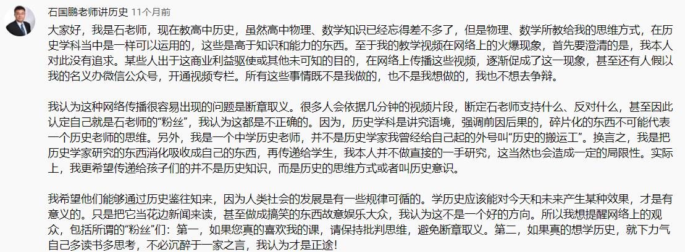

# 马克思主义哲学

**马克思主义哲学与马克思主义中国化**。

谈到马克思主义总让人与党联系起来，毕竟中国共产党是一个马克思主义政党。

《中国共产党章程》指出党员的基本义务有  
“认真学习马克思列宁主义、毛泽东思想、邓小平理论、“三个代表”重要思想、科学发展观、习近平新时代中国特色社会主义思想，学习党的路线、方针、政策和决议，学习党的基本知识，学习科学、文化、法律和业务知识，努力提高为人民服务的本领。”  
“贯彻执行党的基本路线和各项方针、政策，带头参加改革开放和社会主义现代化建设，带动群众为经济发展和社会进步艰苦奋斗，在生产、工作、学习和社会生活中起先锋模范作用。”  
这两个义务是党员必需履行的义务中的第一、二条。

马克思列宁主义、毛泽东思想、邓小平理论、“三个代表”重要思想、科学发展观这几个词从小就一直在背，习近平新时代中国特色社会主义思想这个词也不陌生，读的已经很顺口了。坚持各种主义的前提是了解其内涵，只认同却不了解其内涵在政治立场上固然没什么问题，但这并不是理性的认同。理性认同还需要经过一段比较长时间的思想挣扎，其实没那么容易的，需要经过认识实践的反复过程。

马克思主义不仅仅可以指导中国特色社会主义的建设，其更是一种方法论，一种世界观，对一个人的为人处世也有巨大指导作用。

## 所有内容的展开逻辑

下面的内容中，最前面的内容是马克思主义的内容，马克思主义哲学是一个世界观、方法论的问题。有了马克思主义，不妨顺便研究一下马克思主义指导下的一个实际例子即中国革命与马克思主义在中国的发展。

中国不同阶级的革命史算是历史。历史和政治的关系还挺微妙的。社会科学是有立场的，这里的历史是为政治服务的。这里还有一个关键词“阶级”阶级分析在毛泽东的革命理论中常能见到。（话没说明白，后面完善）

一些爱国者在革命中找到了马克思主义。在马克思主义的指导下，革命面貌又有了转机。马克思主义指导革命，革命发展马克思主义，马克思主义在实践中形成了新的理论成果即毛泽东思想。在改革开放后，随着马克思主义指导下的社会主义建设，又形成了新的理论成果中国特色社会主义理论体系。

至此，党章中的“马克思列宁主义、毛泽东思想、邓小平理论、“三个代表”重要思想、科学发展观、习近平新时代中国特色社会主义思想”都学完了，其中的革命史使得整个体系更丰满，讲清了中国为什么选择了马克思主义的问题。

马克思主义不断在中国发展，2021年是建党100周年，是一个很重要节点。一些任务的结束，一些任务的开始。在这个背景下先要知道党和国家的总任务，有了任务就要去解决，就要有方法有布局，因此提出了“五位一体”和“四个全面”，除了国家建设，还有国防外交以及党自身的建设问题。这也是一个好的办事方法，我们党很擅长做计划，定下目标以后，把大任务分成小任务，小任务再划分成具体任务，这也值得个人去学习。

最后是个人层面的问题以及一些补充。比如中国特色社会主义的意识形态问题，个人思想，道德法律的要求。

## 参考资料

1.主要内容，一些结果性的论断，来自考研政治（不得不说考研政治的内容真是牛逼，用足够精简的内容传达了中国特色社会主义的核心思想）教科书2018版《马克思主义基本原理概论》《毛泽东思想和中国特色社会主义理论体系概论》《中国近代史纲要》《思想道德基础与法律修养》

2.[《马克思主义哲学原理》吉林大学 孙利天 等](https://www.bilibili.com/video/BV1r4411H7oh)

3.[清华大学公开课--马克思主义政治经济学原理](https://www.bilibili.com/video/BV12W411n7wJ)

4.工人阶级的圣经：马克思的[《资本论（中文译本）》](https://www.marxists.org/chinese/marx/capital/index.htm)

5.[石国鹏-中国通史-近现代史](https://youtu.be/D7ZYbp6wrBk)

6.[袁腾飞-近代史系列](https://youtu.be/SFX7ng7eOU4)

7.典中典阶级分析[《毛泽东选集》](https://www.marxists.org/chinese/maozedong/index.htm)

此外还有一些其他零碎的观点内容，到对应位置在补充。

近代史内容大量的参考YouTube[石国鹏老师讲历史](https://youtu.be/W2Xw3AchU10)，考研政治中近代史的部分比较收敛，石国鹏老师的近代史更深刻，更丰满，当然批判性也更强，因此一些观点也很尖锐，曾经B站是可以看到的，现在没有了，需要去Youtube去看。对于翻墙这个事情，总体上我是认同这个观点的[【小岛浪吹】软核翻墙指南，中国政府到底是希望人民翻墙，还是不希望，在国外的你需要翻墙回中国吗？](https://youtu.be/3WT6k3ADtoQ)

<figure>
    
</figure>

对于哲学，或者说社会科学的这些思想，我就是个搬运工。偏激的讲我是没有自己的想法的，实际上我写出来的，都是我认同的别人的观点。别人的观点看的足够多了，有了比较会有自己觉得对的，整个这个文档，就是我认同的思想。但是说实话都是别人的思想，我就和调库一样，拿来当自己的。

