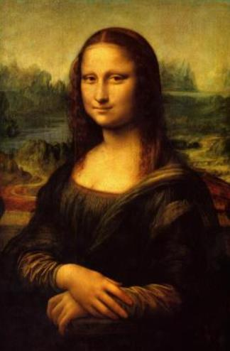

# 马克思主义的世界观与方法论

## 一、辩证唯物论

辩证唯物论就是用辩证法的观点研究世界的本质，即研究世界的本质“是什么”的问题。是马克思主义哲学体系的理论基础和逻辑起点。它以物质和意识或思维和存在的关系为主线，系统论述了辩证唯物主义的物质观、实践观和意识观。相应有四个原理：
- 1.物质存在形式原理（运动是物质的存在方式，时空是运动着的物质的存在方式）。
- 2.实践本质原理（实践具有直接现实性、主体能动性等特点）。
- 3.意识的本质和能动性原理。
- 4.世界的物质统一性原理，这是马克思主义哲学中关于世界本质的原理，是唯物论，是党的思想路线的哲学基础。最后阐述了关于正确认识物质和意识辩证关系的认识论和方法论意义。


>世界的本原是什么的问题。马哲指出是物质。

>马克思哲学认为世界是两级，除了物质就是意识。


### 物质观

>物质、运动、时空

- 物质范畴及其方法论意义
    - 恩格斯的物质定义：“物、物质无非是各种物的总和，而这个概念就是从这一总和中抽象出来的。”
    - 列宁的物质定义：“物质是标志客观实在的哲学范畴，这种客观实在是人通过感觉感知的，它不依赖于我们的感觉而存在，为我们的感觉所复写、摄影、反映。”
    - 列宁对物质的定义方式：从物质与意识的关系上来把握物质。
    - 物质的唯一特性：**客观实在性**。它存在于人的意识之外，可以为人的意识所反映。
>好几个人对物质做了定义。恩格斯的抽象，是把琳琅满目的东西摆在一起，抽象出来这个东西是物质。列宁的定义有点客观实在的意思了。

>人对概念做定义，可以用属类做定义，比如“厕所是属于商场里面公共设施”。对于一些最大概念，通过一样大的概念用关系做定义。比如“男厕所是女厕所旁边的公共设施”。


- **运动是物质的存在方式和根本属性**<!--物质和运动。物质的根本属性和基本存在形式-->
    - 运动的概念：运动是标志一切事物和现象的变化及其过程的哲学范畴。运动是物质的存在方式和根本属性。
    - 物质与运动的关系（不可分割）：一方面，物质是运动着的物质；另一方面，运动是物质的运动，世界上没有离开物质的运动，任何形式的运动，都有它的物质载体。脱离物质谈运动，将导致唯心主义；脱离运动谈物质，将导致形而上学。
    
    - 静止的概念：静止是物质运动在一定条件下的稳定状态，包括空间的相对位置和事物的根本性质暂时未变这样两种运动的特殊状态。
    - 运动和静止的关系（对立统一）二者相互区别，运动的绝对性、静止的相对性；二者相互联系，“动中有静，静中有动”。夸大静止，否定运动，将导致形而上学；夸大运动，否定静止，将导致诡辩论。
    
    - 时空的概念：
        - 时间是指物质运动的持续性、顺序性，特点是一维性，即时间一去不复返；
        - 空间是指物质运动的广延性、伸张性，特点是三维性。
    - 时空的特点：时空有客观性，既有绝对性，又有相对性；既有有限性，又有无限性。
    - 物质运动与时空的关系（不可分割）：时间和空间是物质运动的存在形式。时空是物质运动的时空，物质运动是时空中的物质运动。

```tip
物质的存在方式是运动，运动的存在方式是空间。
物质的根本属性是运动。
```

```note
这个运动是个哲学范畴，运动=变化。时空也是物质，因此物质离不开运动。

哲学概念有时候有点像讲废话😂。比如物质和运动，两句话正说完反说。。但是含义还是挺深的。

动静，时间空间和物理学有交叉，但是哲学里都是很大的概念，这就不得不提电影《星际穿越了》，有些东西看起来很奇幻但是居然是科学的，很有意思。
```


### 物质和意识的桥梁

物质和意识的桥梁-实践

```note
这里的实践是简单铺垫，后面还要大谈实践。这块内容夹在物质和意识之间也是有含义的。世界分成两级：物质和意识，实践是物质意识之间的唯一桥梁。
```

- 实践是自然存在与社会存在区分和统一的基础

- **社会生活的本质：实践**。

- 从实践出发理解社会生活的本质，要把握以下两个大的方面：
    - 实践是使物质世界分化为自然界与人类社会的历史前提，又是使自然界与人类社会统一起来的现实基础；
    - 实践是人类社会的基础，是理解和解释一切社会现象的钥匙。

```tip
在世界上有人之前，物质世界=自然界。后来有了人，人通过自己的活动使物质世界分成自然界和人类社会。实践让物质世界分化为自然界和人类社会，实践也让越来越多的自然界融入人类社会。自然存在就是自然界，社会存在就是人类社会。
```

- 社会生活的实践性主要体现在（原因，为啥是实践呢）：
    - 实践是社会关系形成的基础；
    - 实践形成了社会生活的基本领域，
    - 实践构成了社会发展的动力，改造社会的实践推动着社会历史的变迁和进步。

```tip
社会关系：生产劳动关系，亲情关系等等，实践使得这些关系得以存在，特别是生产劳动关系。

这里说实践构成了社会发展的动力，但是社会发展的根本动力是社会基本矛盾。
```
```note
我觉得哲学上的实践也是个抽象概念，范围很广阔。除了意识的思维活动，人的其他活动活动全都能叫实践。

我个人认为实践是学习知识与验证知识的统一。在实践过程中人获得自我提升。

学习科学技术原理，用到工程上是实践。学习社会科学理论，塑造完善世界观，并在与人交往中验证也是实践。

这是我的实践观。
```

### 意识观

>意识范畴、本质、来源、作用

- 意识的定义：**意识是物质世界长期发展的产物**，是人脑的机能和属性，是客观世界的主观映象。其中，最精确的说法是“意识是客观世界的主观映象”。

- 意识的起源：**意识是自然界长期发展的产物**，它的形成和发展经历了三个阶段，即由一切物质所具有的反应特性到低等生物的刺激感应性，再到高等动物的感觉和心理，最终发展为人类的意识。

>意识是（物质世界）自然界长期发展的产物，对比这两个说法，结合前面实践的铺垫。意识的发展过程说明意识是人独有的。意识专指人的意识。

- 意识的本质：客观世界的主观映象。是客观内容和主管形式的统一。

- 意识产生过程中的影响因素：
    - 第一，劳动（决定性因素）；
    - 第二，语言（重要因素）。
>意识形成过程中，多因素作用，劳动（属于大概念实践）、语言、...，劳动是决定性因素，其他的都是重要。语言是意识的物质外壳，语言是物质，语言不以人的意志而转移。但是语言的含义是意识。

>看新闻，有人会感觉废话连篇。比如两国领导人充分交换意见，意思是基本上没谈拢。谈拢了，双方达成高度共识。存在重大分歧，还有更严重的：勿谓言之不预。外交辞令。挺好玩的，可以看看。

- 意识的能动作用：意识的能动作用是人特有的积极认识世界与改造世界的能力和活动。主要表现在：
    - 第一，意识反映世界具有自觉性，意识活动具有目的性和计划性。
    - 第二，意识活动具有创造性，不仅反映事物的外部现象，而且反映事物的本质和规律。
    - 第三，意识具有指导实践改造客观世界的作用。
    - 第四，意识具有控制人的行为和生理活动的作用。
>能动，是个哲学意味特别强的词。后面还会反复强调。


### 物质意识关系

```note
谈到关系，基本上就是辩证关系，但是相互区别，相互联系。辩证关系=对立统一，一回事。
```

- 物质和意识相互区别：
    - 第一，物质是本原，意识是派生；
    - 第二，物质不是意识，意识不是物质；
    - 第三，物质不能代替意识，意识不能代替物质。
- 物质和意识相互联系：
    - 第一，物质可以转化为(变成)意识，意识可以转化为(变成)物质；
    - 第二，意识对物质既有依赖性，又有相对独立性；
    - 第三，物质决定意识，意识反作用于物质。
```note
哲学这种废话反复说的感觉又来了，😂。但是这可不是废话。。大智慧。
人与人的相处，强强在一起，弱弱在一起都会有问题。强弱配合是比较合适的。
要分清楚哪些是区别，那些是联系。
```

```tip
想把握物质与意识的辩证关系，还要处理好主观能动和客观规律性的关系。
```

- 主观能动性和客观规律性的统一
(1)规律的概念：事物运动发展中的本质的、必然的、稳定的联系。
(2)规律的特点：规律是客观的。客观性是规律的根本特点，它的存在不依赖于人的意识。相反，人的意识活动要受规律的支配。不管人们是否认识到、是否承认，规律都客观存在着，并以一定的方式起作用。
(3)客观规律性与主观能动性的关系：第一，必须尊重客观规律。尊重客观规律是正确发挥主观能动性的前提。第二，只有充分发挥主观能动性，才能正确认识和利用客观规律。
(4)正确发挥人的主观能动性：第一，从实际出发是正确发挥人的主观能动性的前提。第二，实践是正确发挥人的主观能动性的基本途径。第三，正确发挥人的主观能动性，还需要依赖于一定的物质条件和物质手段。
(5)社会历史趋向(规律)与主体选择(能动)的关系：历史发展的必然性决定了人们的活动要受客观规律的制约，而规律作为一种必然趋势是由多种可能性构成的“可能性空间”，哪种可能性能够实现，取决于主体的自觉选择。

```note
成功的实践，既尊重规律，又发挥主观能动性关系。
```

---

```note
唯物论的大总结。
```
- 世界的物质统一性原理
    <!--核心观点：-->
    - 同时同意三个观点的只有马克思主义哲学。
        - 观点一：世界是统一的，即世界的本原只有一个。唯物主义和唯心主义都同意这个观点，而二元论哲学家不同意。
        - 观点二：世界的统一性在于它的物质性，即世界统一的基础是物质。马克思主义哲学和旧唯物主义哲学都同意这个观点，而唯心主义哲学家不同意。
        - 观点三：物质世界的统一性是多样性的统一，而不是单一的、无差别的统一

    - 世界统一于物质，意识统一于物质，人类社会也统一于物质。

    - 人类社会的物质性主要表现在：
        - 第一，人类社会依赖于自然界，是物质世界的组成部分。
        - 第二，人们谋取物质资料的实践活动虽然有意识作指导，但人类获取生活资料的活动是物质性的活动。
        - 第三，人类社会存在和发展的基础是物质资料的生产方式。

    - 世界的物质统一性原理是马克思主义的基石。启发：坚持实事求是，一切从实际出发。一切从实际出发，不从主管出发，这就是物质统一性原理在实际工作中的生动体现。

>观点一唯心唯物都认为本原有一个，可以批判二元论。观点二可以批评唯心主义，无法批判旧唯物。观点三可以批判旧唯物，旧唯物认为单一无差别。

>意识并不是一个客观存在，没了物质，意识也没了，意识统一于物质。
>物质和意识的桥梁是实践，但是实践是物质，一次人类获取生活资料的活动是物质活动

>>工程设计，不要跟着想象来，看看现成的设计。


## 二、唯物辩证法

该部分回答了“世界怎么样”的问题。它通过阐述唯物辩证法的联系和发展的两个观点，进而讲解唯物辩证法的基本规律和范畴，从不同侧面揭示了唯物辩证法与形而上学的对立。其内容可概括为“两个观点、三大规律、五对范畴”。

其重要原理有：
- 1.普遍联系的观点中关于系统及其整体性、整体与部分关系的理解和应用能力；普遍联系的观点及其方法论意义。
- 2.度的含义及其认识意义。
- 3.质量互变规律的内涵及其方法论意义。
- 4.辩证否定观及其方法论意义。
- 5.矛盾的同一性和斗争性的辩证关系原理及其方法论意义。
- 6.矛盾的同一性和斗争性在事物发展中的作用原理，即事物发展的源泉和动力原理。它内含以下内容：
    - （1）运用矛盾的同一性原理分析社会生活中的实际问题；
    - （2）矛盾的转化原理以及二者之间的综合。
- 7.矛盾的普遍性和特殊性的辩证关系及其方法论意义。
- 8.矛盾发展的不平衡性原理及其方法论意义。


>世界是怎样存在的？运动的、变化的。

>辩证法围绕世界是怎样的，两大特征来回答（联系和发展）。两大特征联系和发展在环节上的逻辑问题就是五对范畴，同样是发展但是也有趋势，必然联系偶然联系（亲人和朋友）。三大规律探讨事物发展联系的原因、状态、归宿，为什么发展（发展的原因和动力，对立统一）？怎样发展（发展的过程和状态，质量互变）？向哪里发展（发展的方向和归宿，否定）？

### 辩证法的两个特征：联系和发展

#### 普遍联系

- 联系的概念：联系是指事物内部各要素之间和事物之间相互影响、相互制约和相互作用的关系。辩证法要求在区别中看到联系，在联系中看到区别。
>同一个事物内部，不同事物之间都有联系。辩证法谈联系不绝对的谈，都是以区别为前提去谈联系的，这是辩证法的观点。

- 联系的特点：
    - 第一，联系具有客观性。事物的联系是事物本身所固有的，不是主观臆想的。
    - 第二，联系具有普遍性。// 三个含义
        - 1.任何事物内部的不同部分和要素之间都是相互联系的；
        - 2.任何事物都不能孤立存在，都同其他事物处于一定的相互联系之中；
        - 3.整个世界是相互联系的统一整体。事物的普遍联系是通过“中介”来实现的。
    - 第三，联系具有多样性。世界上的事物是多样的，因而事物之间的联系也是多样的。
    - 第四，联系具有条件性。条件是对事物存在和发展发生作用的诸要素的总和。// “条件性”的含义：
        - 1.条件对事物发展和人的活动具有支持或制约作用；
        - 2.条件是可以改变的，人们通过努力可以创造出事物发展所需要的条件，化不利条件为有利条件；
        - 3.改变和创造条件不是任意的，必须尊重事物发展的客观规律。

>联系就是想不想都在。客观存在的。

>有个有意思的事情，六度空间理论,又名六度分隔理论，意思是你至多只要通过六个人就能认识全世界的任意一个人

- 方法论，一般吧。

#### 永恒发展

- 发展的实质(概念)：发展是前进的、上升的运动，发展的实质是新事物的产生和旧事物的灭亡。
>这个哲学的范围内，运动=变化>发展，好的运动才是发展。运动是绝对的，但是发展是有条件的。可以说发展是永恒的。

- 新、旧事物的概念：新事物是指合乎历史前进方向、具有远大前途的东西；旧事物是指丧失历史必然性、日趋灭亡的东西。

- 新事物是不可战胜的：第一，新事物有新的要素、结构和功能，它适应已经变化了的环境和条件；第二，新事物既否定了旧事物中消极腐朽的东西，又保留了旧事物中合理的、适合新的条件的因素，并添加了旧事物所不能容纳的新内容；第三，新事物是社会上先进的、富有创造力的人们创造性活动的产物，它从根本上符合人民群众的利益和要求，能够得到人民群众的拥护。

- 事物发展的过程性观点：恩格斯指出，“世界不是既成事物的集合体，而是过程的集合体”。事物发展是一个过程，只有经历一定的过程，事物才能实现自身的发展。


#### 辩证法：过程的观点

- 世界不是既成事物的集合体，而是过程的集合体。

>世界上一切事物不过是个过程。这辈子不过是个过程，很快就会结束的。凡事看开一点，过眼云烟嘛。。

- 一切在历史上产生的都要在历史上灭亡。

>好的不好都都终将要消失。

- 任何事物都有它的过去现在和将来。

>当然还有更多的过程观点，下面写出来的都是主观表述，不是观点客观内容，重在理解内含：过程的观点。


### 唯物辩证法的五对范畴

>五对范畴在联系和发展的基础上探讨环节上的逻辑。很多事物联系分情况的：比如直接联系间接联系、必然联系偶然联系、现象联系本质联系。事物发展从不同方向发展都是有可能的。
>这个展开逻辑很清晰的，都是哲学概念——方法论。

#### 原因与结果

- 原因与结果是揭示事物的前后相继、彼此制约的关系范畴。辩证法把这种引起与被引起的关系称为因果关系。其中，引起某种现象的现象叫原因，被某种现象所引起的现象叫结果。
>前后相继的不一定就是因果关系。这就得说万年吵架热点：传统中医了。传统中医行为在前，病好在后，那么是因为传统中医发功导致病好了吗？

>因果好像是佛教的核心思想，佛教靠因果这套理论去解释世界上的好多东西。为啥马克思的辩证法也讲这个呢？辩证法的因果讲的是事物之间的联系。辩证法的因果，比如说我开车撞人逃逸了，导致我被抓判刑了这是个因果；再或者如果侥幸没被抓睡不好寝食难安这也是个因果。佛教的因果我逃逸了，过去很久，20年后我走在路上被电线杆砸死了，这是佛教里的因果，不是不报时候未到，这辈子不报下辈子也有，讲的是个平衡关系，不是逻辑关系。

- 原因与结果的辩证关系：
    - 1.原因与结果的区分既是确定的，又是不确定的。
    - 2.原因与结果相互依存和相互转化，原因产生结果，结果反过来影响原因，互为因果，但不能混淆与颠倒。
    - 3.原因与结果互相渗透，结果存在于原因之中，原因表现在结果之中。
    - 4.原因与结果的关系是复杂多样的，有一因多果、同因异果、一果多因、异因同果、多因多果、复合因果等。
>既定的关系里，因果是确定的，跳出圈以后因果就不确定了。互为因果有点良性循环恶性循环的感觉，互为因果。
>努力学习可以推测结果成绩不错。看过成绩不错可以猜测这孩子挺努力。
>因果关系复杂，尤其因必有其果是不对的，因果复杂性。有因必有果是对的。

#### 必然与偶然

- 必然的概念：必然是指事物联系和发展过程中一定要发生、确定不移的趋势，在一定条件下具有不可避免性。
- 偶然的概念：偶然是指事物联系和发展过程中不确定的趋势。必然与偶然是对立统一的关系。
>不是说这个事是必然，那个事是偶然。想表达的是一件事既是必然的也是偶然的，这想法很宏观，道理很大。
>比如说，遇到男/女朋友，啥天造地设、命中注定就是表达的必然，但是想想这是必然的嘛？当年高考少几分不久就变成了另一个命中注定了？所以一个事情既是必然的也是偶然的。一个词语“缘分”高度概括了必然和偶然的意义，在英语中这个词实在是不好找。

- 必然偶然相互区别：
    - 它们产生和形成的原因不同，必然产生于事物内部的根本矛盾，偶然产生于事物的非根本矛盾和外部条件；
    - 它们的表现形式不同，必然在事物发展过程中比较稳定、时空上比较确定，是同类事物普遍具有的发展趋势，偶然则是不稳定的、暂时的、不确定的，是事物发展中的个别表现；
    - 它们在事物发展中的地位和作用不同，必然在事物发展中居于支配地位，决定着事物发展的方向，偶然居于从属地位，对事物发展的必然过程起促进或延缓作用，使事物发展的确定趋势带有一定的特点和偏差。

- 相互联系：没有脱离偶然的必然，必然存在于偶然之中，要通过大量的偶然表现出来，并为自己开辟道路；没有脱离必然的偶然，偶然背后隐藏着必然，受必然的支配，偶然是必然的表现形式和补充；必然和偶然在一定条件下相互转化。
>这些表述是很规范的哲学表述。有点概率学的意思，有个确定的不确定性，这个不确定的确定的，概论学和统计学就是在研究偶然里的必然。很有意思，很猛。

- 方法论：把握好事物发展的必然，把握事物的总趋势，又要善于从偶然中发现机遇。
>尊重趋势，把握机遇。有句话说的“机会是留给有准备的人”大概表达的就是这么个意思。


#### 可能与现实

- 可能的概念：可能是指包含在事物中并预示事物发展前途的种种趋势，是潜在的、尚未实现的东西。
- 现实的概念：现实是指相互联系着的实际存在的事物的综合。

- 可能与现实的辩证关系：可能与现实既有区别，又有联系。没有现实就没有可能；反过来，没有可能就没有现实。它们在一定条件下相互转化。

- 把握事物的可能，要注意区分可能与不可能、现实的可能与抽象(非现实)的可能、好的可能与坏的可能。
>干一件事情分析可能性。现实中有依据是可能性，没有依据是不可能性。依据充分就是现实可能性，依据不充分是抽象可能性（潜在的可能性）。

>比如我想活到500岁，不可能；赚他一个小目标，现实可能性；当选国家主席、总书记、军委主席，抽象可能性，还是有可能的渺茫罢了。

- 方法论：人生立足于现实，展望未来，主义分析事物发展的各种可能，发挥主观能动性，争取好现实的可能性。

#### 现象与本质

- 现象的概念：现象是事物的外部联系和表面特征，是事物本质的外在表现，人们可通过感官感知。
- 本质的概念：本质是事物的根本性质，是构成事物诸要素之间的内在联系，只有通过理性思维才能把握。

- 现象与本质的对立统一关系
    - 相互区别：现象是个别的、具体的，而本质是一般的、普遍的；现象是多变易逝的，本质是相对稳定的；现象是生动、丰富的，本质是比较深刻、单纯的。现象有真象和假象之分，假象与错觉不是一回事。
    - 相互联系、相互依存：任何本质都通过现象表现出来，没有不表现为现象的本质；任何现象都从一定的方面表现着本质，现象是本质的外部表现，假象也是本质的表现。
>真象和假象都是对本质的表现，错觉自己发神经也可以有的。错觉是错误的感觉没问题，真象是正确的现象这话不对，真象和假象都是客观存在的，哪有对错正确一说，比如我脸很圆，这个正确吗？这客观存在哪有正确不正确一说。
>真象往往隐藏在事物内部，而假象往往外露与事物外部这话不对，真假象都在外面，本质才在里面。日常生活中说的是真相，truth和real。

- 方法论：现实和本质是统一的，所以我们能通过现象认识事物的本质；但是这两又是对立的，所以我们要透过现象看本质。


#### 内容与形式

- 内容的概念：内容是构成事物一切要素的总和，是事物存在的基础。
- 形式的概念：形式是内容诸要素相互结合的结构和表现方式。
>没内容也就没必要存在了。

- 内容与形式的辩证关系：任何事物的内容都有一定的形式，任何形式也都有一定的内容，没有无内容的空洞的形式，也没有无形式的纯粹的内容。事物的内容是无限丰富的，事物的形式也是多种多样的。内容和形式相互作用、相互影响。内容决定形式，形式反作用于内容。当形式适合内容时，对内容的发展起着积极的推动作用；当形式不适合内容时，对内容的发展起着消极的阻碍作用。

>内容更高级一点，但是形式适合内容，表达的让人们容易接收，会推动内容的发展。学数学的时候，这个就很重要形式。
>生产力是社会生产的具体内容，生产关系就是省会生产的组织形式。适应推动，不适应旧阻碍。

- 方法论：重视内容，又要善于运用形式。
>教学的时候，要思考什么样的形式更容易被接受。


### 辩证唯物法三大规律

>三个规律。在联系发展的基础上，探讨为什么会发展，发展中的状态，发展的最终方向。
(1)对立统一规律回答了“事物为什么会发展”的问题，揭示了事物发展的“原因和动力”.
(2量变质变规律回答了“事物怎样发展”的问题,揭示了事物发展的“过程和状态".
(3)否定之否定规律回答了“事物往哪里发展”的问题,揭示了事物发展的“方向和归宿”.

#### 对立统一规律

- 对立统一规律是唯物辩证法的实质和核心
    - 对立统一规律揭示了事物普遍联系的根本内容和变化发展的内在动力，从根本上回答了事物为什么会好展的问题
    - 贯穿其他规律和范畴的中心线索
    - 对立统一规律提供矛盾分析法，是对事物辩证认识的实质
    - 对立统一学说是唯物辩证法和形而上学对立的实质
>很重要。这个规律。

>展开逻辑，矛盾的同一性和斗争性原理、同一性和斗争性在事物发展中的作用原理，普遍性和特殊性的辩证关系原理，矛盾的不平衡发展原理。矛盾分析法。

- **矛盾的同一性和斗争性的辩证关系原理**<!--第一个原理-->
    - 矛盾的同一性：矛盾双方相互依存、相互贯通的性质和趋势。它有两个方面的含义：一是矛盾着的对立面相互依存，互为存在的前提，并共处于一个统一体中；二是矛盾着的对立面之间相互贯通，在一定条件下相互转化。
    - 矛盾的斗争性：矛盾着的对立面之间相互排斥、相互分离的性质和趋势。由于矛盾的性质不同，矛盾的斗争形式也不同，对于多种多样的斗争形式，可以分为对抗性矛盾和非对抗性矛盾两种基本形式。
    - 矛盾的同一性和斗争性相互联结、相辅相成。没有斗争性就没有同一性，没有同一性也就没有斗争性，斗争性寓于同一性之中，同一性通过斗争性来体现。在事物的矛盾中，矛盾的斗争性是无条件的、绝对的，矛盾的同一性是有条件的、相对的。<!--像废话的话😂😂😂，可能道理就是这样，道理越大越像废话，-->
    - 方法论：“看问题一分为二”，“求同存异”，“批判继承”，“事物之间会相互转化”。
>矛盾就是对立统一，对立统一就是矛盾。汉语语境的矛盾是个不太好的词。这个哲学上的矛盾是个中性词，一对矛盾。世间万物都是一对一对出现的。


>相互依存。没有上哪来下，没有强哪来弱，相互依存的；相互贯通，互相变，上也会成下，相对的。每对矛盾是每时每刻既同一又斗争，不是时而斗争时而同一的关系。
>比较激烈的对抗性矛盾，你死我活；缓和的非对抗性的。区分这个是有意义的，政治的理论是为政治的现实服务的（社会科学是有立场的）。比如马克思说资本主义必将灭亡，这不是骂你咒你灭亡，这不科学，马斯克是要用理论讲道理的，资本主义存在诸多矛盾，矛盾促使资本主义灭亡。那有人又会问按照这个逻辑中国也有矛盾呀，按照这个逻辑中国也会灭亡吗？然后讲道理，当然不会，非对抗性矛盾是可以通过改革去解决的。你资本主义是剥削者和被剥削者的矛盾，你怎么解决。


>所以遇到对于外网上一些人对国家社会人民的一些尖锐问题比如：中国特色社会主义是社会主义吗？中国是一党专制吗？甚至问出中国是民主国家吗？这些问题，都有理论依据去做出有力回应。在后面就有的，特色社会主义特色在哪，政治协商是怎么回事，人民代表大会的间接民主的实现。
>然后外网上有人捂住耳朵，我不听，我不看，我也不愿意看你的理论。这就有点双标了。哲学、社会科学，得讲道理，互相了解对方的观点的，才有继续交流下去的意义。所以网上对于自然科学的讨论（除了民科）一般是比较祥和平静友好的，但凡沾一点点社会科学、意识形态的东西的讨论，必定过不了多久就会变成一场纯人身攻击的骂战。这也挺有意思的。


>哲学这个东西，学完套生活可以吗？。规律、道理、哲理，坐下想可能不太容易，得靠悟。😂😂😂，看啥时候能顿悟吧。哲学和道理，寻找真理。

>这个方法论要和原理结合起来。有用处的。

- 矛盾的同一性和斗争性在事物发展中的作用原理<!--第二个原理-->
    - 矛盾的同一性在事物发展中的作用表现在：
        - 1.同一性是事物存在和发展的前提，由于矛盾双方相互依存，互为存在的条件，矛盾双方可以利用对方的发展使自己得到发展。
        - 2.同一性使矛盾双方相互吸取有利于自身的因素，在相互作用中各自得到发展。
        - 3.同一性规定着事物转化的可能和发展的趋势，由于矛盾双方彼此相通，矛盾双方可以向着自己的对立面转化而得到发展。
    - 矛盾的斗争性在事物发展中的作用表现在：
        - 第一，矛盾双方的斗争促进矛盾双方力量的变化，此消彼长，为事物的质变创造条件。
        - 第二，矛盾双方的斗争是一种矛盾统一体向另一种矛盾统一体过渡的决定力量。
    - 方法论：事物发展“相反相成”，“相辅相成”；学会从事物的对立面把握事物的统一，逆向思考；和谐不是无差别的一致。
>感觉和第一个还有点像。
>

- 矛盾的普遍性和特殊性的辩证关系原理<!--第三个原理-->
    - 矛盾的普遍性简单来说可以表述为“矛盾无处不在，矛盾无时不有”。
    - 矛盾的特殊性是指各个具体事物的矛盾及每一个矛盾的各个方面在发展的不同阶段上各有其特点。具体表现为三种情形：
        - 一是不同事物的矛盾各有其特点；
        - 二是同一事物的矛盾在不同发展过程和发展阶段各有不同特点；
        - 三是构成事物的诸多矛盾以及每一矛盾的不同方面各有不同的性质、地位和作用。
    - 矛盾的普遍性和特殊性的辩证统一关系。矛盾的普遍性即矛盾的共性，矛盾的特殊性即矛盾的个性。矛盾的共性是无条件的、绝对的，矛盾的个性是有条件的、相对的。任何现实存在的事物都是共性和个性的有机统一体，共性寓于个性之中，没有离开个性的共性，也没有离开共性的个性。
    - 方法论：“具体问题具体分析”

```note
这里又是这种颠来倒去的话😂。这个道理一直知道，废话这么多为啥得出了一个本来就懂的道理呢？

当别人说具体问题具体分析我认为这是废话的时候说明我潜意识里是个马克思主义者。从小就认为马克思主义的理论是正确的。

中美人权争论。美国每年出版一本中国人权报告白皮书，说中国怎么没人权，现在中国也学会了每年搞一个美国人权啥的报告。那么到底谁没有人权呢？如果没有理论这不就成骂街了？如果去看看两个报告就会发现分歧所在，美国人的价值观、主张抽象人权，就是说只要是个人、诞生以后就具有乱七八糟权力写进了宣言里，然后拿着宣言去衡量全世界，说你没有这条这条，你们没人权。也就是说不考虑你这什么民族、什么国家、什么国情，你没有我写的这些，你就是没人权，这就是抽象人权，所有的问题一样分析。

中国谈的人权认为没有放之四海而皆准的人权，没有不变的权利，比如接受义务教育的权利，现在是有的，但是新中国刚刚成立的时候，物质基础不够支撑这个权利想上学没有。所以看国家发展阶段，人的权利是变化的，这就是具体分析问题具体分析。

2021年12月发布的

[《中国的民主》白皮书](http://www.scio.gov.cn/zfbps/32832/Document/1717206/1717206.htm)

[China: Democracy That Works](http://www.scio.gov.cn/zfbps/32832/Document/1717208/1717208.htm)


一些国家的喷点

[中国2019年人权报告](https://china.usembassy-china.org.cn/zh/2019-hr-rp-zh/)

```

- 矛盾的不平衡发展原理
    - 概念：主要矛盾是矛盾体系中处于支配地位、对事物发展起决定作用的矛盾。次要矛盾是矛盾体系中处于从属地位、对事物的发展起次要作用的矛盾。在每一对矛盾中又有矛盾的主要方面与矛盾的次要方面。
    - 原理：事物的性质是由主要矛盾的主要方面决定的。
    - 方法论：“两点论”与“重点论”结合，抓关键
>人就是个复杂的矛盾综合体。但是，矛盾要分主次。既要把握好主要矛盾，也要处理好次要矛盾。


>总结一下矛盾分析法。中庸和谐不走极端，求同存异，差异中求共识，物极必反，福祸相依；从对立中把握事物的统一，逆向思维；具体问题具体分析，对症下药量体裁衣；抓关键看主流，两点和重点结合。


#### 量变质变规律

---
>大把概念

- 质的概念：质是一事物成为自身并区别于其他事物的内在规定性。认识质是**认识和实践**的起点和基础。只有认识质，才能区别事物。

- 量的概念：量是事物的规模、程度、速度、构成成分、空间排列等可以用数量关系表示的规定性。认识量的意义：准确认识事物的量是认识的深化和精确化，只有认识量，才能更深刻地把握质；二是只有正确了解事物的量，才能正确估计事物在实践中的地位和作用。

>量不仅仅指数量。我和你不同就是因为质不同。认识东西从质开始，由量深入。学数学，先知道一个定理想干什么，大概思路是什么，先定性，再定量，大概就这么个意思。

- 事物的量和质是统一的，量和质的统一在度中得到体现。
- 度的概念：度是保持事物质的稳定性的数量界限，即事物的限度、幅度和范围，度的两端叫关节点或临界点，超出度的范围，此物就转化为他物。度这一哲学范畴启示我们，在认识和处理问题时要掌握适度原则。
>度是个区间，关节点是区间的端点。也就是说这个界限是个范围。

- 量变的概念：量变是事物数量的增减和组成要素排列次序的变动，是保持事物的质的相对稳定性的不显著变化，体现了事物发展渐进过程的连续性。
- 质变的概念：质变是事物性质的根本变化，是事物由一种质态向另一种质态的飞跃，体现了事物发展渐进过程和连续性的中断。

---
>关系来了

- 量变和质变的辩证关系
    - 相互区别：量变是保持事物的质的相对稳定性的不显著变化，而质变是事物性质的根本变化；量变体现了事物发展渐进过程的连续性，而质变体现了事物发展渐进过程和连续性的中断。
    - 相互联系：
        - 第一，量变是质变的必要准备。
        - 第二，质变是量变的必然结果。
        - 第三，量变和质变是相互渗透的。一方面，在总的量变过程中有阶段性和局部性的部分质变；另一方面，在质变过程中也有旧质在量上的收缩和新质在量上的扩张。
>想要实现质变，一定要进行量的积累，这是马克思的观点。有人不是这么认为的，认为不需要量的积累也行，激变论，夸大了质变，否定了量变。也有人认为可以永远量变不质变，庸俗进化论。

- 方法论：
    - 理论上的方法论，用马克思的理论抨击其他人的观点，就是理论上的方法论，上面批判过了。
    - 实践中的方法论，适度原则，
>凡事拿捏一个度。对社会主义初级阶段的认识，社会主义社会是质，初级阶段就是量。改革发展和稳定，改革也要拿捏火候，在可控范围内，改革。
>对个人的启发：量的积累。
<!--考研就是这个样子，😂，考了三次小问题，20岁出头的时候，不要太多的去考虑赚钱的问题，还是要知识知识能力的积累-->

#### 否定之否定规律

>万事万物将往哪里发展的问题

- 肯定因素的概念：肯定因素是维持现存事物存在的因素。
- 否定因素的概念：否定因素是促使现存事物灭亡的因素。
>一个东西既有肯定又有否定。

- 辩证否定观的基本内容：
    - 第一，否定是事物的****自我**否定。
    - 第二，否定是事物发展的环节。
    - 第三，否定是新旧事物联系的环节。
    - 第四，辩证否定的实质是“扬弃”，即新事物对旧事物既批判又继承，既克服其消极因素又保留其积极因素。
>辩证唯物主义认为的自我否定，有人认为是外在力量在否定事物，这个观点是形而上学。一个例子，下课回家有个毛毛虫一脚干死，对于虫子来说是外在否定的。首先这虫子不干死他终究会死的，这个问题把偶然当作了必然。辩证法是研究万事万物背后的关系，不以人的德意志转移，这个谈不上是个规律。
>扬弃，形而上学有句话，是就是是，不是就是不是，，辩证法既是又不是，既对也不对，既好也不好。辩证法把话都说完了😂，立于不败之地。    但是这么说话挺让人讨厌的，这么说肯定不会错，但是没有任何信息量，辩证法是中庸的。

- 事物的辩证发展过程：事物的辩证发展过程经过**肯定一否定一否定之否定**三个阶段。第一次否定使矛盾得到初步解决，而处于否定阶段的事物仍然具有片面性，还要经过再次否定，即否定之否定，实现对立面的统一，使矛盾得到根本解决。事物的辩证发展就是经过**两次否定、三个阶段，形成一个周期**。其中，否定之否定阶段仿佛是向原来出发点的“回复”，但这是在更高阶段的“回复”。事物的发展呈现出周期性，不同周期的交替使事物的发展呈现出波浪式前进或螺旋式上升的总趋势。
>每个字都闪耀的辩证法的光芒，回答了万事万物从哪里发展的问题。螺旋上升、迂回前进，不停的变成更厉害的自己。


- 方法论：
    - 理论上的：只看回归不看发展：循环论；只看发展不看回归：直线论。
    - 实践中的：道路是曲折的，前途是光明的。

>佛教是循环论的观点，一个圈，世界上万事万物都在这个圈里打转，称为“业”。“业”的涵义十分深奥而广泛，如果翻译成现代语言，“业”相当于“行为”，以及这些行为在当时或过后产生的相应的惯性力量和对这些行为产生的自动记忆。所有生物和人类的行为，在当时和过后必然产生出相应的惯性力量和记忆，这个惯性力量，就称之为“业力”。业力这种惯性力量就象是影子，如影随形地跟随着做此事的这个人。同时，业力不仅会如影随形地跟随着这个作者，而且时刻会对这个作者产生相应的作用力。如做的是好事，就会产生好的作用力，简称为“善报”。如做的是坏事，则会产生坏的作用力，简称为“恶报”。也挺有意思。很猛。

>直线论，希望未来一帆风顺的，基本上是不可能，辩证法告诉我，挫折就在前面等着。


### 辩证思维方法

- 客观辩证法与主观辩证法。
    - 客观辩证法的概念：客观辩证法是指客观事物或客观存在的辩证法，即客观事物以相互作用、相互联系的形式呈现出的各种物质形态的辩证运动和发展规律。
    - 主观辩证法的概念：主观辩证法是指人类认识和思维运动的辩证法，即以概念作为思维细胞的辩证思维运动和发展规律。
唯物辩证法既包括客观辩证法也包括主观辩证法，体现了唯物主义、辩证法、认识论的统一。

>大自然本来就存在的辩证法，不需要人参与仍然在演绎的辩证法。
>主观辩证法是人观察外部世界获得了辩证法映射的人脑中的辩证法。

- 客观辩证法与主观辩证法的辩证关系：主观辩证法是客观辩证法在人的思维中的反映，客观辩证法与主观辩证法在本质上是统的，但在表现形式上却是不同的。客观辩证法采取外部必然性的形式，主观辩证法则采取观念的、逻辑的形式。


- *辩证思维方法与现代科学思维方法*
    - 辩证思维方法主要有：归纳与演绎、分析与综合、抽象与具体、逻辑与历史相统一等。
现代科学思维方法是一个巨大的方法群，包括控制方法、信息方法、系统方法、结构-功能方法、模型化方法和理想化方法等。
辩证思维方法和现代科学思维方法的关系：辩证思维是现代科学思维的方法论前提，辩证思维方法的基本精神和原则贯穿于现代科学思维方法之中。现代科学思维方法又丰富了辩证思维方法..…者的结合体现了人类思维方法在哲学与具体科学中的发展。

- 学习唯物辩证法，不断增强思维能力。
学习和掌握唯物辩证法，要求我们在实践中不断增强辩证思维能力、历史思维能力、战略思维能力、底线思维能力和创新思维能力。

## 三、认识论

本部分围绕着实践、认识、真理三个核心及认识发展过程中实践与认识的辩证关系原理、认识发展律、真理发展律等三大规律，强调认识是在实践基础上主体对客体的能动反映，系统阐述了马克思主义哲学的辩证唯物主义认识论理论，实现了在实践基础上唯物论和辩证法的高度统一，辩证唯物主义认识论和历史唯物论的有机结合，正确回答了“怎样认识世界”的问题。

其重要原理有：
- 1.可知论和不可知论的区别原理
- 2.认识的主体及其形成和发展
- 3.实践和认识的辩证关系原理(实践的观点是马哲首要的和基本的观点)
- 4.认识发展辩证过程的原理
- 5.认识运动的不断反复和无限发展的原理
- 6.理性因素和非理性因素在认识过程中的作用原理
- 7.真理的具体性原理
- 8.真理和谬误的辩证关系原理
- 9.检验真理标准的唯物论和辩证法原理
- 10.真理和价值的辩证关系原理


>既然物质世界是运动的、变化的，那么应该怎样认识世界呢？认识的过成又有什么规律呢？
>唯物论辩证法是客观的，认识进入到主观了。

```note
认识这个词很大，可以找一个小一点的，就比如知识，或者再具体一点，数学，工程数学。拿来生活套一套，还是很合适的，而且我觉得认识论是可以指导学习的。

哲学套生活我觉得这个事情讲反了，实际上哲学起源于生活，就是对生活规律的总结。
```

### 认识的来源和本质

>不妨在理解的时候，把“认识”=“知识”

#### 认识的来源：实践

>实践派生出认识，没有实践就没有认识。这个关系和物质意识有点像。实践说到底是物质，认识实际上是意识。套用物质和意识的关系是没有任何问题的。
>新概念是老概念的不断派生。先看看别人的错误的实践观是怎么回事。

- 错误的实践观
    - 在中国古代哲学中，实践被称为“践行”“实行”或“行”，与“知”相对应，但主要是指道德伦理行为。
    - 康德把实践看成理性自主的道德活动。
    - 黑格尔把实践理解为主观改造客观对象的创造性的精神活动。
    - 费尔巴哈把实践与物质性的活动联系起来，但他所理解的实践又仅限于日常生活活动，并将实践等同于生物适应环境的活动。
>中国古代，知行合一，光知道孝敬还不够，要践行才是个有道德的人，通过道德伦理行为定义实践，过于狭隘，把道德等同于实践。
>康德忽略了客体，只有主体，自主行为忽略了客体存在。
>黑格尔，有进步，但是还认为实践是精神活动，也是有问题的。
>费尔巴哈，承认了实践的客观性，但是狭隘的理解为生物行为，吃喝拉撒作为实践。

- 正确的实践观：实践是感性的、对象性的物质活动
    - “感性的”指的是实践要受意识的指导，体现着主体的意愿和目的。
    - “对象性”指的是实践绝不是主体自主的行为，它必须有指向的改造对象。
    - “物质活动”指的是实践是具有物质性的客观行为。
>感性是意识指导的，体现目的。对象是客观的。实践说到底是物质活动。

- 实践的本质
    - 实践的本质（概念)：实践是**人类**能动地改造世界的社会性的物质活动。
    - 实践的基本特征(特点)：
        - 第一，直接现实性。实践可以将人脑中观念的东西变成现实的存在。
        - 第二，自觉能动性。实践需要接受意识的指导，体现出主体的目的性和计划性。/* 主体能动性 */
        - 第三，社会历史性。不同历史时期的实践不同，并且一定历史时期的实践受历史条件的制约。

>实践只有人才有。有句话好：我懂这么多道理，也没过好这辈子啊。问题出在哪呢？光听道理了，没做到。问题出在没实践，实践具有直接现实性，实践具有把脑中的东西变成现实东西的功能。

- 实践的基本结构
    - 实践主体的概念：实践主体是指具有一定的主体能力、从事现实社会实践活动的**人**，是实践活动中自主性和能动性的因素，担负着设定实践目的、操作实践中介、改造实践客体的任务。实践主体的能力包括自然能力和精神能力，精神能力又包括知识性因素和非知识性因素。实践主体有个体主体、群体主体和人类主体三种基本形态。
    - 实践客体的概念：实践客体是指实践活动所指向的对象。实践客体与客观存在的事物不完全等同。
    - 实践中介的概念：实践中介是指各种形式的工具、手段以及运用、操作这些工具、手段的程序和方法。实践的中介系统可分为两个子系统：
        - 一是作为人的肢体延长、感官延伸、体能放大的物质性工具系统；
        - 二是语言符号工具系统。
    - 实践的主体和客体相互作用的关系：实践关系、认识关系和价值关系，其中实践关系是最根本的关系。实践的主体和客体与认识的主体和客体在本质上是一较的。
>实践有主体、客体中介。主体是人，但是不是所有人都是主体，客体是物，但不是所有物都是客体。地球上我们没见过的不知道的但是存在的东西。中介，语言符号工具方法都是的。

>还有两个词，主体客体化、客体主体化。

- 实践的基本形式
    - 实践的基本形式：物质生产实践(劳动)、社会政治实践(处理人与人之间的关系)和科学文化实践(对未知领域的探索)等。其中，物质生产实践(劳动)是最基本的实践形式。
    - 当代实践的新形式：当代人类实践出现了新的变化，实践活动的范围越来越广泛而深入。一个突出的表现就是，现代信息技术的发展使得当代社会开始产生一种新的实践形式，即虚拟实践。虚拟实践是伴随信息化和网络化发展而产生的，其实质是主体和客体之间通过数字化中介系统在虚拟空间进行的双向对象化的活动，具有交互性、开放性、间接性等特点。虚拟实践是实践活动的派生形式，具有相对独立性。
>人类的基本实践类型：物质生产实践（劳动）；社会政治实践（搞关系）；科学文化实践（探索）。物质生产，先吃饱穿暖在考虑搞关系，所以说最基本。最近出来了虚拟化实践，实际上网上干的事还是那些事，但是虚拟实践还是传统的派生，还是在搞关系探索生产，借助互联网。

<!--前面一堆实践，终于回到认识了-->

- 为啥说实践决定了认识？
    - 1.实践是认识的来源。实践产生了认识的需要，实践还为认识的形成提供了可能。
    - 2.实践是认识发展的动力。
    - 3.实践是认识的目的。
    - 4.实践是检验认识真理性的唯一标准。
>实践和认识是个鸡生蛋蛋生鸡的问题。但是马克思的立场是实践是认识的来源。
>实践，干一件事有人干得好，有人就不太行，咋回事呢？马克思并不排斥天赋（生理因素）的影响，但还不到决定性的高度。有人说我不实践，从小听别人说，马克思也承认间接经验的作用。
>反正认识是由实践决定的，间接经验生理因素事重要的。


#### 认识的本质

>就是在讲认识是什么，人类的认知事怎么一回事。也是想看错误的认识的本质的观点。

- 认识的本质
    - 唯心主义先验论：从思想感觉到物
    - 唯物主义反映论：从物到感觉思想
        - 直观反映论
        - 能动反映论
>这是个大框架，有点唯物唯心两派的感觉。马克思的观点肯定是唯物能动反映论。除了马克思都是旧唯物，直观反映论也叫机械反映论。

- 唯一正确的认识观(能动的反映论)：认识的本质是主体在实践基础上对客体的能动反映。这种能动反映不但具有反映客体内容的反映性特征，而且具有实践所要求的主体能动的、创造性的特征。一方面，认识的反映特性是人类认识的基本规定性；另一方面，认识的能动反映具有创造性。
>把人的认知分为两面，一面反映，一面创造。反映是基本特征，不同意就是唯心主义先验论；不同意创造就是机械反映论。

- 认识的反映特性和创造特性的关系：不可分割
>辩证关系不可分割，创造是反映的创造，反映是创造的反映，走向极端就是两个批评。😂感觉又是废话反复说，但是不是废话。

- “能动反映论”两个突出特点（有点）：
    - 把实践的观点引入认识论
    - 把辩证法引入认识论，认识是个辨证化，由不知到知、由浅入深的充满矛盾的过程。


### 认识的过程和规律

#### 认识的过程：两次飞跃

- 从实践到认识：从感性认识到理性认识的飞跃。
    - 感性认识的概念：感性认识是认识的初级阶段，是人们在实践基础上，由感官直接感受到的关于事物的现象、事物的外部联系，事物的各个方面的认识。
    - 理性认识的概念：理性认识是认识的高级阶段，是人们借助抽象思维，在概括整理大量感性材料的基础上，达到关于事物的本质、全体、内部联系和事物自身规律性的认识。
>感性认识直接性为突出特点，包括感觉知觉和表象；理性概念判断和推理，特点是间接性和抽象性。
>现实认知操作感性和理性分不开的，不存在没有感性认识的理性认识，反之亦然。作为知识点可以分开。

- 感性认识和理性认识的辩证关系
    - 相互区别：
        - 第一，对象不同。感性认识是对事物外部联系的反映，而理性认识是对事物内部联系的反映。
        - 第二，形式不同。感性认识包括感觉、知觉和表象三种形式，而理性认识包括概念、判断和推理三种形式。
        - 第三，特点不同。感性认识的特点是直接性和具体性，而理性认识的特点是间接性和抽象性。
    - 相互联系：
        - 首先，感性认识有待于发展和深化为理性认识。
        - 其次，理性认识依赖于感性认识。
        - 最后，在实际的认识过程中，感性认识和理性认识又是相互交织、相互渗透的。一方面，感性中渗透着理性的因素；另一方面，理性中渗透着感性的因素。感性认识和理性认识是辩证统一的，二者统一的基础是实践。
>辩证关系就是对立统一关系。割裂感性和理性认识就会走向唯理论或经验论，实际生活中会犯教条主义或经验主义错误。

>>从小到大说“读万卷书，行万里路”，如果到处都旅游去过了，那为啥我还想个傻逼一样呢？那可能是因为我这全是纯纯感性认识，没带脑子去，没带着思考去，无非是到了拍个照，发个朋友圈。。。去之前很开心很向往，去玩以后会觉得不过如此，。怎么说呢，没有理论支持，啥都不知道当然不过如此了，没有情怀。理性变多的时候感性也会膨胀。


- 从感性认识到理性认识的飞跃，必须具备两个基本条件：一是勇于实践，深入调查，获取十分丰富和合乎实际的感性材料。二是必须经过理性思考的作用，运用理论思维和科学抽象，将丰富的感性材料去粗取精、去伪存真、由此及彼、由表及里的加工制作，形成概念和理论的系统。


- *从认识到实践，从理性认识到实践的飞跃*。
这是认识过程中更为重要的飞跃。其重要性表现在：第一，认识世界的目的是改造世界。第二，认识的真理性只有在实践中才能得到检验和发展。


#### 认识的规律

- 认识的影响因素
    - 理性因素是指人的理性直观、理性思维等能力。它在认识活动中的作用主要有指导作用、解释作用和预见作用等。
    - 非理性因素是指认识主体的情感和意志，具有不自觉、非逻辑性等特点的联想、想象、顿悟、灵感等认识形式也属于非理性因素。它在认识活动中的作用主要有激活作用、驱动作用和控制作用。
>区分感性认识理性认识，感性因素理性因素。

- 认识的两大规律
    - 认识过程的反复性
        认识过程的反复性，是指人们对于一个复杂事物的认识往往要经过由感性认识到理性认识、再由理性认识到实践的多次反复才能完成。从客观方面看，事物的各个侧面及其本质的暴露有一个过程；从主观方面看，人的认识能力有一个提高的过程。
    - 认识过程的无限性
        认识过程的无限性，是指对于事物发展过程的推移来说，人类的认识是永无止境、无限发展的，它表现为“实践———认识——再实践——再认识”的无限循环，由初级阶段向高级阶段不断推移的、永无止境的前进运动。这种认识的无限发展过程，在形式上是循环往复，在实质上是前进上升。
>螺旋上升，否定之否定规律。辩证法是万物之法，辩证法在人的认知领域起作用。感受辩证法。


- *方法论*
    - 实践超前于认知：冒进主义（左）
    - 实践落后于认知：保守主义（右）
>认知水平低于实践的水平，反过来实践不敢往前走，保守。

>新闻中的，左倾右倾，左派右派，共产党员叫左倾右倾，非党员叫左派右派。中国的左右和日本美国不一样，中国的左派好像和日本的右派观点差不多是咋回事呢？左右是相对的。中国要建设中国特色社会主义，中国就会出现建设特别激进的，消灭企业家，没收有钱人的财富跑步进入社会主义，左了；还有一种，保守，先搞资本主义200年，右派，走资派。


### 认识的结果：真理与价值

>认识结果：认对了是真理，认错了是谬误。

#### 真理和谬误

- 错误的真理观
    - 马赫主义：多数人承认就是真理。
    - 实用主义：“有用既真理”。胡适。如果说真理一定是有用的那没问题。

- 正确的真理观：真理是标志主观与客观相符合的哲学范畴，是人们对于客观事物及其规律的**正确反映**。


```note
数学定理可以认为是真理。

我觉得数学真理客观性的第一层是数学本身，用定义自己推自己，即在自己的话语体系内说得通。表现为一道数学题有标准答案。

客观性的更深层次是真物质世界的客观性。比如高斯公式，第一层客观性可以用他计算曲面积分，第二层客观性是讲了通量和散度的关系。

学数学就是一个人在量上精确的构建客观世界的各种细节，掌握各种规律。这一点应用数学控制理论上表现得就很明显，因为我只学过控制理论基础的东西，但我觉得其他数学应该也是也是在描述客观世界，最起码应用数学一定是。

所以我觉得检验自己学一门数学学的怎么样，就是问问自己是否感受到了质量的统一，主观想法与客观世界的统一。
```

- 真理的特点：客观性、一元性，绝对性，相对性。
    - 客观性的含义：凡真理都是客观真理。真理的客观性或客观真理有两层含义：真理的内容是客观的，真理中包含着不以人的意志为转移的客观内容；二是指真理的标准是客观的，客观的社会实践是检验真理的唯一标准。
    - 客观性衍生出的一元性的含义：真理的一元性是指在同一条件下对于特定的认识客体的真理性认识只有一个，它不因主体认识的差别和变化而改变。
    - 绝对性(绝对真理)的两层含义：一是指任何真理都标志着主观与客观之间的符合，都包含着不依赖于人和人的意识的客观内容，都同谬误有原则的界限。这一点是绝对的、无条件的。二是人类认识按其本性来说，能够正确认识无限发展着的物质世界，认识每前进一步，都是对无限发展着的物质世界的接近，这一点也是绝对的、无条件的。因此，承认了世界的可知性和认识发展的无限性，也就必然承认了真理的绝对性。
    - 相对性(相对真理)的两层含义：一是真理所反映的对象是有条件的、有限的；二是真理反映客观对象的正确程度也是有条件的、有限的。也就是说，任何真理都只能是主观对客观事物近似正确即相对正确的反映。
>真理的相对性和绝对性的意思是，一个真理既有绝对性又有相对性，主要是看角度。发展的绝对性决定了真理是相对的。马克思认为人是有能力认识世界的。

>真理的相对性，其实还是很好理解的，且不说客观真理，就说人的认识也是相对的。如果不觉得去年的自己是个傻逼，那么就说明这一年没有任何长进，这也是我判断自己是不是在不断进步的方式。站在明天看今天，会觉得今天很幼稚才说明人在长进，也可以这么理解相对性。

比如说，我觉得高考是我英语的巅峰，说明我英语没有任何长进。但是我去年连系统的频率稳定性、稳定裕度都不知道居然敢在简历里写我懂控制懂电源设计，这也太傻了，这说明我这一年控制方面的知识储备是在进步的。


- 绝对真理与相对真理的辩证关系
    - 绝对真理与相对真理是同一客观真理的两种属性。任何客观真理都是绝对真理和相对真理的辩证统一。
    - 一方面，相互依存
    - 相互包含，真理的绝对性寓于相对性中，相对性必然包含并表现着真理的绝对性。无数相对真理的总和，构成绝对真理。
>这个寓于，真理相对性使得真理在发展，但发展的过程中不是全盘推翻，留下一些推翻一些。推翻一些留下一些，无数相对真理构成绝对真理，但是这个无数是个极限（数学含义上的），只能说理论上有终极绝对真理，概念上有，现实中无限接近（我靠牛逼啊，数学哲学，有点意思了。）真理永远走在由相对向绝对的过程中。

- 二者辩证关系中，明确真理永远在由相对向绝对转化和发展中。任何真理性的认识都是由真理的相对性向绝对性转化的一个环节，这是真理发展的规律。
- 真理的相对性和绝对性，根源于人的认识能力、思维能力的基本矛盾，是人思维的至上性和非至上性或认识能力的有限性和无限性的矛盾。
>认识的无限性决定真理的相对性，有限性决定了认识的绝对性。


方法论：只看到绝对真理：教条主义；只看到相对真理：诡辩论（怀疑主义）。
>诡辩论就没有对的东西，你说出口就是错的，以后错暂时的正确都不承认。没有暂时的稳定，大概就这么个逻辑。


- 谬误的概念：人们对于客观事物及其发展规律的歪曲反映。

- 真理与谬误的辩证关系。
    - 相互区别：由于真理与谬误的区分取决于认识的内容是否如实地反映了客观事物，因此真理与谬误是性质不同的两种认识，它们是对立的。
    - 相互联系：真理与谬误又是统一的，它们相互依存、相互转化。真理与谬误相比较而存在，没有真理就无所谓谬误，没有谬误也无所谓真理；真理中包含着某种以后会暴露出来的错误的方面或因素，谬误中也隐藏着以后会显露出来的真理的成分或萌芽。在一定条件下，真理与谬误相互转化。真理与谬误在一定范围内的对立是绝对的，但超出一定范围，它们就会相互转化，真理变成谬误，谬误变成真理。
>对的东西有可能会变错，错的东西有可能会变对。


>真理的相对性，谬误，不等同。真理的相对性指的是未来可能会变错的趋势，但是现在是对的，谬误现在就不对。

#### *真理的检验标准*
- 实践是检验真理的唯一标准，这是由真理的本性和实践的特点决定的。真理的本性是主观和客观相符合。实践是主观见之于客观的物质活动，具有直接现实性的特点和优点。
- 逻辑证明的作用：实践是检验真理的唯一标准，但并不排斥逻辑证明的作用。逻辑证明是探索真理、论证真理的方式，是正确思维和表达的必要条件，是对实践标准的一个重要补充，但不是检验真理的标准。
- 实践作为检验认识真理性的唯一标准，既是确定的，又是不确定的，是确定性和不确定性的统一。
>改革开放，真理标准问题的讨论。真理的本性：主客观统一，实践不就把物质意识连接，连接主客观。当然马克思主义也承认逻辑证明的作用，比如做数学题，逻辑证明，得证了，证明真理。
>实践作为标准，既是确定又不确定，又来了。确定的：。不确定的：实践又局限性，不是一次完成。


#### 真理与价值的辩证统一

```note
真理是一个是不是的问题，价值评价是一个对我有没有用的问题。比如说，钱对我有用。这个问题看起来像是很主观的，不同人的评价不同，但是马克思认为价值评价是客观的。

这里要区别一下“价值”和“价值评价”
```

- 价值的概念：作为哲学范畴，价值是指在实践基础上形成的主体和客体之间的意义关系，是客体对个人、群体乃至整个社会的生活和活动所具有的积极意义。

- 价值的基本特性：客观性、主体性、多维性、社会历史性。

```note
价值的客观性：不以人的意志而转移，真理、价值，价值我说了不算的，做不了主的。主体性是指主体不同价值不同，主体和主观是不一样的。多维指的个人维度、家庭维度、社会维度、维度不同，价值不一样。历史时期不同，价值不同。

关于价值评价，价值判断。认识论讲，认识分两种：知识性认识、评价型认识。比如一个苹果放下，说这是苹果，那这是真理。评价型认识是喜不喜欢吃，好不好看，是从主客体的关系出发的。前面都是知识型认识。价值评价是评价型认识。

知识性认识是从客体出发，要去求真的。
```

- 价值评价：价值评价是一种关于价值现象的评价性的认识活动，是主体对客体价值以及价值大小所作的评判或判断。

- 价值评价的基本特点：
    - 第一，评价以主客体的价值关系为认识对象。
    - 第二，评价结果与评价主体直接相关，依主体的特点而转移。
    - 第三，评价结果的正确与否依赖于对客体状况和主体需要的认识。
>评价依赖主体，主体知识越多评价越靠谱。


- 价值评价正确与否的标准：价值评价的特点表明，评价并不是一种主观随意性的认识活动，而是具有客观性的认识活动。由于人民群众的要求和利益从根本上代表着人类整体的要求和利益，是与历史发展的基本要求或趋势相一致的，因此对于任何价值评价的主体而言，其价值评价只有与人类整体的要求或利益相一致，才是正确的价值评价。
- 价值评价的作用：价值评价在实践中起着激励、制约和导向作用。首先，价值评价是推动实践不断实现价值的精神驱动力量。其次，价值评价是实践发展的规范因素。最后，价值评价是实践活动发展的导向因素。
>评价居然不是主观的，这是马克思的观点。也就是说你说喜欢不能反人类，所以是客观的。比如S和M，签了合同一拍即合，两人都很开心，。反人类不可以，是错误价值评价，所以是客观的。

- 真理与价值的辩证关系
    - 真理尺度：在实践中人们必须遵循正确反映客观事物本质和规律的真理。
    - 价值尺度：在实践中人们都是按照自己的尺度和需要去认识世界和改造世界，创造和实现价值。
    - 二者的辩证关系：
        - 首先，成功的实践必然是以真理和价值的辩证统一为前提的。
        - 其次，价值的形成和实现必须以坚持真理为前提，而真理又必然是具有价值的。
        - 最后，真理和价值在实践和认识活动中是相互制约、相互引导、相互促进的。

>一个好的实践，要尊重真理尺度和价值尺度。


### 认识目的：改造世界

- *全面贯彻辩证唯物主义的认识路线*
认识与实践的统一，是马克思主义认识论的本质规定。在实际工作中运用这一原理，就必须做到坚持一切从实际出发，在实践中坚持和发展真理，正确认识世界和改造世界，全面贯彻辩证唯物主义和历史唯物主义的思想路线。

- 自由与必然
    - 必然：客观规律的存在及其对人的活动的制约。
    - 自由：人从自然束缚、社会束缚和旧观念的束缚中解放出来自由与解放本质上同义。

- 自由与必然的辩证关系
    - 相互区别：必然是指事物发展的客观规律性，而自由则是对必然的认识及对客观世界的改造。
    - 相互联系；自由与必然不可分割，自由以必然为限度，又以必然为根据。
- 自由的条件：认识条件和实践条件。认识条件是指“认知越多就会越自由”。
- 实践条件有两个，分别是：“自由要以客观规律(必然).为前提”；“自由要以不牺牲别人的自由为前提”。

>自由体现能动性，必然体现客观规律性。
>一开始是必然世界，随着进步，不断获得更多自由。所以人类的发展就是从必然走向自由。自由并不意味着规律消失了，自由也是有条件的，一是认识条件：认识越多越自由，二是实践条件，自由以必然为限度，以不牺牲别人的自由为限度。


>为啥认识越多越自由呢？小时候啥都不懂傻逼一样想干啥干啥多自由。。。😂。在这种自由下能完整的活下来真是个奇迹，所以还是认识越多越自由。


## 四、唯物史观

这一部分主要研究“社会”和“社会发展”。

客观唯心主义用形而上学的精神实体或神秘力量解释社会发展，主观唯心主义则从人的精神世界中寻求社会发展的根源，将人的理性、情感、意志作为社会发展的动力。在马克思主义以前，一些唯物主义思想家也试图用物质的、经济的和技术的原因解释社会发展，将地理环境、经济因素或科学技术作为社会发展的决定性力量。

马克思和恩格斯将**物质生产这一人类实践的基本方式作为整个社会历史的起点和新世界观建构的逻辑起点，把物质生产这一社会内部的、感性物质的和持久起作用的动态因素作为社会发展的根本动力。

马克思认为社会发展的背后动力是人们集体性的组织生活的方式的变化。所有组织社会的基本成分（上层建筑）（社会阶层，政治组织，意识形态）等都是经济活动的一种外化体现。上层建筑所包含的关系都与经济活动中不同分工者之间的关系密切相关。马克思认为经济活动的分析是组成社会的各种关系与机制分析的基石。


这部分内容首先总括性地说明人类社会的产生、本质和社会规律的特点以及社会有机体及其结构，这是学习和掌握历史唯物主义诸原理的前提。它主要包括两方面：第一，人类社会的物质基础和本质；第二，人类社会的经济、政治、观念结构。

其重要原理有：
- 1．人类社会与自然界的和谐发展原理
- 2．物质资料生产方式是人类社会发展的决定力量原理
- 3．社会的实践本质原理
- 4．社会是不断自我更新的有机体原理
- 5．社会意识形态相对独立性原理

其次，着重讲述社会发展的基本规律和动力以及社会历史的主体，并从两方面加以具体阐述：第一，社会的发展规律和动力；第二，历史的创造者。

其重要原理有：
- 1.社会基本矛盾运动规律
- 2.“生产力标准”的依据及意义
- 3.社会发展规律和人的自觉活动辩证关系原理
- 4.改革是社会主义社会发展的动力原理
- 5.交往理论
- 6.科学技术双重效应
- 7.历史观和党的群众观的统一 

```note
物质中有这么个东西，不以人的意志而转移，研究这个特殊的物质的发展规律和特点。

人类社会历史基本矛盾及其运动规律，怎么发展的，什么力量推动，发展过程中有什么规律，大概就这些东西。

先来看看唯心史观的问题在哪里。唯心史观的两个缺陷：一是至多考察人们活动的思想动机，而没有进一步追究思想动机背后的物质动因；二是只看到个人在历史上的作用，而忽视人民群众创造历史的决定作用。

唯心史观认为是人想让他怎么发展就怎么发展，是精神推动的。唯物史观认为有精神背后的不得已的客观的物质动因。还是挺抽象，啥叫精神背后的物质动因，比如男女平等，1000年前为啥不是呢？这个问题不是意识决定的，生产力水平低下的时候，靠的是体力劳动，现在生产力水平发达，不完全靠体力的， 这个层面上是男女平等的，权利方面的问题自然就得到了实现。此外唯心史观认为关键时刻一两个人的决策会影响历史。

批判这两个东西，马克思一上来先说背后的物质动因，。
```

### 社会基本矛盾及运动规律

马克思主义，社会发展的根本动力问题。

在说动力之前，要铺垫一下社会这个语境下，物质是什么，意识是什么。唯物论里，叫物质和意识；认识论的语境下，实践和认识；在社会语境下，社会存在不就是物质，社会意识不就是意识嘛。有了这两个东西，才好接着研究社会语境下的一些东西。

#### 社会存在和社会意识

- 社会历史观的基本问题：社会存在与社会意识的关系问题。

- 社会存在和社会意识的构成及其作用
    - 会存在的概念：社会存在是社会生活的物质方面，是社会实践和物质生活条件的总和，包括  
        - 物质生产方式(决定性因素)、
        - 自然地理环境(重要影响因素)、
        - 人口因素(重要影响因素)。
    - 社会意识的概念：社会意识是社会生活的精神方面，是社会存在的反映。包括社会心理、自发形成的风俗习惯。还有社会意识形式，也属于上层建筑的社会意识形式称为社会意识形态，主要包括政治法律思想、道德、艺术、宗教、哲学等。
 
```note
物质和意识在社会这个范围内，社会存在和社会意识。实际上就是物质和意识的关系。

物质生产方式在后面还会说到。构成很重要，生产方式=生产力+生产关系，生产力包括劳动资料、劳动对象、劳动者，生产关系包括所有制关系、人与人的关系、产品分配关系。生产力是个很大话题。

社会意识也挺大的。社会心理风俗习惯，比如车牌号666、888就是好，彩礼嫁妆，没啥道理，但是都是这样的，不成系统的，东一个西一个。成系统的叫成社会意识形式，与阶级有关的叫社会意识形态（政治法律思想，到的艺术哲学、宗教），无关的叫非形态（）。

不同阶级看法不同，吵来吵去没个结论的东西，就是社会意识形态，比如法律，是统治阶级意志体现，比如古代欺君之罪要砍头的，现代当然没这么狠；道德，社会主义国家集体主义、国家为大、奉献社会，资本主义国家不是，他们以私有制为基础，个人权利神圣不可侵犯，维护自己的权利最重要。

艺术，文艺复兴的，那些画，是有资产阶级启蒙思想的，是因为生产力的发展新兴资产阶级不满教会对精神世界的控制，产生的以人为中心的思想，比如蒙娜丽莎，塑造的是一位塑造了资本主义上升时期一位城市有产阶级的妇女形象。我们国家的艺术很通俗，是为无产阶级人民群众服务的，用无产阶级喜闻乐见的形式呈现出来。如果批评说太通俗，追求抽象电影各种乱七八糟，这当然不是搞不出来，艺术就由阶级立场的，服务更多的人。


非形态，就是不需要吵架，结论很客观的。数学物理化学，语言学心理学，自然科学，工程技术。资产阶级和无产阶级的物理一样，没有分歧。

社科类，新闻传播法律文学，这个东西没法去国外交流，自然科学以学类去国外交流是有的。社科的主张立场都不一样比如，学马克思主义中国化，立场过于鲜明。所以一直强调的，社会科学是有立场的，学了一个社会科学理论，要思考是为谁说话的，是有立场的，是代表阶级利益的。资本家由资本家的经济学理论，工人阶级有工人阶级的经济学理论。
```
<figure>
    
</figure>


```note
由此想到的第一个问题：中医。关于中医的讨论太多了。我感觉**传统**中医不单单是包括自然科学的范畴，甚至有了社会科学的影子，都开始有立场了。那么这个时候如果我生病了，我作为一个唯物主义者，我去“相信”具有社会科学色彩的中医，这很难做到啊。而且“相信”这个词本来就代表了立场，是精神力量，带有一点社会意识形态的色彩。

如果有人把传统中医叫作“传统文化”，那么更完蛋，这直接就是社会意识心态了。和文学、诗词、归类到一起了。还不如不说自己是文化。

现代医学不用说，肯定是非社会意识形态，任何人没有分歧的。所以从这个角度讲，中医应该把自己社会科学属性和自然科学属性搞明白了，落实自然科学的东西，那么我相信网上的争论也就烟消云散了。
```

- 社会存在和社会意识的辩证关系
    - 社会存在决定社会意识：
        - 首先，社会存在是社会意识内容的客观来源，社会意识是社会物质生活过程及其条件的主观反映。
        - 其次，社会意识是人们进行社会物质交往的产物。
        - 最后，随着社会存在的发展，社会意识也相应地或早或迟地发生变化和发展。
    - 社会意识具有相对独立性，表现在：
        - 首先，社会意识与社会存在发展的不完全同步性和不平衡性。
        - 其次，社会意识内部各种形式之间的相互影响及各自具有的历史继承性。
        - 最后，社会意识对社会存在能动的反作用。这是社会意识相对独立性的突出表现。先进的社会意识对社会发展起积极的促进作用；落后的社会意识对社会发展起消极的阻碍作用。
>如果世界上只有我一个人，那就没有社会意识了，社会都没有。。。
>不完全同步，马克思主义不号称最先进的思想， 那么中国为啥不是世界第一呢？，不平衡性，合理的。政治理论是为政治现实服务的，所以说学这干啥呢？说这些是为我们这项做的事情提供合理解释的，对于尖锐的问题，解释就在这里，都以如果有人提出各种尖锐问题，甚至反动问题，我是可以拿出理论武器有力反击的。


- 文化对社会发展的重要作用主要表现在：其一，文化为社会发展提供思想保证。其二，文化为社会发展提供精神动力。其三，文化为社会发展提供凝聚力量。其四，文化为社会发展提供智力支持。


#### 生产力与生产关系的矛盾

- 生产力的概念：生产力是人们解决社会同自然矛盾的实际能力，是人类在生产实践中形成的改造和影响自然以使其适合社会需要的**物质力量**。它表示人与自然的关系。
>生产力是物质，是人与自然的关系，后面做对比。

- 生产力的基本要素：
    - 一是**劳动资料**即劳动手段。其中，最重要的是生产工具，它是生产力发展水平的客观尺度，是区分社会经济时代的客观依据。
    - 二是**劳动对象**。劳动资料和劳动对象合称为生产资料。
    - 三是**劳动者**。劳动者是生产力中最活跃的因素。
>还有个东西科技。科技很重要，属于生产力（科技是第一生产力），但是科技不是生产力中的独立要素。为啥这么说呢？生产力里包含了科技，科技可以渗透在三要素里。
>在现代，科学技术对于生产发展的作用越来越大，日益成为生产发展的决定性因素。从这个意义上说，科学技术是先进生产力的集中体现和主要标志，是第一生产力。这得看话怎么说。


- 生产关系的概念：生产关系是人们在物质生产过程中形成的不以人的意志为转移的经济关系。
- 生产关系的基本要素：
    - 生产资料所有制关系、
    - 生产中人与人的关系、
    - 产品分配关系。
- 在生产关系中生产资料所有制是最基本的、决定性的，它构成全部生产关系的基础，是区分不同生产方式、判定社会经济结构性质的客观依据。
生产关系是一种客观的物质利益关系。生产关系虽然是一种人与人_的关系，但它是在物质生产过程中结成的关系，是不以人的意志为转移的。

>生产关系也是物质。
>对照：生产资料所有制判定社会经济结构性质的客观依据；生产工具是区分社会经济时代的客观依据。
>生产关系是人与人的关系，对比生产力是人与自然的关系。


- 生产力与生产关系的辩证关系
    - 生产力与生产关系是社会生产不可分割的两个方面。在社会生产中，生产力是生产的物质内容，生产关系是生产的社会形式，二者的有机结合和统一，构成社会的生产方式。<!--5对范畴，内容和形式--->
    
    - 生产力决定生产关系：其一，生产力状况决定生产关系的性质；其二，生产力的发展决定生产关系的变革。
    - 生产关系反作用于生产力：当生产关系适合生产力发展的客观要求时，它对生产力的发展起推动作用；当生产关系不适合生产力发展的客观要求时，它就会阻碍生产力的发展；当不变更生产关系，生产力就不能继续发展时，生产关系对生产力的反作用表现得尤为突出。
>内容和形式，形式适合内容，促进发展。生产关系适应生产力的时候，促进发展，不适应的时候阻碍发展。建国初期大跃进的分析。
>生产力决定生产关系，生产关系反作用于生产力，内容和形式的关系。这个关系的矛盾运动的关系就构成了社会发展的第一规律。

社会发展的第一规律：**生产关系一定要适应生产力发展状况的规律**。

>一开始是匹配的，生产力向前发展，这时候不匹配了，生产关系要不断地被迫发展适应生产力。

```note
大跃进和人民公社化运动，现在定性为社会主义探索的一次严重失误。

但是要想想一开始为什么要搞。建国后三大改造完成了，我们进去了社会主义初级阶段，但是这个说法在当时并没有提出来。现在有个问题，刚建国，生产力肯定是不行的，但是生产关系已经完成了改造了。目前的情况是生产关系是超前于生产力的。生产关系是绝对不可以改回去的，就只能大力发展生产力。所以毛主席发动大跃进，大力发展生产力，使生产力要和生产关系匹配。

我觉得毛主席的思路是没有任何问题的，毛主席作为党的领导核心时更注重生产关系的变革，当然也考虑到了生产力的适应问题，所以要大跃进。从这点考虑，当时出现的各种搞笑表语也显得很合理，现在看起来很搞笑的标语恰恰是当时人民想尽一切办法为了发展生产力的一个缩影。确实也是难。

他们也是为了建设社会主义，实现共产主义付出巨大代价的一代人，尽管在现在看起来这些标语很搞笑。但是也要想想这背后的动因是什么，前后逻辑是怎么回事。

但是为了满足生产力适应生产关系的要求，忽视了经济发展的客观规律，过分夸大了人的主观能动性，导致了各种各样问题的出现。

在后面革命史的部分还会讲到这个事情。
```


#### 经济基础与上层建筑的矛盾

- 经济基础的概念：经济基础是指由社会一定发展阶段的生产力所决定的生产关系的总和。
>语法分析：经济基础-是-生产关系。经济基础本质上就是生产关系，所以在级别上是相等的，不能说谁决定谁，谁反作用于谁。最厉害的是这些哲学概念是可以换着说的。


- 上层建筑的概念：上层建筑是指建立在一定经济基础上的意识形态以及相应的制度、组织和设施。
    - 意识形态又称观念上层建筑，包括政治法律思想、道德、艺术、宗教、哲学等思想观点。
    - 政治法律制度及设施和政治组织又称政治上层建筑，包括国家政治制度、立法司法制度和行政制度，以及国家政权机构、政党、军队、警察、法庭、监狱等政治组织形态和设施。

- 观念上层建筑和政治上层建筑的关系：政治上层建筑是在一定意识形态指导下建立起来的，是统治阶级意志的体现；政治上层建筑一旦形成，就成为一种现实的力量，影响并制约着人们的思想理论观点。在整个上层建筑中，**政治上层建筑居主导地位**，国家政权是它的核心。

>政治上层建筑居于主导地位，有监狱警察法庭军队，可以告诉什么东西可以传播。一定程度上可以构建观念上层建筑。
>在上层建筑里面，观念上层建筑（意识形态）这和前面的一摸一样，意识形态出现了两次，也就是说意识形态分属于两个大概念，。
>社会意识：社会心理、风俗、习惯，社会意识形态，非形态。上层建筑：观念上层建筑，政治上层建筑。

>属于上层建筑的社会意识就是社会意识形态（观念上层建筑）


- 经济基础与上层建筑的辩证关系
    - 经济基础决定上层建筑。具体表现在：第一，经济基础的需要决定上层建筑的产生；第二，经济基础的性质决定上层建筑的性质；第三，经济基础的变化发展决定上层建筑的变化发展及其方向。
    - 上层建筑对经济基础具有反作用。这种反作用集中表现在为自己的经济基础的形成和巩固服务。上层建筑的反作用是巨大的，但不是无限的。它可以影响社会性质和历史进程，但不能决定历史发展的总趋势。
    
>生产力决定生产关系，生产关系本质和级别上讲就是经济基础，经济基础决定上层建筑，那么也可以讲生产关系决定上层建筑，再上一步，生产力决定上层建筑

>两对矛盾，生产力生产关系，经济基础上层建筑。判断生产关系先进与否，看生产关系是否适应生产力的发展。那么如何判断上层建筑是否先进，并不是看上层建筑是否适应经济基础的发展（前面的逻辑）。是看上层建筑服务的经济基础是否适应生产力，如果适应，经济基础就先进所以上层建筑就先进。

经济基础和上层建筑的相互作用构成二者的矛盾运动规律，就是社会发展第二规律：**上层建筑一定要适合经济基础状况的规律**。


### 社会形态更替规律

- 社会形态更替的一般规律及特殊形式

- 社会形态的概念：社会形态是关于社会运动的具体形式、发展阶段和不同质态的范畴；社会形态是同生产力发展一定阶段相适应的经济基础与上层建筑的统一体。社会形态包括社会的经济形态、政治形态和意识形态，是三者的历史的、具体的统一。
>社会形态是经济基础与上层建筑的统一体。
>唯物史观就这样，概念来回组合。


- 社会形态的特点：
    - 首先，社会形态的内容是全面的，既包括经济基础，又包括上层建筑，二者缺一不可，犹如“骨骼”和“血肉”。
    - 其次，社会形态是具体的，不是抽象的。
    - 最后，社会形态是历史的，有它产生、发展和灭亡的过程。
>骨骼具有决定性，那么经济基础就是骨骼。任何一个资本主义国家都有一个具体形态，不能空泛抽象的来谈。

- 社会形态更替的特点
    - 第一，社会形态更替的过程呈现出统一性和多样性。纵向看表现为社会形态更替的统一性和多样性。横向看，同类社会形态既有共同本质，又有各自特点。
    - 第二，社会形态更替是必然性与人们的历史选择性共同作用的结果。合规律和合目的的统一。
    - 第三，社会形态更替的过程呈现出前进性和曲折性。社会发展过程中的决定性、统一性表明社会发展的总趋势是前进的；社会发展过程中的选择性、多样性表明社会发展的具体道路不是直线的，而是曲折的。
>社会形态更替，指从原始社会-奴隶社会-封建社会-资本主义社会-共产主义社会，的社会形态更替的特点。
>统一性有纵向和横向。纵向，时间，统一性指都要发展到共产主义的，多样性比如中国可以跳过资本主义。横向看，就今天，好多国家是资本主义国家，有共同点，但是又不同，德国日本美国的不一样，社会主义国家，中国朝鲜古巴越南都不一样。

>必然性指规律，历史选择性指能动，比如中国封建结束进入资本主义是符合规律的，进入社会主义也是符合规律的。发挥能动性选择社会主义是没问题的。

>总之，社会形态迂回前进，螺旋上升，否定之否定来了，辩证法是万物之法。

>社会发展是自觉地，有人参与。自然界演变史自发的，没有人参与。

### 社会发展的动力

- 社会历史发展的五大动力
    - 根本动力：**社会基本矛盾**。生产力和生产关系、经济基础和上层建筑的矛盾。。
    - 直接动力(重要动力)：**阶级斗争**。阶级斗争是社会基本矛盾在阶级社会中的直接表现。
    - 重要动力：**革命**。革命在社会发展中的重要作用表现在，革命是实现社会形态更替的重要手段和决定性环节。
    - 重要动力：**改革**是推动社会发展的又一重要动力。
    - 重要动力：科学技术革命是社会动力体系中的一种重要动力。现代科学技术革命对人类社会发展的影响更加深远、更加强烈。

>生产力史社会基本矛盾运动中最基本的动力因素，是人类社会发展的最终决定力量，社会所有矛盾都是这对矛盾的表现形式，如果这个矛盾解决的好，社会就会平稳发展。生产力变了，生产关系要变，生产关系要变，上层建筑也会变。

>首先，现代科技革命推动生产方式的变革。其次，现代科技革命推动生活方式的变革。最后，现代科技革命推动思维方式的变革。科学技术是一把“双刃剑”，既能通过促进经济和社会发展造福于人类，同时也可能在一定条件下给人类的生存和发展带来消极后果。


### 社会历史创造者

>唯心史观认为历史不是物质推动，宣扬少数任务创造历史，这观点称为英雄史观。这个观点还挺常见的，


- *唯物史观考察历史创造者问题的原则*：
    - 首先，唯物史观立足于整体的社会历史过程来探究谁是历史创造者。
    - 其次，唯物史观从社会历史发展的必然性入手来考察和说明谁是历史创造者。
    - 再次，唯物史观立足现实的人及其本质来把握历史的创造者。
    - 最后，唯物史观从人与历史关系的不同层次上考察谁是历史创造者。
>唯物史观不同于唯心史观，不讨论小片段局部看问题。唯物史观研究现实的人。


- 唯物史观考察的人：现实的人。所谓现实的人，“不是处在某种虚幻的离群索居和固定不变状态中的人，而是处在现实的、可以通过经验观察到的、在一定条件下进行的发展过程中的人”。
>唯物史观研究你我他具体的人，不研究抽象的人，抽象的人空泛的谈人的共同的东西。谈现实状态下，特定历史条件下，你该怎么样。

- 人的本质：人的本质是现实的人之所以存在的内在根据。人的本质问题包括两个方面：一是人与动物的区别；二是人与人的区别。
    - 在人与动物相区别的层次上，人的本质在于劳动。
    - 在人与人相区别的层次上，人的本质是一切社会关系的总和。

```note
不劳动就不是人。。。我是谁，不是血肉躯体，是谁的儿子，谁的同学，谁的朋友，这堆关系的一个点就是人。人和人的差别不是身高长相差别，是圈子不一样，我同学是谁看我同学圈子，看我爸是谁，这是差别。人的本质是社会属性。

研究这个当然有意义，当然有讨论的价值，我不就是我喽。搞不清楚当然也没问题，都是普通人嘛，但是如果但凡我们要稍微思考一点高层次的问题，要管理一群人，管理一个国家，运行一个社会，要稍微有点上进心，考虑一点大的问题，这个问题马上就会凸显出来。假设有种东西（暂且这么叫），从人的母体出来，被袋鼠带走了，这个东西和我长得一样，有我的一切自然属性，那这个东西是不是人。马克思主义认为这不是人，如果别的哲学认为人的本质是自然属性，那这就是人。

如果有人问这不还是很无聊吗😂，不管是不是和我有啥关系呢？区分这个很有作用的，有意义，如果某天遇到了这个东西，一刀砍了，这是杀人吗？还是说虐待动物。涉及到判死刑还是处罚的问题。是不是人牵扯到权利的问题。哲学理论是有用的，不是空谈的，如果觉得没有用，那说明思考的太少了，不能只满足于吃喝拉撒😂。
```

- 人民群众创造历史
    - 人民群众的概念：人民群众是一个历史范畴。人民群众从质上说，是指一切对社会历史发展起推动作用的人；从量上说，是指社会人口中的绝大多数。在不同的历史时代，人民群众有着不同的内容，包含着不同的阶级、阶层和集团。人民群众中最稳定的主体部分始终是从事物质资料生产的劳动群众及其知识分子。
    - 人民群众是历史创造者的原因：首先，人民群众是社会物质财富的创造者。其次，人民群众是社会精神财富的创造者。再次，人民群众是社会变革的决定力量。最后，人民群众既是先进生产力和先进文化的创造主体，也是实现自身利益的根本力量。
    - 人民群众创造历史的限制条件：历史是人民群众创造的，但人民群众创造历史的活动及作用，又受到社会历史条件的制约。这些条件包括经济条件、政治条件和精神文化条件。

```note
人民群众这个词很常见，上面有定义。如果我对社会历史发展推了，我就是人民群众，我要是拖了历史后腿，那我就是反动派。

习主席能力大多推一点，我能力小，少推一点，推多推少是个心意，总是要推动的，最起码不能拖后腿吧。

现在还有反动派的，致力于推翻社会主义制度，逆潮流的一般人。人民群众是个政治概念，区别于老百姓。

政治面貌，如果党员填中共党员，民主党派如九三、致公党，啥都没有写群众，这是个好人身份，。无党派人士，没参加任何党派但有重大影响力的人物😂😂不能乱填。

人民群众，在一定时期包括剥削阶级的，这两个事没啥必然联系。封建社会，地主也是人民群众，他把社会从努力社会推动到封建社会，资本主义社会，资本家也是人民群众，历史再往前走，他们就不是了。

经济条件是根本制约因素
```

- 方法论：群众观点和群众路线。
    - 马克思主义群众观点的主要内容：
        - 坚信人民群众自己解放自己的观点，
        - 全心全意为人民服务的观点，
        - 一切向人民群众负责的观点，
        - 虚心向群众学习的观点。
    - 群众路线是群众观点在实际工作中的具体运用。基本内容：一切为了群众，一切依靠群众，从群众中来，到群众中去。群众路线是无产阶级政党的根本路线，也是党的根本领导方法和工作方法。
>如果有人问为啥呢？因为历史是群众创造的这个理论。

- 个人在社会历史中的作用
    - 历史人物在历史创造过程中的作用：历史人物是历史进程的影响者，有些起推动历史前进的进步作用，有些起阻碍历史前进的反动作用。因此，历史人物对历史发展的具体过程始终起着一定的作用，有时甚至对历史事件的进程和结局产生决定性的影响，但不能决定历史发展的基本趋势。
    - 无产阶级领袖在历史中的作用：无产阶级领袖在历史中的作用，取决于他们对历史发展规律的认识程度以及同人民群众的结合程度。

```note
这个是针对唯心史观讲的。回答一下你，个人有啥用，历史人物也是人民群众的一员，和人民一起创造历史。比如毛主席，和人民群众一起。

按照这个东西，袁世凯创造历史吗？复辟帝制是不是历史呢？历史课上这当然叫历史。但是政治课，顺着潮流上的叫历史，这个事情不是历史。体会这个事情。
```
