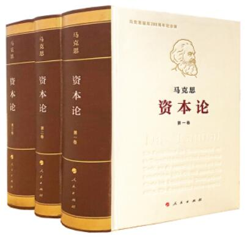

# 马克思关于资本主义的论断

政治经济学是研究生产关系的，而生产关系是生产、交换、分配、消费四个环节的关系的总和。

社会科学的立场性在这个部分表现的很突出。在马克思主义以前，已经有了政治经济学：古典政治经济学又称古典经济学、资产阶级古典政治经济学。不过这是资产阶级的政治经济学。资产阶级政治经济学把“国民财富”作为研究对象，只讲物与物的关系，不讲人与人的特殊社会关系，把资本主义生产关系看成自古有之，永恒存在的东西。亚当·斯密所著的《国富论》把资本主义经济学发展成一个完整的体系，书中批判了重商主义把对外贸易作为财富唯一源泉的片面观点，斯密把经济研究从流通领域拓展到生产领域。

马克思通过创作《资本论》，实现了政治经济学的根本革命，为政治经济学的发展作出了划时代的贡献。《资本论》明确把资本主义生产关系作为研究对象，并以唯物辩证法作指导，运用科学抽象法进行研究，从而第一次科学地确立了政治经济学的对象和方法。《资本论》在批判资产阶级古典政治经济学的价值论的基础上，创造性地分析了劳动的二重性，建立了科学的劳动价值论，从而为政治经济学奠定了理论基础。 

<center>
    
</center>

```note
资本论的中文译本三大厚本，每本都和新华字典差不多，真要看完得好好花点时间。考研政治里经济学的内容是对资本论高度的浓缩，用比较小的篇幅传达了《资本论》里最核心的内容，资本论mini吧，还是很猛的。可以在比较短的时间内大概理解核心思想和概念。

政治经济学最终的落脚点是政治，也即马克思主义政治经济学是有着鲜明的立场的，是要说明资本主义必将灭亡的。  

政治经济学要谈两个问题：**简单商品经济**和**发达商品经济**。而发达商品经济内在又有两个阶段：自由竞争阶段、垄断阶段。（可以认为在资本主义社会出现之前是简单商品经济）

简单商品经济围绕**价值**展开，发达商品经济也即资本主义阶段围绕**剩余价值**展开。  
```

这一块可以说是既理论又实际。讲述了从原始人开始，物物交换，出现货币，再后来社会分工，有了小老板雇佣工人，攒钱做大，变成大老板，再后来再某个行业垄断，再到资本主义国家的"商而优则仕"。可以说是一个人完整的发家史。

当然马克思是要去探讨这个过程中的人与物、人与人之间的关系。

## 价值规律与简单商品经济

这一部分大概就是经济这个东西是哪来的。从原始人，开始分工合作交换东西，到商品经济形成过程中伴随的一系列新的东西，都要下一个比较准确的定义，方便后面设于剩余价值理论的展开。

- 商品经济产生的历史条件
    - 1.存在社会分工；
    - 2.生产资料和劳动产品属于不同的所有者。
>商品经济，做出来东西是为了卖钱，这就是商品经济。小农经济自给自足，就不会有商品经济。社会分工存在，然后各取所需来交换。

---


### 价值是什么
>是抽象劳动

- 商品的二因素：使用价值和价值。
- **使用价值**是指商品能满足人们某种需要的属性，即商品的有用性，反映人与自然之间的物质关系，是商品的自然属性，是一切劳动产品共有的属性。使用价值构成社会财富的物质内容。
- **价值**是凝结在商品中的无差别的一般人类劳动，即人类脑力和体力的耗费。价值是商品特有的社会属性。
- 交换价值：使用价值是交换价值的物质承担者。价值是交换价值的基础，交换价值是价值的表现形式。交换价值首先表现为一种使用价值同另一种使用价值相交换的量的关系或比例。决定商品交换比例的不是商品的使用价值，而是价值。
- 使用价值和价值的关系：二者不可兼得，且缺一不可。
- 劳动的二重性：商品是劳动产品，生产商品的劳动可区分为具体劳动和抽象劳动。具体劳动是指生产一定使用价值的具体形式的劳动，即有用劳动。抽象劳动是指撇开一切具体形式的、无差别的一般人类劳动，即人的体力和脑力的耗费。
- “劳动的二重性”和“商品的二因素”的关系：具体劳动形成商品的使用价值，抽象劳动形成商品的价值实体。具体劳动和抽象劳动是同一劳动的两种规定。任何一种劳动，一方面是特殊的具体劳动；另一方面又是一般的抽象劳动。这就是劳动的二重性，它决定了商品的二因素。

```note
使用价值是自然属性，所有劳动产品都有的。使用价值=有用处，价值=值多少劳动，交换价值=用多少货币。

价值是劳动，不是劳动所得的东西就没有价值。白拿的东西不值钱，但可能有用，比如空气。常讲的这个人（物质）条件不错大概指的就是家里有用的东西多。

交换价值是掏多少钱买，有用才掏钱（使用价值是物质承担者），值钱才能谈掏多少钱（价值是交换价值的基础），掏多少钱出来就是值多少钱的直观体现（交换价值是价值的表现形式）。

使用价值和价值，比如房子，要么拿来住，要么卖了换钱。“商品房”。所以对于只有一套市中心的房子的人来说，充分体现了什么叫使用价值和价值不可兼得。

马克思认为商品具有两因素，这是因为生产商品的劳动有二重性：具体劳动抽象劳动。因为劳动具有二重性，所以劳动做出来的商品有两因素。具体劳动，人与自然关系，使用价值，商品的自然属性；抽象劳动，生产者与社会的关系，价值，商品的社会属性。

世界上这么多商品，怎么衡量价值呢？前面回答了价值是劳动，那么肯定就是用劳动衡量了，具体用什么劳动呢？来看看
```

---

### 价值如何衡量

- 决定商品价值量的因素：决定商品价值量的不是生产商品的个别劳动时间，而是**社会必要劳动时间**。社会必要劳动时间是指在现有的社会正常生产条件下，在社会平均的劳动熟练程度和劳动强度下制造某种使用价值所需要的劳动时间。

- 商品价值量与劳动生产率的关系：生产商品所需要的社会必要劳动时间随着劳动生产率的变化而变化。商品的价值量与生产商品所耗费的劳动时间成正比，与劳动生产率成反比。

- 影响劳动生产率的因素主要包括：劳动者的平均熟练程度、科学技术的发展程度及其在生产中的应用、生产过程的社会结合、生产资料的规模和效能以及自然条件等。

- 简单劳动与复杂劳动：形成商品价值量的劳动是以简单劳动为尺度计量的。复杂劳动等于自乘的或多倍的简单劳动。复杂劳动转化为简单劳动，是在商品交换过程中自发实现的。

>商品有简单有复杂。劳动强度不客观，劳动时间去衡量价值。
>价值量和劳动生产率这个事情很好理解，速度=路程/时间 的关系。

>个别劳动生产率，社会生产率。[后面还会说](#当代资本主义的新变化) 这个问题，也挺有意思

---

### 价值如何表现

>为什么只有“价值如何表现”，没有“使用价值如何表现”，因为使用价值，即一个东西的用处直接就看出来了。但是价值，即值多少钱，看不出来，换完以后别人掏钱给我了，才知道值多少钱即价值了。这里实际上是在讲交易的历史。

- 商品的价值形式的发展经历了四个阶段：简单的或偶然的价值形式、总和的或扩大的价值形式、一般的价值形式以及货币形式。
>简单和偶然，原始社会，物物交换，交换的东西双方互相需要，还能遇见，数量还正好够，但是一旦发生，价值就被表达出来了。后来，找了个等价物，比如🐏，换其他的。再后来，贵金属，金银来了，货币时代，终极完备形式，价值靠货币来表达了。

- 货币的本质：商品的交换是以货币为媒介的，货币是在长期交换过程中形成的固定地充当一般等价物的**商品**。

- 货币的职能：货币有五种基本的职能，即**价值尺度、流通手段、贮藏手段、支付手段和世界货币**。其中，价值尺度和流通手段是货币的两个最基本的职能。
>现在还是货币（贵金属）时代，没到纸币时代。
>价值尺度：因为货币也是商品，可以衡量其他商品价值，比如说衡量一辆车10万，说完10万大概就知道多贵了，不用掏出来，观念货币。
>流通手段：货币作为媒介，必须真钱，现实货币（区别观念货币），不足值也行，因为转一圈最后要换成东西的，牛逼的人就开始演绎了，既然可以不足值，干脆让他一点钱都不值好了，纸币就出现了，零价值（经济学里的理想模型）。
>贮藏手段，我家有好多货币，作为财富不流通保存起来，必须足值。所以说作为财富的东西一定要有价值，家里屯纸币肯定是不行的，因为纸币零价值。纸币换成金银货币或者其他价值实物金融资产，这些，而且要足值，才能叫财富。
>支付手段，货币用来支付、还债等等。区别流通手段（有现货交易），支付手段可以理解成合同约定用货币支付，清偿这种的。

>劣币驱逐良币：买东西，一两金锭，底上刻着“一两”，我不小心磕了一小块，不足值了，拿去买东西，老板也不会介意的，因为就是过一下，他也会花出去的。所以有人就搞假冒伪劣的，不足值，最后大家都用劣币了。这是经济学现象，在往上衍生，也可以成为一个社会学现象。
>纸币不可以执行价值尺度的功能，注意，纸币是零价值的。
>相对应的，贮藏手段一定要用足值货币，

- 货币的产生使整个商品世界分化为两极：一极是各种各样的具体商品，它们分别代表不同的使用价值；另一极是货币，只代表商品的价值。

- 货币产生后，商品内在矛盾的外化：货币产生后，商品内在的使用价值和价值的矛盾就发展成为外在的商品和货币的矛盾。货币的出现有利于解决商品交换的困难，促进了商品经济的发展。但是，货币的出现并没有也不可能解决商品经济的基本矛盾，反而使矛盾更加扩大和加深了。

>货币是固定充当等价物的贵金属，🐏、贝壳充当等价物不能叫货币，货币仅仅指的金银贵金属。马克思《资本论》原话：金银天然不是货币，货币天然是金银。别人充当等价物不能叫货币，金银充当等价物才能叫货币。

---

### 价值有何规律
>内容，表现形式、作用

- 价值规律的基本**内容**和客观要求：
    - 1.商品的价值量由生产商品的社会必要劳动时间决定；
    - 2.商品交换以价值量为基础，按照等价交换的原则进行。
>大家都不吃亏

- 价值规律的**表现形式**：商品的价格围绕商品的价值**自发**波动。从较长时间来看，价格高于价值的部分和价格低于价值的部分能够相抵，商品的平均价格和价值是一致的。
>自发和自觉这两个词，注意区别。价格，价值，币值，币值越高价格越低，这是国际视野了。人民币去美国欧洲币值就不太行，但是去了东南亚非洲，感觉还是挺有钱的。但是，商品本身价值是决定因素。

- 价值规律的积极作用：
    - 1.自发地调节生产资料和劳动力在社会各生产部门之间的分配比例；
    - 2.自发地刺激社会生产力的发展；
    - 3.自发地调节社会收入分配。
- 价值规律的消极作用：
    - 1.可能导致垄断的发生，阻碍技术的进步；
    - 2.可能引起商品生产者收入两极分化；
    - 3.可能导致社会资源浪费。
>市场无形的手，价值规律的手，哪里有钱赚，哪里就有人去，而且争先恐后的改良技术，赚超额剩余价值。但是发展到后期，会出问题，比如阿里巴巴腾讯，垄断，支付接口的问题。
>价值规律也是盲目的，一下子涌进去的人多了，大量项目上马，过度投资，太多了，也容易出问题。


### 私有制基础上商品经济的基本矛盾

>这个基本矛盾，基本，前面讲了好多矛盾给，商品价值与使用价值、具体劳动和抽象劳动、个人劳动时间和社会必要劳动时间。为啥会有呢？根源于这个基本矛盾。因为基本矛盾的存在，衍生出上面的矛盾。

- 私有制商品经济的基本矛盾：**私人劳动和社会劳动的矛盾**。
>一个劳动，既是又是的关系，很熟悉了。从私有制来看，私人劳动，自己干自己的，随便干，几点起都行；但是从社会分工的角度看，又是有约束的，每天睡到11点不上班，这还干个屁。

- 商品经济基本矛盾的发展：私人劳动和社会劳动的矛盾在资本主义制度下，进一步发展成资本主义的基本矛盾，即**生产资料资本主义私人和占有生产社会化之间的矛盾**。正是这一矛盾的不断运动，才使资本主义制度最终被社会主义制度所代替具有了客观必然性。
>《资本论》的目的就是研究资本主义，通过严谨的论证的，这不是在诅咒资本主义，说你必死必死，就得死，不是这样的。这是理论的，这句话有5遍。

- 马克思在继承英国古典政治经济学劳动创造价值理论的同时，**创立**了“劳动二重性理论”。
>古典政治经济学，资本主义经济学，价值有劳动创造早就有了，但是分成具体劳动和抽象劳动是马克思原创的。

- 深化对马克思劳动价值论的认识：
    - 第一，深化对创造价值的劳动的认识，对生产性劳动作出新的界定。
    - 第二，深化对科技人员、经营管理人员在社会生产和价值创造中所起的作用的认识。
    - 第三，深化对科技、知识、信息等新的生产要素在财富和价值创造中所起作用的认识。
    - 第四，深化对价值创造与价值分配关系的认识。
>呼吁性的东西。马克思那个年代劳动是产业工人的劳动如炼钢的，现在服务业如餐饮按摩的也是劳动，以前资本家也是管理人员，现在资本家只投资，现在管理企业的也是打工是劳动人，和传统资本家还不太一样。劳动创造价值没错，但是科技、知识在创造价值中也是不可估量的。价值创造和价值分配是不匹配的，如果真是这样，那资本家就得死了。。。可以适当的分你资本家一点点。


## 发达商品经济：自由竞争阶段

这个时期，大概是讲的小工厂的老板的故事。一个人，通过自己的努力搞了个工厂，雇了几个工人，努力攒钱，不断把小工厂开大，开成大一点的厂。

在这个小老板做生意的过程中涉及到的人与物的关系、人与人之间的关系。

### 资本主义经济制度的本质

- 资本主义经济制度的产生
    - 资本主义生产关系萌芽的途径：一是从小商品经济分化出来；二是从商人和高利贷者转化而来。
    - 资本原始积累的途径：所谓资本原始积累，就是生产者与生产资料相分离，资本迅速集中于少数人手中，资本主义得以迅速发展的历史过程。资本原始积累主要通过两个途径进行：一是用暴力手段剥夺农民土地；二是用暴力手段掠夺货币财富。
    - 资本主义生产方式的确立：进行了资产阶级革命，实现了产业革命，最终建立起资本主义生产方式。


```note
资本主义生产关系哪来的？小商品经济分化出来，就是说做买卖越做越大，把做的差的收回来当工人，还有一个是从商人和高利贷，做买卖做亏了，还不起，连人带商铺成别人的了。

对于原始资本积累，也是两个条件：暴力手段剥夺农民土地，农民没地了就只能打工当工人；暴力手段掠夺货币财富，中国也是这个的受害者。

资本主义生产力和生产关系进一步发展，对上层建筑的彻底变革提出需求。经过资本主义革命，建立资产阶级的政治统治，实现产业革命，生产力生产关系空前大发展，建立起资本主义生产方式。
```

#### 资本家的货币变成资本

- 劳动力成为商品与货币转化为资本
    - 劳动力的概念：劳动力是指人的劳动能力，是人的体力和脑力的总和。劳动力的使用即劳动。
    - 劳动力成为商品的基本条件：第一，劳动者是自由人；第二，劳动者没有别的商品可以出卖，“自由”得一无所有。
    - 劳动力商品的价值：劳动力商品的价值，由生产、发展、维持和延续劳动力所必需的生活必需品的价值决定。劳动力价值的构成包含历史的和道德的因素，所以劳动力价值的最低界限是由生活上不可缺少的生活资料的价值决定的。它包括三个部分：
        - 1.维持劳动者本人生存所必需的生活资料的价值；
        - 2.维持劳动者家属的生存所必需的生活资料的价值；
        - 3.劳动者接受教育和训练所支出的费用。
    - 劳动力商品的使用价值：劳动。
    - 货币转化为资本的条件：劳动力成为商品。
>劳动者出售的是劳动力不是自己。劳动力也是商品了。我只有劳动力，我不卖劳动力我就得死了。商品有价值和使用价值，劳动力也有。劳动力价值，让我和我家人能活下去的吃饱穿暖最少需要的钱，以及学习成本。历史道德，不同时期不同地方，劳动力价值有波动，所谓的大城市工资高大概就表达这个意思。
>劳动力商品买回来就是劳动，劳动是价值的源泉。打工人的用处就是劳动，劳动就是赚钱，打工人劳动就是在给资本家赚钱。货币所有者买到打工人，就可以压榨打工人，让打工人的劳动力给自己赚钱了，这时候资本就增值了。所以，货币不会增值，资本才会增值。

>资本主义所有制的实质：资本家凭借对生产资料的占有，在等价交换原则的掩饰下，雇佣工人从事劳动，占有工人剩余价值。

#### 打工人剩余价值的生产

---
>一个做包子的资本家，买面40元，雇个工人：20元，干4小时活，做出来卖60块。这资本家当的不行，自己一点没赚。
>一个做包子的资本家，买面80元，雇个工人：20元，干8小时活，做出来卖120块。这次资本家装了20块，可以合格了。

>劳动力的价值，一个历史时期，维持这个工人的物质资料的价值，也就是说给你的钱够你活下去。所以，工资就这么点。
>资本家赚的20元就是剩余价值$$m$$。

从劳动的方面看，
- 具体劳动，**转移**了面粉的价值到包子里，生产了包子的使用价值。
- 抽象劳动，生产新价值。//上面例子，工人创造了40块钱的新价值，世界上80块钱的面变成了120的包子。

从资本的方面来看
- 不变资本$$c$$：买面的80，借助具体劳动转移到最终产品去，不会增值。
- 可变资本$$v$$：买工人的20，由工人劳动再创造出来，能够增值，并带来剩余价值$$m$$
- 剩余价值率$$ m'=m/v $$

从时间来看，一天8小时
- 前4个小时，为自己劳动，创造劳动力价值（工资），必要劳动时间
- 后4个小时，为资本家劳动，创造剩余价值，剩余劳动时间。

如果资本家想赚更多钱，也就是说积累更多剩余价值，那么可以很直接的加班996，9116都行。然后政府说不准加班。那就换个思路，提高工作效率，延长剩余劳动时间。绝对剩余价值生产是直接的压榨，相对剩余价值是相对压榨。

至于超额剩余价值，率先提高生产率，部分资本家就可以多赚钱了。超额剩余价值没办法长久存在的，但是全社会都有后，就都有相对剩余价值了。

>现在，生产自动化也有很多，出现了各种无人车将、自动化社会、自动控制的东西，有人说你看看资本家我现在没剥削了，想否定马克思的理论。马克思说：不存在绝对的无人，设备维护也得要人的吧。其次表面没剥削，但是你剥削了生产制造这些机器设备的人的劳动，剥削转移了。
>这马克思说的不就是机械制造、电气自动化的工人嘛😂。
---
>书上比较复杂的论述。

- 剩余价值的生产
    - 资本主义生产过程的两重性：一方面是物质资料的生产过程；另一方面是剩余价值的生产过程，即价值增殖过程。资本主义生产过程是劳动过程和价值增殖过程的统一。其中，价值增殖过程是剩余价值的生产过程，这是资本主义生产过程的主要方面。

(2)剩余价值的概念：剩余价值是雇佣工人所创造的并被资本家无偿占有的超过劳动力价值的那部分价值。它是雇佣工人剩余劳动的凝结，体现了资本家与雇佣工人之间剥削与被剥削的关系。
(3)必要劳动时间和剩余劳动时间的关系：工人的工作日包括必要劳动时间和剩余劳动时间。在价值增殖过程中，雇佣工人的劳动分为两部分：一部分是必要劳动，用于再生产劳动力的价值；另一部分是剩余劳动，用于无偿地为资本家生产剩余价值。
(4)资本的本质：资本是可以带来剩余价值的价值。剩余价值是由雇佣工人的剩余劳动创造的。在资本主义社会里，资本总是通过各种物品表现出来，但资本的本质不是物，而是一定的历史社会形态下的生产关系。
(5)不变资本(c)和可变资本(v)的概念：不变资本是以生产资料形态存在的资本，它通过工人的具体劳动转移到新产品中，其转移的价值量不会大于它原有的价值量。
可变资本是用来购买劳动力的那部分资本，在生产过程中不是被转移到新产品中，而是由工人的劳动再生产出来。在再生产过程中，.工人所创造的新价值，..丕仅包括相当于劳动力价值的价值，而且还包括一定量的剩余价值。
(6)把资本区分为不变资本和可变资本的意义：这种划分进一步揭示了剩余价值的源泉，为确定资本家对雇佣劳动者的剥削程度提供了科学依据。它表明，雇佣劳动者的剩余劳动是剩余价值的唯一源泉。剩余价值既不是由全部资本创造的，也不是由不变资本创造的，而仅仅是由可变资本雇佣的劳动者创造的。
(7)剩余价值率的计算公式：资本家对工人的剥削程度，可以用剩余价值率表示：$$m'=m/v$$。
(8)绝对剩余价值：在必要劳动时间不变的条件下，由于延长工作日的长度而生产的剩余价值。
(9)相对剩余价值：在工作日长度不变的条件下，通过缩短必要劳动时间而相对延长剩余劳动时间所生产的剩余价值。缩短必要劳动时间是通过提高全社会的劳动生产率实现的。
(10)超额剩余价值：企业由于提高劳动生产率而使商品的个别价值低于社会价值的差额。
(11)生产自动化条件下剩余价值的源泉：雇佣工人的剩余劳动仍然是超额剩余价值的唯一源泉。
>资本主义生产过程，从打工人来看我在不停劳动，从资本家角度来看是钱在不停变多，这就是生产过程的两重性。


#### 打工人剩余价值的积累

- 资本积累的含义：把剩余价值转化为资本，或者说剩余价值的资本化，就是资本积累。
- 资本主义简单再生产的含义：资本家获得剩余价值后，如果将其全部用于消费，则生产就在原有规模的基础上重复进行。资本主义简单再生产是物质资料再生产和资本主义生产关系再生产的统一。
- 资本主义扩大再生产的含义：资本家将获得的剩余价值的一部分转化为资本，使生产在扩大规模上重复进行。
>前面卖包子，面80工人20，包子买了120，赚了20。如果这个资本家把赚的20享受了，这个资本家就没有积累。真正的资本家，要扩大规模，忍着不花，第二天用120块钱，买100的面，卖150的包子。

- 资本积累的本质：资本家不断地利用无偿占有的工人创造的剩余价值来扩大自己的资本规模，进一步扩大和加强对工人的剥削和统治。
- 影响资本积累的因素：对工人的剥削程度、劳动生产率的高低、所用资本和所费资本之间的差额以及资本家垫付资本的大小（本金）。显然，这些都是加强和扩大对工人剥削的影响因素。
>现在的资本家，拼的是本金，感觉实体经济，工业部分利润率，可能也就百分之十几这个样子。但是规模大，投进入三五千万，这一年就几百万。所以造成有钱的人越容易赚钱。可是如果5000万存银行，一年6%的利息，收益300万，这是最low的方式。靠钱赚钱，资本主义就这个样子。。。

- 资本积累的初步后果：资本积累加剧社会的两极分化，一极是财富越来越集中于少数人手中；另一极是多数人只拥有社会财富的较小部分。资本积累不但是社会财富占有两极分化的重要原因，而且是资本主义社会失业现象产生的根源。
- 资本积累学说的意义：揭露了资本主义制度下贫富两极分化的原因，揭示了资本主义失业现象的本质，深刻阐明了资本主义制度必然灭亡的历史命运。

- 资本**技术构成**的含义：由生产的技术水平所决定的生产资料（面）和劳动力（工人）之间的比例，叫作资本的技术构成。
- 资本**价值构成**的含义：从价值形式上看，资本可分为不变资本（面）和可变资本（雇人），这两部分资本价值之间的比例，叫作资本的价值构成。
- 资本**有机构成**的含义：由资本的技术构成决定并反映技术构成变化的资本价值构成，叫作资本的有机构成，通常用$$ c:v $$来表示。在资本主义生产过程中，资本有机构成呈现不断提高的趋势，这是由资本无限追逐剩余价值的本性决定的。
>技术构成：物比物；价值构成：钱比钱。
>因为技术构成变了，导致价值构成变了，这时候这个价值构成就是价值构成。
>生产中，有机构成提高的趋势，大概是因为设备愈来愈多，厂房越来越多。自动化程度越来越高，工人越来越少，工人不就失业了。这就是失业理论。然后贫富差距拉大，资本主义必将灭亡，第二次灭亡。再喊一次。

- 相对过剩人口的形成：资本的有机构成提高，可变资本相对量减少，资本对劳动力的需求日益相对地减少，结果就不可避免地造成大批工人失业，形成相对过剩人口。相对过剩人口基本有三种形式：流动的过剩人口，潜在的过剩人口、停滞的过剩人口。经常性的庞大失业人口的存在，是资本主义的痼疾。

- 资本积累的终极后果：资本积累的历史趋势是资本主义制度的必然灭亡和社会主义制度的必然胜利。
>有人说，按照这个推理，社会主义也是这样啊，也推出灭亡啊。这当然不可以，这是有立场的，对于资本主义制度来讲，这是顽疾，这是伴随这个制度的，系统bug。社会主义不一样啊，我们的失业是发展中的问题，当然可以解决，靠进一步深化改革，坚持党的领导，发展生产力。这个逻辑很通畅的。

>资本主义扩大再生产的源泉：资本积累
>资本积累的源泉：剩余价值


#### 剩余价值的流转

- 资本循环的含义；资本循环是资本从一种形式出发，经过一系列形式的变化，又回到原来出发点的运动。
- 产业资本在循环过程中经历的三个不同的阶段以及执行的三种不同的职能：第一个阶段是购买阶段，产业资本执行的是货币资本的职能；第二个阶段是生产阶段，产业资本执行的是生产资本的职能；第三个阶段是售卖阶段，产业资本执行的是商品资本的职能。
>采购——生产——销售，钱转一圈就来一圈的利润。

- 产业资本运动具备的两个基本前提条件：一是产业资本的三种职能形式必须在空间上并存；二是产业资本的三种职能形式必须在时间上继起。
>采购生产销售钱均匀分布的，空间上并存，一环扣一环，扣不住那就是资金链断裂，东西没卖出去坏了，砸手上了。

- 资本周转的含义：资本是在运动中增殖的，资本周而复始、不断反复的循环，叫作资本的周转。
- 影响资本周转快慢的关键因素：一是资本周转时间；二是生产资本中固定资本和流动资本的构成。
>资本转一圈，一份利润，转的快就赚的多。固定资本就是分多次转移才能到产品里的（机器设备），流动资本就是一次就不见了，转移到产品里了（电子元件）。流动资本越大，资本家赚钱越快。

- 社会再生产的核心问题：社会总产品的实现问题，即社会总产品的价值补偿和实物补偿问题。
- 社会再生产顺利进行的条件：社会总产品在物质形态上划分为两大部类，即第Ⅰ部类和第Ⅱ部类。第Ⅰ部类由生产生产资料的部门构成，第Ⅱ部类由生产消费资料的部门构成。社会再生产顺利进行，要求生产中所耗费的资本在价值上得到补偿，同时要求实际生产过程中所耗费的生产资料和消费资料得到实物的替换，这在客观上就要求两大部类内部各个产业部门之间和两大部类之间保持一定比例关系。
>社会再生产，刚刚是聊的个别资本家。现在是整个社会的资本家，整个经济怎么运转。价值补偿指的是所有资本家造出来的东西要能卖出去，实物补偿是材料能补充上。
>研究整个社会再生产，马克思做了个假设，划分了两个部类，生产生产资料和生产生活资料。所有商品价值$$ I_{(c)}+I_{(v)}+I_{(m)} $$，第二部类商品价值也是$$ II_{(c)}+II_{(v)}+II_{(m)} $$接下来要开始交换了，要求$$ I_{(v)}+I_{(m)} = II_{(c)} $$社会才能有效运转，其他的部类消化。最好是相等，但是往往不是，多一点还好，等式严重失衡，生产出来的东西过剩。资本主义经济危机的发生，实际上是以强制方式解决社会再生产问题，但是造成极大的资源浪费。

> 马克思把资本家垫付资本做的好几次划分
> 
>|划分   |划分结果                 |划分的依据|
>|------|-------------------------|-------|
>|第一次|不变资本、可变资本         |资本在生产中是否增殖|
>|第二次|货币资本、生产资本、商品资本|资本在循环中的职能|
>|第三次|固定资本和流动资本         |转移到最终产品中的方式|
>
>区分固定资本和流动资本：经过一次劳动后还存在的是固定资本。

#### 剩余价值的分配
>生产结束了，各类资本家过来分钱了。商业资本家分到商业利润、产业资本家分到产业利润、银行资本家获得利息、土地所有者获得租金。那么打工人呢？微薄的工资维持生计。

- 工资的本质：在资本主义制度下，工人工资是劳动力的价值或价格。
- 工资的表现形式：工资表现为“劳动的价格”或工人全部劳动的报酬，这就模糊了工人必要劳动和剩余劳动的界限，掩盖了资本主义的剥削关系。
>资本家会说，你干嘛说我剥削你，你给我劳动，我给你钱了啊。这明明是等价交换，马克思说不是的，你没给够，你这剩余价值也是我创造的。


>资本家为了掩盖剥削，创造一系列概念，下面的都是

- 成本价格的概念：资本家的垫付资本，从量上说等于$$ c+v $$
>资本家没有什么可变不变，都是成本，就投资了这么多。

- 利润的概念：资本家并不把剩余价值看作可变资本的产物，而是把它看作全部垫付资本的产物或增加额，剩余价值便取得了利润的形态。剩余价值是利润的本质，利润是剩余价值的转化形式。//就是剩余价值
>量上一样，实际也相同。但是资本家把这部分叫利润$$ r $$。

- 利润率的计算公式：利润率=利润/垫付资本= $$ r/(c+v) $$。
- 平均利润与平均利润率的含义：不同部门之间如果利润率不同，资本家之间就会展开激烈的竞争，使资本从利润率低的部门转向利润率高的部门，从而导致利润率平均化，不同部门的资本家集团按照等量资本获得等量利润的原则来瓜分剩余价值。按照平均利润率来计算和获得的利润，叫作平均利润。
>如农业利润20%，工业部门利润40%，然后人们就涌入工业部门，逐渐走到哪利润就都是30%了。最后一样的钱投到哪个行业都成30%了，这是行业之间竞争形成的。

- 生产价格的概念：商品的成本价格与平均利润之和。
>生产价格是带利润的，亏本卖的意思是，赚的比原来少就是亏本。要有这个思维，没这个思维就不适合当资本家。比如说投资200万，搞了一年还是200万，保住了本？这都亏成啥样了，这钱放银行都在变多的，这亏大了。
>价值规律：简单商品经济，表现形式：价值决定价格；自由竞争资本主义时期，表现形式：价格围绕生产价格波动。
>超额利润，前面有个超额剩余价值，这两个是一个东西。资本家叫这个超额利润。

>但平均利润率形成以后，超额利润仍然存在，因为平均利润率是行业间形成的，而超额利润是行业内企业间形成的。

- 剩余价值的分配：在利润平均化规律的作用下，产业资本家获得产业利润，商业资本家获得商业利润，银行资本家获得银行利润，农业资本家获得农业利润。

- *马克思剩余价值理论的意义*：剩余价值理论深刻揭露了资本主义生产关系的剥削本质，阐明了资产阶级与无产阶级之间阶级斗争的经济根源，指出了无产阶级革命的历史必然性。马克思在分析剩余价值的生产、积累、流通以及分配过程，揭示资本主义经济特殊规律的同时，也揭示了商品经济和社会化生产的一般规律。

>通过这个理论告诉工人，价值都是你们创造的，拿起枪去斗争。

#### 资本主义的基本矛盾与经济危机
- 资本主义的基本矛盾：生产社会化和生产资料资本主义私人占有之间的矛盾，是资本主义的基本矛盾。这是生产力和生产关系之间的矛盾在资本主义社会的具体体现。
>生产之间需要合作，但是东西归每个个人。

- 经济危机的本质特征：生产相对过剩。相对过剩是指相对于劳动人民有支付能力的需求来说社会生产的商品显得过剩，而不是与劳动人民的实际需求相比的绝对过剩。
>倒牛奶，不是真的不需要，

- 经济危机的可能性：是由货币作为支付手段和流通手段引起的。但是这仅仅是危机在形式上的可能性。
>如果没有货币，物物交换，永远不会有经济危机。有了货币，各种通缩，有巨大影响。

- 经济危机爆发的根本原因：资本主义的基本矛盾。这一基本矛盾具体表现为两个方面：第一，生产无限扩大的趋势与劳动人民有支付能力的需求相对缩小的矛盾；第二，个别企业内部生产的有组织性和整个社会生产的无政府状态之间的矛盾。
>企业越来越大，工人就那么点钱。企业内部有组织，但是全社会是盲目的，自己决定。

- 经济危机爆发的阶段：危机、萧条、复苏和高涨。资本主义的再生产不一定都经过这四个阶段，.但是危机阶段是必经阶段，没有危机阶段，就不存在资本主义再生产的周期性。


### 资本主义政治制度和意识形态

>前面经济就忘了，这里开始看看政治、文化。

- 资本主义国家及政治制度
    - 资本主义国家的职能：包括对内和对外两个基本方面，即对内实行政治统治和社会管理，对外进行国际交往和维护国家安全及利益。
    - 资本主义民主制度：资本主义民主制度是与资本主义生产方式相适应而发展起来的。资产阶级提出了符合自身利益和要求的“主权在民”“天赋人权”“分权制衡”“社会契约”“自由、平等、博爱”等政治思想。
    - 资本主义法制：宪法是资本主义国家法律制度的核心，它所依据的基本原则：私有制原则、“主权在民”原则、分权与制衡原则和人权原则。
    - 资本主义政权组织形式：资本主义国家政权采取的是分权制衡的组织形式，即国家的立法权、行政权、司法权分别由三个权力主体独立行使，形成各主体之间的“制衡”。


- 资本主义政治制度的进步作用和局限性
    - 局限性：
        - 第一，资本主义的民主是金钱操纵下的民主，实际是资产阶级精英统治下的民主。
        - 第二，法律名义上的平等掩盖着事实上的不平等。
        - 第三，资本主义国家的政党制是一种维护资产阶级统治的政治制度，其多党制则是资产阶级选择自己的国家管理者、实现其内部利益平衡的政治机制。
        - 第四，政党恶斗相互掣肘，决策效率低下，激化社会矛盾。
    - *进步作用*：
        - 第一，资本主义的政治制度作为上层建筑，在战胜封建社会的小生产方式，保护、促进和完善资本主义生产方式方面起着重要作用，推动了社会生产力大幅度发展，促进了社会进步。
        - 第二，资本主义政治制度使人民群众享有了比在封建专制主义条件下更多的社会政治自由，因而历史性地促进了人的发展，促进了人类的进步。
        - 第三，资本主义政治制度在其历史发展进程中积累了相当丰富的政治统治和社会管理的经验，这对于社会进步同样具有士分重要的积极意义。
>表面民主，政党维护的是资产阶级的利益。

- *资本主义意识形态的本质及其评价*
    - 资本主义意识形态的本质：
        - 第一，资本主义意识形态是资本主义社会条件下的观念上层建筑，是为资本主义社会形态的经济基础服务的；
        - 第二，资本主义意识形态是资产阶级的阶级意识的集中体现。
    - 对资本主义意识形态的评价：对于资本主义的意识形态，应该用辩证的观点来分析。资本主义社会在长期发展中创造了大量的物质财富和精神成果，推动了历史前进。但资本主义意识形态是为资产阶级的阶级剥削和阶级压迫服务的。因此，资本主义意识形态具有极大的阶级历史局限性，对此我们必须加以分析、批判和摒弃。

>从这开始，马克思写的主体政经内容就没了。后面就是出自恩格斯列宁之手。
>马克思哲学上的两大贡献：唯物辩证主义，唯物史观
>马克思的两大理论贡献：唯物史观，剩余价值学说


## 发达商品经济：垄断资本主义

```note
前面是小老板，这里小老板里面有做的厉害的，做成大老板，和超级大老板。出现了各种顶尖超级公司。

这时候，老板当的差不多了，精神境界也就起来了，不满足于管理一个公司了，是时候考虑参与政治了。

经典的比如，唐纳德·特朗普是特朗普集团董事长及总裁，也是特朗普娱乐公司的创始人，在全世界经营房地产、赌场和饭店。
```

- 资本主义发展经历的两个阶段：自由竞争资本主义和垄断资本主义。垄断资本主义的发展包括**私人垄断资本主义**和**国家垄断资本主义**两种形式。

### 垄断资本主义的形成

#### 基本概念

- 垄断形成的方式：生产集中和资本集中的含义。
    - 生产集中：生产资料、劳动力和商品的生产日益集中于少数大企业的过程，其结果是大企业在社会生产中所占的比重不断增加。
    - 资本集中：大资本吞并小资本，或由许多小资本合并成大资本的过程，其结果是越来越多的资本为少数大资本家所支配。
>工厂越开越大，某个人钱越来越多。


- 垄断的含义：少数资本主义大企业为了获得高额利润，通过相互协议或联合，对一个或几个部门商品的生产、销售和价格进行操纵与控制。
- 垄断的产生的原因：1.为了获得高额利润；2.形成对竞争的限制；3.为了避免两败俱伤，企业之间联合起来。
- 垄断的组织形式：常见的垄断组织有国际卡特尔、辛迪加、托拉斯和康采恩等。最简单的、初级的垄断组织形式；短期价格协定。
- 垄断的本质：通过联合实现独占和瓜分商品生产和销售市场，操纵垄断价格，以攫取高额垄断利润。


- 垄断条件下仍然存在竞争的原因：
    - 1.垄断没有消除产生竞争的经济条件(即私有制)；
    - 2.垄断必须通过竞争来维持；
    - 3.是不存在由一个垄断组织囊括一切部门、一切社会生产的绝对垄断。
- 垄断条件下竞争的特点：
    - 1.垄断条件下竞争的主要目的是获得高额垄断利润，并不断巩固和扩大已有的垄断地位。
    - 2.垄断条件下竞争的手段更加多样，不仅采取经济手段，还采取非经济的手段，使竞争变得更加复杂、激烈。
    - 3.在垄断时期，竞争的规模扩大，范围遍及各个领域和部门，并由国内扩展到国外。
>垄断，仍有竞争。


#### 金融资本和金融寡头
>随着垄断企业越来越来大，一个大规模企业，靠一个人的钱肯定不行，要维持这个企业，往往需要借助资金的融通借贷之类的，出现了一些配套的东西，比如金融资本。所以没了这些配套的资本，企业扩张还挺难。

- 金融资本的含义：是由**工业垄断资本**和**银行垄断资本**融合在一起而形成的一种垄断资本。
- 金融资本形成的主要途径：金融联系、资本参与、人事参与。

```note
金融联系：企业缺钱，找银行借钱，就建立起金融联系。

资本参与：你给我钱，我给你一部分股份。

人事参与：你给我钱，然后派来几个人做高层，参与管理。

金融资本说白了就是钱生钱的主要途径。
```

- 金融寡头的含义：是指操纵国民经济命脉，并在实际上控制国家政权的少数垄断资本家或垄断资本家集团。
- 金融寡头的统治方式：
    - 对经济的控制，主要是通过“参与制”(金融寡头通过掌握一定数量的股票来层层控制企业的制度)来实现的。
    - 在政治上对国家机器的控制，主要是通过同政府的“个人联合”(亲自担任或指派代理人担任政府要职)来实现的。
    - 对社会的控制，通过建立政策咨询机构，掌握新闻、科教文化等上层建筑的各个领域来左石和影利国家的2太
>最大的几个金融资本称为金融寡头。如果操控国家的呢？
>经济上，参与制：到处给钱，参与企业决策。
>政治上，个人联合，资本家影响政治。
>掌握社会机器、舆论，操控想法。比如，某牛奶厂形成垄断，结果有人买其他奶，那么来个新闻说他牛奶有问题，致癌，搬出专家来。一天到晚手机上看的东西实际上是别人想让我看到的，这些新闻我会以为是我自己的想法，实际上是别人想让我这么想。


#### 垄断利润和垄断价格
- 垄断利润的含义：是垄断资本家凭借其在社会生产和流通中的垄断地位而获得的超过平均利润的高额利润。
>自由竞争，结果是获得平均利润，垄断以后有了垄断利润。

- 垄断利润的来源：垄断资本所获得的高额利润，归根到底来自无产阶级和其他劳动人民所创造的剩余价值。具体包括：
    - 第一，来自对本国无产阶级和其他劳动人民剥削的加强。
    - 第二，由于垄断资本可以通过垄断高价和垄断低价来控制市场，使得它能获得一些其他企业特别是非垄断企业的利润。
    - 第三，通过加强对其他国家劳动人民的剥削和掠夺从国外获取利润。
    - 第四，通过资本主义国家政权进行有利于垄断资本的再分配，从而将劳动人民创造的国民收入的一部分变成垄断资本的收入。
>不管什么利润，首先都是打工人创造的。然后垄断企业还能从挤压一部分小企业的利润空间。厂大了国外开分厂，比如，富士康工厂造iPhone，大头美国拿了，销售赚的钱多啊，一层层下去，到打工人手里没多少了。

- 垄断价格的含义：是垄断组织在销售或购买商品时，凭借其垄断地位规定的、旨在保证获取最大限度利润的市场价格。其公式为$$\color{red}垄断价格 = 成本价格 + 平均利润 + 垄断利润$$。垄断利润主要是通过垄断组织制定的垄断价格来实现的。垄断有垄断高价和垄断低价两种形式。
>垄断高价买东西给消费者，垄断低价买供应商的材料。垄断价格没有否定价值规律，是在垄断资本主义的表现形式。

>价值规律是不变的，但表现形式在变化。

|**时期**|简单商品经济|自由竞争的资本主义|垄断时期的资本主义|
|:-:|:-:|:-:|:-:|
|**表现形式**|价格围绕价值波动|价格围绕生产价格波动|价格围绕垄断价格波动|


### 垄断资本主义的发展
>垄断进一步发展，不是个人垄断了，

>脉络，先是私人垄断，然后国家垄断，然后向世界扩展形成国际垄断。

#### 国家垄断资本主义

- 国家垄断资本主义含义：国家垄断资本主义是国家政权和私人垄断资本融合在一起的垄断资本主义。

- 国家垄断资本主义形成原因：国家垄断资本主义是科技进步和生产社会化程度进一步提高的产物，是资本主义基本矛盾进一步尖锐化的结果。
    - 首先，社会生产力的发展，要求**资本主义生产资料在更大范围内被支配**，从而促进了国家垄断资本主义的产生。
    - 其次，经济波动和经济危机的深化，要求国家垄断资本主义的产生。
    - 最后，缓和社会矛盾、协调利益关系，也要求国家垄断资本主义的产生。
>第一条是根本原因，贫富差距过大，也需要国家出面干预一下。

- 国家垄断资本主义主要形式：
    - 一是国家所有并直接经营的企业；
    - 二是国家与私人共有、合营企业；
    - 三是国家通过多种形式参与私人垄断资本的再生产过程，包括国家向私人垄断企业订货、提供补贴等；
    - 四是宏观调节；
    - 五是微观规制，主要是国家运用法律手段规范市场秩序，限制垄断，保护竞争，维护社会公众的合法权益。
>1有点中石油中石化的意思。2现在的混合制企业。
>宏观调控是为了让经济快速增长，充分就业，稳定物价和国际收支平衡。比如美国为啥贸易战，因为美国经常在逆差状态，花的多赚的少。美国就开始调控了。
>微观规制，比如发现某家公司太大了，影响国家的某些东西了，那就拆分，比如波音公司。手段有反托拉斯法

- 国家垄断资本主义实质：国家垄断资本主义是私人垄断资本利用国家机器来为其发展服务的手段，是私人垄断资本为了维护垄断统治和获取高额垄断利润，而与国家政权相结合的一种垄断资本主义形式，并没有**改变垄断资本主义的性质**。国家垄断资本主义的出现是**资本主义经济制度内的经济关系**调整，并没有从根本上消除资本主义的基本矛盾。
>本质上是形式上的改，还是资本主义范围内的改，你还是必死无疑，第三次死了。

#### 更厉害的金融
>私人伴随金融寡头，到国家了，金融进一步发展，金融是配套的。

- 金融垄断资本的发展

- 金融垄断资本得以形成和壮大的重要制度条件：金融自由化与金融创新。体现在：
    - 1.金融业在国民经济中地位上升，金融资本在资本主义国家GDP和利润总额中变大。
    - 2.实体经济利润率下降，金融资本膨胀。
    - 3.制造业就业人数减少，以金融为核心的就业人数增加
    - 4.虚拟经济脱离实体经济。
>银行信托证券利润变大，实体利润下降。金融，资本就是不停吸血，赚取其他行业的利润。近几年金融领域不错。
>虚拟经济，自己不创造财富，到处吸血。比如房子，本来值100万，被金融业炒到300万，因为有杠杆。股票，本来一股5块，炒作到20块，；感觉有泡沫不值那么多钱。结果是实体越来越萎缩，

- 金融垄断资本发展的结果：一方面促进了资本主义的发展；另一方面也造成了经济过度虚拟化，导致金融危机频繁发生，不仅给资本主义经济，也给全球经济带来灾难。
>2008经典美国次贷危机，泡沫一破，影响金融业，然后各种连锁反应。


#### 国际垄断资本

- 垄断资本向世界范围扩展的主要经济动因：
    - 一是将国内过剩的资本输出，以便在国外谋求高额利润；
    - 二是将部分非要害的技术转移到国外，以取得在别国的垄断优势；
    - 三是争夺商品销售市场；
    - 四是确保原材料和能源的可靠来源。
>比如合资车，中国提供市场，外国来一部分边缘技术。

- 垄断资本向世界范围扩展的基本形式：
    - 1.借贷资本输出；
    - 2.生产资本输出；
    - 3.商品资本输出。
>不会有技术资本输出的。

- 垄断资本向世界范围扩展的经济社会后果：对于资本输出国来讲，有利；对资本输入国来讲，有利有弊。
>对输出国来说，没有一点坏处吗？还是有点的，但是没谈，明说没坏处那不行。


- 垄断资本国际化条件下的垄断组织。
    - **国家垄断资本主义的国际联盟**：当代国际垄断同盟的形式以国家垄断资本主义的国际联盟为主，还包括跨国公司。跨国公司是国际垄断同盟的重要形式之一。国家垄断资本主义的国际联盟是国际垄断同盟的高级形式，是由一些资本主义国家的政府出面缔结协定所组成的国际经济集团，如西方七国集团、欧盟等。为防止全球性经济危机的爆发，国际垄断资本还建立起国际经济调节机制，以加强国际协调。
    - 第二次世界大战以来，从事国际经济协调、维护国际经济秩序的国际性协调组织主要有三个：国际货币基金组织、世界银行和世界贸易组织。
    - 垄断资本国际化的实质：垄断资本国际化条件下各种形式的国际垄断组织、国际垄断同盟和国际经济协调机构的发展，在一定程度上促进了经济全球化的发展，但它们从根本上说是为了**维护资产阶级的利益、为他们攫取高额垄断利润服务的**。
>再来一遍：私人垄断-国家垄断-海外扩张形成国际垄断同盟，早期叫国际卡特尔，现在叫国家垄断资本主义的国际联盟。
>协调组织，解决国际联盟的冲突。
>这个事情好就好在促进经济全球化的发展，坏就坏在还是为了维护资产阶级的利益。

- *垄断资本主义的基本特征垄断资本主义的基本特征*：
    - 第一，垄断组织在经济生活中起决定作用。
    - 第二，在金融资本的基础上形成金融寡头的统治。
    - 第三，资本输出有了特别重要的意义。
    - 第四，瓜分世界的资本家国际垄断同盟已经形成。
    - 第五，最大资本主义大国已把世界上的领士分割完毕。
>这是列宁说的，很老了。


#### 经济全球化

- 经济全球化的表现：一是国际分工进一步深化；二是贸易全球化；三是金融全球化；四是企业生产经营全球化。
>早期，国际分工的初级阶段，垂直分工，国家之间按照不同产业、行业门类分工，后来分工成了扁平化分工，一个产业中的不同环节，比如轮胎发动机方向盘都在不同国家造的，所以说全球化深化了。
>金融是指钱在全球流通，生产经营工厂、销售、办公室在全球不同地方。

- 经济全球化的动因：
    - 第一，科学技术的进步和生产力的发展为经济全球化提供了坚实的物质基础和根本推动力(根本原因)。
    - 第二，跨国公司的发展为经济全球化提供了适宜的企业组织形式，促进了国际分工。
    - 第三，各国经济体制的变革为国际资本的流动、国际贸易的扩大、国际生产的大规模进行提供了适宜的体制保障。

- 经济全球化的影响
    - 积极方面：生产社会化程度不断提高。
    - 消极方面：一是发达国家与发展中国家之间的差距扩大。二是在经济增长中忽视社会进步，环境恶化与经济全球化有可能同时发生。三是各国特别是相对落后国家面临全球化的冲击，国家内部和国际社会都出现了不同程度的治理危机。四是经济全球化使各国的产业结构调整变成一种全球行为，它既为一国经济竞争力的提高提供了条件，同时也存在着对别国形成依赖的危险。五是在一定程度上增加经济风险。
>一句话：双刃剑。


## 当代资本主义经济政治新变化

### 新变化出现的表现和特点

- 生产资料所有制的变化：
    - 1.个体资本所有制；
    - 2.私人股份资本所有制；
    - 3.国家资本所有制；
    - 4.法人资本所有制。

```note
早期一个人开一个小公司。后来应付不了了，我出一部分钱，你出一部分钱，共同所有一家公司。再后来，国家干预或加入。

现在出现了一种新的生产资料所有制形式：法人资本所有制。法人指的是企事业单位在法律上取得的人格，我犯法抓我，公司犯法抓法人代表。公司作为法人占有其他公司的股票，这是法人资本所有制。比如中国工商银行（宇宙第一大行），其股东不是xxx具体人，而是法人，比如汇金公司，以法人的名义持有ICBC的股份，称为法人股东。这个的好处，公司制度的伟大变革。很有意义。

法人资本所有制的好处，比如我有个A公司，你有个好项目想成立一个B公司但没钱，你需要借钱并愿意拿出股份共享收益。第一个选择找我个人投资，你可以得到我身上的资源、人脉、团队经验。还有个选择，找A公司给你钱，A就成为法人股东，公司具有的完整产业链、渠道、资源全部可以给B公司用。更大程度盘活资源、利用资源。所以真有好项目，肯定不找个人投，肯定找公司投。
```


- 劳资关系和分配关系的变化：资本家及其代理人采取的缓和劳资关系、促使工人自觉地服从资本家的意志的激励制度主要有；职工参与决策、终身雇佣、职工持股。
>初期很直接的压榨，现在为了缓和矛盾，比一开始有进步的。工会，员工也可以参与公司决策；终身雇佣在日本做的比较好，只要不犯错不开除，所以员工对企业的依赖度比较好，所以日本工人，基本上知道年龄就知道收入水平了。为了让工人不感觉到是被压迫，给了员工股份，这样员工还会还有一点资本家的感觉，华为用这个形式就特别好。


- 社会阶层和阶级结构的变化：
    - 一是资本家不再直接经营和管理企业，而是靠拥有的企业股票等有价证券的利息收入为生。
    - 二是高级职业经理成为大公司经营活动的实际控制者。
    - 三是知识型和服务型劳动者的数量不断增加，劳动方式发生了新变化。
>早期，小公司资本家，除了出资还要管理，现在专门请职业管理人，就靠拥有股票就能获得收入。CEO、COO、CTO也是打工人，比较高级，管理运营劳动，打工皇帝。现在出现了很多知识型劳动型的职业，比如直播带货，上面也没啥资本家，未必要进入企业被压迫才能赚钱。

- 政治制度的变化：
    - 首先，政治制度出现多元化的趋势，公民权利有所扩大。
    - 其次，法制建设得到重视和加强。
    - 最后，改良主义政党在政治舞台上的影响日益扩大。
>资本主义民主制度完善，无产阶级也可以说话了，法律的发展一方面保护资本家一方面保护工人，虽然法律承认的剥削，但是在限度内。改良政党也出来了。


- 经济调节机制和经济危机形态的变化：
    - 去工业化和产业空心化日趋严重，产业竞争力下降；
    - 经济高度金融化，虚拟经济与实体经济严重脱节；
    - 财政严重债务化，债务危机频繁爆发；
    - 两极分化和社会对立加剧；
    - 经济增长乏力，发展活力不足，周期性危机与结构性危机交织在一起；金融危机频发，全球经济屡受打击。

```note
经济危机爆发，如果实体经济强大，抗危机能力会强，至少能稳定生产出物质财富。发达国家会把高污染，高消耗企业转移到人工成本低的地方，这就是去工业化，本国就剩虚拟经济了。

在高速发展时期，可以发钱缓和工人与资本家危机，遇到问题了，政府都要破产了，就会出问题。社会对立，占领华尔街。

结构性危机，有些产业好，有些产业严重危机。以前资本主义经济危机从经济体中产生，现在是收到金融领域的拖累，比如2008，首先发生在金融领域，金融过度衍生，出现问题。

啥叫金融过度衍生呢？比如说一家房地产企业要卖房子，我要买房子，我钱不够，找银行贷款，我把房子放银行做抵押，然后我还钱，这就是初级形式的金融操作。用少部分的钱，借银行的钱，金融杠杆。如果三者构成闭环，有一个出了问题，另外两个就牵连，但是别的行业没啥影响。但是如果金融衍生品出现，比如说银行，有一堆人和我借钱，银行有一堆“债权”，这些人很会玩，债权是无形的，但是值钱，既然债权值钱，玩法就花哨了，把债权打包在一起成商品，拿去抵押借贷，借别的公司的钱，还可以凭这个东西入股一家公司成为股东，拿到一些股票，还可以卖给别人，...，这就是金融衍生，这些是千万种玩法的九牛一毛，这些人这些人真聪明，这一个套一个，刚刚还讲了法人股份，也搞进来，一环套一环，金融过度膨胀衍生，社会就会出现问题，金融秩序乱套，反过来影响实体。
```

### 新变化出现的原因和实质

- 当代资本主义新变化的原因：
    - 第一，科学技术革命和生产力的发展，是当代资本主义发生新变化的根本推动力量(根本原因)。
    - 第二，工人阶级争取自身权利和利益的斗争，是推动当代资本主义发生新变化的重要力量。
    - 第三，社会主义制度初步显示的优越性对当代资本主义产生了重要影响。第四，主张改良主义的政党对资本主义制度的改革，也对当代资本主义的新变化发挥了重要作用。

- 当代资本主义新变化的实质：
    - 第一，当代资本主义发生的变化从根本上说是人类社会发展一般规律和资本主义经济规律共同作用的结果。
    - 第二，当代资本主义发生的变化是在资本主义制度基本框架内的变化，并不意味着资本主义生产关系的根本性质发生了变化。周期性经济危机仍然是当代资本主义发展的基本经济特征。
>我们对一些问题处理的好，比如疫情控制，对资本主义制度也是有影响的。

>他变了，那他是不是不用死了呢？当然不是，必须灭亡，他没变马克思不意外，发生变化这是规律，但是变来变去你制度还是没变，那不还是灭亡？你是你，你必死无疑，第四次灭亡。

### 2008年国际金融危机以来资本主义的矛盾与冲突

- 由美国次贷危机引发的2008年国际金融危机是自20世红30年代大萧条以来最为严重的全球性经济危机。在这场危机的影叩下，西方国家的经济生活、政治生活和民生等各方面都出现了各和问题：第一，经济发展“失调”；第二，政治体制“失灵”；第三社会融合机制“失效”。

- 这些现象背后的深层次原因和根源，在于资本主义制度本身，在于资本主义的基本矛盾。
>美国金融领域影响到实体然后再到全球。到现在还有影响，到现在世界乱象丛生，欧洲难民潮，英国脱欧，背后都是经济原理。贸易战，贸易壁垒，他得保护一下自己，闭关锁国。保护主义就是反全球化

>有人说，资本主义制度是人类制度的终结，但是经过危机，看起来不是终结。选举制度都惨不忍睹。

## *资本主义的历史地位和发展趋势*
>资本主义灭亡。死路一条，早晚得死。第五次了。

### 资本主义的历史地位

- 资本主义的进步性：相比封建社会，它是进步的。
- 资本主义的局限性：第一，资本主义基本矛盾阻碍社会生产力的发展。第二，资本主义制度下财富占有两极分化，引起经济危机。第三，资本家阶级支配和控制资本主义经济和政治的发展和运行，不断激化社会矛盾和冲突。

### 资本主义为社会主义所代替的历史必然性

首先，资本主义基本矛盾“包含着现代的一切冲突的萌芽”。其次，资本积累推动资本主义基本矛盾不断激化并最终否定资本主义自身。再次，国家垄断资本主义是资本社会化的更高形式，将成为社会主义的前奏。最后，资本主义社会存在着资产阶级和无产阶级两大阶级之间的矛盾和斗争。

### 资本主义向社会主义过渡的复杂性和长期性
首先，任何社会形态的存在都有相对稳定性，从产生到衰亡都要经过相当长的时间跨度。其次，资本主义发展的不平衡性决定了过渡的长期性。最后，当代资本主义的发展，还显示出生产关系对生产力容纳的空间，说明资本主义为社会主义所代替尚需长期的过程。


