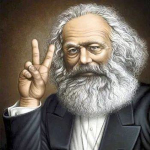

# Ⅰ.马克思主义是什么

<!--知识层次：本科大一大二水平-->

## 马克思主义介绍

“马克思列宁主义揭示了人类社会历史发展的规律，它的基本原理是正确的，具有强大的生命力。中国共产党人追求的共产主义最高理想，只有在社会主义社会充分发展和高度发达的基础上才能实现。社会主义制度的发展和完善是一个长期的历史过程。坚持马克思列宁主义的基本原理，走中国人民自愿选择的适合中国国情的道路，中国的社会主义事业必将取得最终的胜利。”  ——摘自《中国共产党章程》

<figure>
    
</figure>

恩格斯在《反杜林论》里把马克思主义原理分为了三个部分：马克思主义哲学、政治经济学、科学社会主义。<!--马克思主义的构成-->

哲学是基础是方法论，政治经济学是主体内容（《资本论》），科学社会主义理论是目的和归宿。

可以说，马克思用哲学的方法写了政经的内容得出科社的结论。

（待完善)
历史唯物主义。经济理论《资本论》。马克思确立他的阐述原则是“政治经济学批判”。马克思认为，这是“政治经济学原理”的东西。

马克思认为资产阶级的灭亡和无产阶级的胜利是同样不可避免的。他和恩格斯共同创立的马克思主义学说，被认为是指引全世界劳动人民为实现社会主义和共产主义理想而进行斗争的理论武器和行动指南。

```note
“主义”是个由哲学意义的词，比如[实用主义](https://www.bilibili.com/video/BV1A5411g7Rh)，[环保主义](https://www.bilibili.com/video/BV1eA411M7qe)

哲学史系统的世界观和方法论，是对世界上事务的不同看法观点，所以对待一个事情没有自己的观点的时候，不妨多看看一些哲学家的观点，看看自己更认同哪一个。

从这个角度上讲，我作为一个人，我所传达的观点都是别人已经有的观点😂，如果我说的有些东西看起来还挺深刻，并不是说我的思想有多深刻，是我引用的哲学家的思想比较深邃。我只是个观点搬运工罢了。
```

所以可以看出，马克思主义有三个部分。

其基本观点是关于自然社会人类思维发展一般规律的科学认识，是对人类思想成果和社会实践经验的科学总结。

基本方法建立在辩证唯物主义和历史唯物主义世界观和方法论基础上。主要包括实事求是、辩证分析、社会基本矛盾和主要矛盾分析的方法、历史分析的方法、阶级分析的方法、群众路线的方法等。

马克思主义理论是从实践中来的。


这里讲马克思和恩格斯这两个人，很猛，理论导师。两人合作的第一个著作，神圣家族。


## 马克思主义哲学概览

哲学。什么是哲学？♂这肯定不是哲学。前面简单的提了一下。

有人说哲学是科学的科学，这个可能要学完哲学才能理解这句话，这话先放在这里，学完了再call back。马克思主义哲学史众多哲学分支的其中一支。

哲学，或者宽泛的说社会科学，是有立场的，是有观点的。马克思主义的立场是人民，无产阶级。

```note
一开始无产阶级，工人面对资本家说你剥削了我，资本家说我给你工资了啊，凭啥说我剥削了你。这就答不上来了，因此需要一套理论来回答这个尖锐的问题。

只看一遍就学会不现实，违背客观规律了。所以学习是个重复的过程。
```

在了解什么是哲学之前先来看几个关键词：
- **世界观和方法论**是个人所有的，每个人可以有自己的世界观，世界观无好坏，不违反道德法律就行。
- **哲学**是系统化、理论化的世界观和方法论。
- **马克思主义哲学**是哲学中的一派，站在马哲的*立场*，其是绝对正确的。（社会科学是有立场的）

马克思主义哲学包含：唯物论、辩证法、认识论、唯物史观。

```note
洗脑和学习都是用一切手段将符合自己利益的认识与思想去灌输给他人。区分是否洗脑的关键不是灌输这个过程，而是看灌输的这种认识与思想是否符合事实真相和科学。

有人特别排斥去接收一些各种主义的思想，认为这是洗脑。这些主义本来就是哲学，是系统化的世界观方法论，甚至可能是一些哲学家毕生思考的问题。我觉得人生下来是没有自己的思想的，世界观和方法论都是在成长学习中慢慢获得最终形成的。如果直接去看各种不同的系统的世界观和方法论（即不同哲学家的哲学思想），这不比自己靠生活实践来得快吗？被各种主义洗脑洗多了才会有自己的思想，如果从生下来就拒绝接收一切思想，对一些事情没有看法观点，甚至拒绝学习各种主义，一直到长大了都没啥想法，那这不是个傻子嘛😂。
```

```note
学哲学不要轻易觉得别人是在胡说八道，不要轻易觉得别人的观点有问题。网上对于任意一个沾点社会科学的问题的讨论基本上都是吵架结束，虽然说哲学的精髓就在于辩论（真理越辩越明），但是我还是觉得网上这种辩论方式有点极端了，这也搞得我从来不敢在社交网络发表一点带观点的言论。。。
```

```note
牛逼的人可能就牛逼在有坚定的世界观😂😂。
要是我坚定的认为人活一辈子图的就是开心，每天滚滚红尘也没啥问题，我的世界观就是这样的，立场坚定。
或者我努力奋斗，上学时候每天每天背单词，好好学习，上班加班996一直到退休，立场坚定也很快乐。
坏就坏在生活中看到别人有好的物质条件我就动摇了，滚滚红尘中的我就不开心了；或者奋斗到一半，发现大学躺平60分稳过的同学过得日子并不比我差，突然觉得自己奋斗有屁用，这就是立场不坚定。立场不坚定就是痛苦的来源。
```

### 哲学及其基本问题
哲学是系统化、理论化的世界观和方法论。恩格斯指出，哲学的基本问题是**思维**和**存在**的关系问题。（或者讲物质和意识）

哲学基本问题包括两个方面：
- 1.思维和存在谁是世界的本原。即思维和存在何者为第一性、何者为第二性，
- 2.思维和存在有无同一性，即思维能否正确认识存在。

哲学基本问题的意义：“第一性问题”即哲学基本问题的第一个方面，是区分**唯物主义**和**唯心主义**的标准；“同一性问题”即哲学基本问题的第二个方面，是区分**可知论**和**不可知论**的标准。

```note
马克思主义认为（立场，观点）物质是世界的本原，物质意识具有同一性，即意识可以正确认识物质。我也认同马克思主义的观点，当然只是这么说没啥感觉，也要对比一下唯心主义的观点才好更深刻的认识马克思主义的观点。（这就是前面说的我没啥自己的观点，我的观点是看多了别人的挑了个自己觉得对的）

...后面补充吧。
```

```note
自然科学家或者接受过基础科学教育的人应该都认同唯物主义，但是对于主观唯心主义，有一件事情我从来都不知道和他根本就不存在这不一样嘛？比如各位还没出现的男/女朋友，从来都不知道那不就是不存在嘛，对于单身来说反正都一样，所以一个社会科学的观点存在总是有他解释的范围的。这也是社会科学和自然科学不同的地方，哲学的精髓就在于吵架，真理越辩越明大概就是这么来的。

客观唯心：“道”，道生一，一生二，二生三，三生万物。

站在马哲的立场，肯定是物质决定意识。但是不妨也看看其他的哲学家是怎么思考这个问题的，或许有所启发[哲学基本问题：物质怎么就决定意识了？](https://www.bilibili.com/video/BV11f4y1H7ek)
```

### 不同的哲学流派

(1)凡唯物主义者，都主张物质第一性，认为物质是世界的本原，不同的是作为世界本原的物质到底指的是什么。根据对这个问题的不同回答，唯物主义阵营区分为几类不同的历史形态。
唯物主义的历史形态：第一，古代朴素唯物主义依据对自然现象笼统直观的认识，把物质归结为一种或几种实物；第二，近代形而上学唯物主义根据当时自然科学关于原子是物质最小单位的认识，把物质归结为原子，认为原子的属性就是一切物质形态的共同属性；第三，现代辩证唯物主义从无限多样的物质现象中抽象出共同的本质，从哲学上作了最高概括，指出客观实在性是物质的本质规定。

(2)凡唯心主义者，都主张意识第一性，认为意识是世界的本原，不同的是作为世界本原的意识到底指的是什么。根据对这个问题的不同回答，唯心主义阵营区分为几类不同的形态。
唯心主义的基本类型：第一，主观唯心主义认为，作为世界本原的意识是本我的意识；第二，客观唯心主义认为，作为世界本原的意识是独立于“我”的客观精神。

(3)“世界是怎样存在的？”这个问题，不是哲学的基本问题，但也是一个重要问题。根据对这个问题的不同回答，哲学可以分为“辩证法”和“形而上学”两大阵营。辩证法认为世界是联系的、全面的、发展的、矛盾的；形而上学则认为世界是孤立的、片面的、静止的、无矛盾的。

### 马克思在哲学史上的两大贡献
- 第一大历史贡献：在哲学史上第一次将“唯物主义”与“辩证法”相结合，形成了辩证唯物主义理论。
- 第二大历史贡献：在哲学史上第一次用物质的观点分析“人类社会”和“人类历史”，创立了历史唯物主义理论。

```warning
对于马克思主义哲学，四个部分回答四个问题。世界的本原是什么（物质的）？物质世界是怎么存在的（运动的联系的）？我们如何认识这个世界（实践和认识论）？人类历史这个特殊物质是怎么发展的（社会发展规律）？
```

## 马克思主义政治经济学概览


## 马克思主义科学社会主义概览


## 参考资料


- 工人阶级的圣经：[资本论](https://www.marxists.org/chinese/marx/capital/index.htm)


