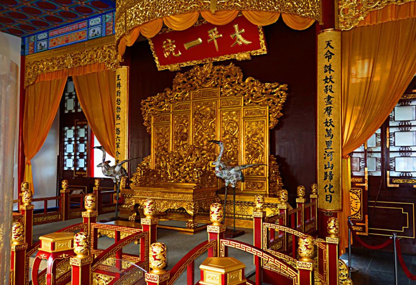

# 共产党成立前的革命

早期不同阶级对国家出路的探索，其他阶级的探索为旧民主主义革命，从1919年五四运动后，为新民主主义革命时期

1840-1925各个阶级轮番上阵，尝试探索国家出路，最终历史告诉我们：别的阶级不行，（共产党代表的）无产阶级行。

## 清晚期中国的国情

在开始讲探索故事前，看看中国是个什么情况（小总结，展开前的铺垫），反正是很惨。

### 资本-帝国主义的侵略


- 鸦片战争前的中国：
    - 经济上，封建地主土地所有制经济占主导地位。
    - 政治上，基本特征是实行高度中央集权的封建君主专制制度。
    - 社会结构的特点：族权和政权相结合的封建宗法等级制度，其核心是宗族家长制。
    - 文化思想体系以儒家思想为核心。

- 鸦片战争前的世界: 一些国家先后经过了资产阶级革命和工业革命，资本主义制度终于在欧美确立起来。中国已经落后于世界强国。

```tip
封建土地剥削制度，地主剥削农民。农民有贫农、中农、富农。富农也是剥削者，消灭地主但是不能说消灭富农。建国之前，要消灭地主但是不消灭富农。建国后，地主（最坏的）灭掉了，富农也有剥削。所以各个土地政策要主义对待富农的态度。
```

>这是一个皇帝还在的时期，皇权至高无上。
>从1840年开始，中国的大门被打开，各种屈辱扑面而来，近代屈辱总结。

- 资本-帝国主义对中国的侵略
    - “虎门销烟”的定性：钦差大臣林则徐在广东虎门销毁所收缴鸦片的行动，完全是维护国家利益和民族尊严的正义行动。
    - 不平等条约：
        - 中英《南京条约》
        - 中英《虎门条约》
        - 中美《望厦条约》
        - 中法《黄埔条约》
    - 签订不平等条约的结果：
        - 割香港岛，破坏了中国的主权和领土完整；
        - 外国船舰可在中国领海自由航行破坏了中国的领海主权；
        - 外国人不受中国法律管束，破坏了中国的司法主权；
        - 协定关税，破坏了中国的关税主权。
    - 中国社会性质的变化：中国**逐步**沦为半殖民地半封建国家。随着社会主要矛盾的变化，中国逐渐开始了反帝反封建的资产阶级民主革命。正因为如此，鸦片战争成为中国近代史的起点。

>《辛丑条约》中国正式沦为半殖民地半封建国家。慈禧彻底放弃反抗，成了“洋人的朝廷”

- 近代中国社会的半殖民地半封建性质
    - 沦为半殖民地的原因：1.西方入侵丧失主权；2.还没完全丧失。和印度不一样！！
    - 沦为半封建社会的原因：1.武力打开门户，中国卷入世界资本主义体系，封建社会瓦解；2.西方不想中国成为独立资本主义国家。
    - 中国半殖民地半封建社会的基本特征：
        - 1.资本-帝国主义侵略势力日益成为支配中国的**决定性**力量；
        - 2.中国的封建势力成为资本-帝国主义压迫、奴役中国人民的社会基础和统治支柱；
        - 3.封建地主的土地所有制依然在广大地区内保持着；
        - 4.中国新兴的民族资本主义经济虽然已经产生，但它的发展很缓慢，力量很软弱；
        - 5.近代中国各地区经济、政治和文化的发展是**极不平衡**的;
        - 6.中国的广大人民尤其是农民日益贫困化以至大批地破产，过着饥寒交迫和毫无政治权利的生活。
    - 近代中国社会阶级关系的变化：地主阶级农民阶级还在，
        - 近代中国诞生的工人阶级是中国新生产力的代表，是近代中国最革命的阶级。
        - 中国资产阶级也是近代中国新产生的阶级，它的来源不同，构成比较复杂。其中，一部分是官僚买办资本家；另一部分是民族资本家。

```tip
近代中国各地区经济、政治和文化的发展是**极不平衡**，是国情（半殖民地半封建社会）的替代性说法。

官僚-封建；买办-帝国，微软中国总裁，代表外国人的利益（无贬义）。

还有个词：小资产阶级。小资产阶级不是资产阶级，是劳动人民。小资有财富，但不剥削别人，自食其力。将来雇人变成民资。个体户可以认为是小资产阶级。
```

- 近代中国的主要矛盾和历史任务
    - 近代中国国情：半殖民地半封建社会。
    - 近代中国的主要矛盾：帝国主义和中华民族的矛盾，封建主义和人民大众的矛盾。
    - 近代中国的主要任务：1.民族独立、人民解放（反帝反封建）；2.国家富强、人民富裕。
    - 近代中国的革命性会：资产阶级民主革命
    - 近代中国的革命道路：农村包围城市、武装夺取政权
    - 近代中国的革命路线：无产阶级领导的，人民大众的，反帝反封建反官僚资本主义革命

```tip
一个很通畅的逻辑：国情——矛盾——任务——道路

||国情|矛盾|任务|道路|
|-|-|-|-|-|-|
|近代|两半社会||反帝反封|农村包围城市|
|现代|社会主义初级|需要和发展|解放生产力|中特的路|
```

### 反侵略的斗争

>有压迫就有反抗，近代中国人民也做过抗争，下面是一个近代抗争的**概览总结**

- 反抗外来侵略的斗争
    - 人民群众的反侵略斗争：广州**三元里**人民的抗英斗争，是中国近代史上中国人民第一次大规模的反侵略武装斗争。
    - 爱国官兵的反侵略斗争：
        鸦片战争期间，广东水师提督关天培、江南提督陈化成、副都统海龄(满族)，中日甲午战争时的致远舰管带(舰长)邓世昌等，都以身殉国。

- 粉碎瓜分中国的图谋
    - 边疆危机和瓜分危机：英国从印度入侵西藏，又从缅甸入侵云南；法国从越南侵犯广西；俄国从中亚入侵新疆；日本吞并琉球、侵犯中国台湾。
    - 瓜分中国的狂潮到来的标志：中日甲午战争和《马关条约》的签订。
    - 中日甲午战争后，列强掀起了瓜分中国的狂潮，表现在：竞相租借港湾和划分势力范围。
    - 《马关条约》：规定把台湾、澎湖列岛和辽东半岛割让给日本。
    - “干涉还辽”事件：俄德、法三国迫使日本放弃了割占辽东半岛的要求，又以干涉还辽“有功”为由，要求租借中国港湾作为报酬。
    - 列强瓜分中国图谋破产的原因：1.帝国主义列强之间的矛盾和互相制约，是一个重要的原因；2.根本的原因是中华民族进行的不屈不挠的反侵略斗争。
    - 对义和团运动的评价
        - 局限性：
        由于当时中国人民对帝国主义的认识还停留在感性认识的阶段，义和团运动存在着笼统的排外主义的错误；
        由于认识不到帝国主义联合中国封建地主阶级以压迫中国人民的实质，义和团曾经蒙受封建统治者的欺骗；
        由于小生产者的局限性，义和团运动中还存在着迷信、落后的倾向。
        - 一个基本的历史事实不容抹杀：义和团运动在粉碎帝国主义列强瓜分中国的斗争中，发挥了重大的历史作用。
>台湾1895-1945被日本统治，1949国民党开始占据台湾

- 反侵略战争的失败与民族意识的觉醒
    - 反侵略战争失败的原因：1.社会制度的腐败是根本原因；2.经济技术的落后是近代中国反侵略战争失败的另一个重要原因。
    - 民族意识的觉醒：鸦片战争以后，先进的中国人开始睁眼看世界；中日甲午战争以后，中国人民的民族意识开始普遍觉醒。
    - 先进中国人的觉醒主张。
        - 林则徐、魏源：林则徐是近代中国睁眼看世界的第一一人，他主持节译了《世界地理大全》，编成《四洲志》一书。在《海国图志》中，魏源提出了“师夷长技以制夷”的思想，主张学习外国先进的军事和科学技术，以期富国强兵，抵御外国侵略，开创了中国近代向西方学习的新风。
        - 王韬、薛福成、马建忠、郑观应等人：不仅主张学习西方的科学技术，同时也要求吸纳西方的政治、经济学说。
        - 严复: 他在《救亡决论》 一文中，响亮地喊出了“救亡”的口号。在中日甲午战争后，严复翻译了《天演论》。他用“物竞天择”“适者生存”的社会进化论思想，为这种危机意识和民族意识提供了理论根据。
        - 孙中山：在创立革命团体兴中会时喊出了“振兴中华”这个时代的最强音。

```note
外国瓜分没成功，中国人想反侵略但是也没成功。现在的中国人可以很容易的看出制度是根本原因，但是当时技术被认为是根本原因，并且在技术上做了很多文章（学技术：洋务运动）。甲午海战后，中国人发现连日本都打不过了，大规模觉醒。外国人发现中国连日本都打不过了，大规模瓜分。台湾也是这个时候丢的。
```

```note
历史上拿战争作为新时代的开篇，好像也没有。从封建社会到两半社会居然是战争作为开篇的。那就得研究战争前，知己知彼百战百胜，然后鸦片战争前不知己不知彼，一打就败。1840前英美法都通过革命建立了资产阶级国家，英国1640就搞了，强大的资本主义工业国。这时候中国就和中世纪差不多，这谁头朝下已经注定了（我也希望中国赢）。当时乾隆“物产丰富”使团不予接见，不用通商，这话倒是也没问题，小农思想，乾隆就是个老地主。英国已经蒸汽机纪元50年了，前要原料后要市场，中国地大物博，这不正好对上了。主动打开是改革开放，抽你打开就是近代沦丧，最后义无反顾的选择了被沦丧，闭关锁国。清政府不了解自己也不了解别人，最后只开了广州还觉得是给你脸了。禁烟运动是鸦片战争的导火索？英国人可能比较喜欢听，可是你不走私不就没有这回事了。白银输出，政府收税收白银，银价上涨，人民赚钱赚铜钱，相当于赋税加重了。

清末鸦片战争用的居然是弓箭

鸦片战争后签的条约能不能符合英国人的初心（原料产地和市场，通商贸易的权利）？割地赔款不是主要目标，但是后面跟着一帮蹭地的（俄国），日本也对中国的地有浓厚兴趣。俄国日本也要通商权利，但是更喜欢土地。导致这个差异的，也是各个国情，俄日没有英法美发达，英法美要了地也是殖民，给你卖东西赚钱就不错。

在同一个地方摔了多少次，没一点长进，林则徐和魏源说来点西方技术，然后没了。在打开国门的初级阶段，商品经济得到了小农经济的抵御。英国认为清朝没落实好。有运钢琴来的，刀叉来的...也挺奇妙。英国人认为不行，还得抽，当时正在镇压太平天国，英国又来了，打到北京了，圆明园拆了，12个水龙头拿了。圆明园不仅仅是英法，一开始是英法，后面中国人一看，这不上对不起组织。

有时候也是不懂得外交礼节，杀使者。。没法说，接着签条约。

总算是认识到洋人的厉害了。林则徐开眼看世界第一人，民族英雄。林则徐给道光皇帝上奏章，我知道英国是个侵略国家，但他不敢来。皇帝觉得林则徐欺君之罪（英国打过来了），发配了。为啥林则徐觉得英国人打不来，林说洋人吃生肉，吃生肉得喝茶，大黄（泻药），只要他敢打，我们就断绝茶叶大黄出口，憋死他。

该尊敬还得尊敬，开眼看世界第一人所以没办法，水平不高不丢人。魏源也差不多，但是《海国图志》里有蒸汽机的图。洋务运动“师夷长技以制夷”，打心眼里看不起外国人，称夷。然而西方不是只强在技术，何况学的东西还错漏百出，写的书也没人看。
```

## 国家出路的探索时期

```tip
中国太惨，各个阶级都踊跃尝试
- 第一个上台的是农民阶级：太平天国运动（诸多农民运动最大的一个，还有如天地会）
- 第二个上台的是封建地主阶级：洋务运动，
- 第三个资产阶级的维新派：戊戌维新变法
- 资产阶级革命派：辛亥革命
- 无产阶级
```

### 农民阶级：太平天国运动

```tip
1851-1864
```


- 太平天国农民战争
    - 太平天国农民战争爆发的原因:
        - 1.清政府加重了赋税的征收科派，农民的负担更为沉重
        - 2.另一方面，中国的农业和家庭手工业相结合的自然经济逐渐解体。
    - 太平天国农民战争的性质：太平军所进行的战争，是一次反对清政府腐朽统治和地主阶级压迫、剥削的正义战争。
    - 太平天国农民战争的失败：太平天国内部自相残杀的天京事变，成为太平天国由盛转衰的分水岭。

- 《天朝田亩制度》
    - 《天朝田亩制度》的内容:《天朝田亩制度》是最能体现太平天国社会理想和这次农民起义**特色的纲领性**文件。它根据“凡天下田，天下人同耕”的原则确立了平均分配土地的方案（耕者有其田）。《天朝田亩制度》实际上是起义农民提出的一个以解决土地问题为中心的比较完整的社会改革方案。
    - 《天朝田亩制度》的进步性：从根本上否定了封建社会的基础即封建地主的土地所有制。
    - 《天朝田亩制度》的局限性：第一，它并没有超出农民小生产者的狭隘眼界；第二，具有不切实际的空想的性质；第三，并未付诸实施。

- 《资政新篇》
    - 《资政新篇》的内容：开始提倡资本主义的雇佣劳动制。
    - 《资政新篇》的进步性：是一个具有资本主义色彩的方案。
    - 《资政新篇》的局限性：限于当时的历史条件，未能付诸实施。

- 太平天国农民战争的理论分析
    - 太平天国农民战争的历史意义
        - 1.太平天国农民战争沉重打击了封建统治阶级，强烈撼动了清政府的统治根基；
        - 2.太平天国农民战争是中国旧式农民战争的最高峰;
        - 3.太平天国农民战争冲击了孔子和儒家经典的正统权威;
        - 4.太平天国农民战争有力地打击了外国侵略势力;
        - 5.在19世纪中叶的亚洲民族解放运动中，太平天国农民战争是其中时间最久、规模最大、影响最深的一次。
    - **太平天国农民战争失败的原因**
        - 1.根本原因在于农民阶级的阶级局限性：
            - 无法从根本上提出完整的、正确的政治纲领和社会改革方案；
            - 无法制止和克服领导集团自身腐败现象的滋生；
            - 无法长期保持领导集团的团结。
        - 2.太平天国没有科学理论的指导。
        - 3.太平天国未能正确地对待儒学。
        - 4.太平天国的领袖们对于西方资本主义侵略者还缺乏**理性**的认识。

**农民不能为中国找到出路**

（农民不行，无贬义，指的是政治上不太行，无法当领导者。古往今来的农民：受到压迫揭竿而起，推到皇帝我自己来压迫；痛恨腐败，推倒我来腐败；来来回回就这些，讲的杀富济贫，到头来先把自己济了，最后内讧了。）

<figure>
    
</figure>

```tip
他的纲领中反封建不反帝；有的题选反封反帝。太平天国应该反封反帝，这是他的任务；作为结果，客观上反帝了。太平天国是一场反帝反封建的运动，打击了封建帝国主义，但没有提出反帝纲领。
```

```note
1851洪秀全，梦到上帝睡醒来就搞了个拜上帝教。建了个太平天国，要反清统治，反地主阶级压迫和剥削。教科书对太平天国的定性是正义的。

太平天国是有纲领的，但是不科学不正确（马克思主义立场），太平天国理论分析因为是当作教科书的，写的很理论，但是理解了以后我怎么感觉都是骂人的话😂😂，有点文化人骂人的感觉。比如失败的原因：骂人的最高境界，你做这件事失败的原因是因为是你在做，是根本原因，但凡换个人都行；没科学理论指导，就是一般人在瞎干，凭感觉，搞了两个东西，一个没干。最后内讧了。受压迫太深推翻推翻皇帝说好了劫富济贫，最后把自己先济了。。。

冲孔子相当于站在了读书人的对立面，成大事团结知识分子，依靠人民群众。

以前的农民运动，都是我推翻了你我要当皇帝，我不愿意被压迫但是我可以压迫别人（阶级局限性）。太平天国稍稍提出了一点先进的东西（虽然没做）。但是也是农民起义最高峰。

1983年，据说在四川盆地，一帮农民搞了个中原皇清国，为首的叫张清安，搞了个农民政权。登基大典法典都有的，国号中原皇清，这个政权两个月吧，他觉得在山里玩不痛快，要封毛泽东、邓小平，还要封蒋经国，写了个信放邮筒里，写的蒋经国收，这不奇妙了嘛，最后被县公安局剿灭了，；再次说明农民的局限性。
```


```note
太平天国，这个事情怎么说呢？也是哈哈哈...

这是农民起义的最高峰，用宗教团结人民，到也不是新鲜事。洪秀全用的是拜上帝教，有中国特色的基督教。上帝是我爹，基督是我哥。基督教的基本教义是上帝没有形象，反对个人崇拜，最多挂十字架，耶稣。洋人问洪秀全25个问题，杨秀清主持回答的，一个没答反问50个，上帝啥样长多高。上帝突然有了个二儿子这都没法解释。还有杨秀清每次想代表上帝的时候，口吐白沫躺地上，参考跳大神，然后说要说的话。洪秀全手下除了知识分子啥人都有，这也注定了水平不会高。

《天朝田亩制度》到是有“耕者有其田”的思想，但是他干了打土豪分田地的事吗？没有。他以法律的方式没收了地主的土地，不但在数量上也在质量上平均，绝对平均的分土地。有革命性但是没法操作，空想性。留足口粮其余产品上交，农民没有收益权，实际上也没有转让权，事实上消灭了商业，做掉地主阶级，洪秀全成了总地主，事实上土地是归了洪天王所有，当然洪秀全说是天父的，我替我爸看着。农民起义的最高追求是啥？农民不反封建，农民只反地主，因为地主妨碍了农民当地主的可能，农民的最高追求是我当地主你当农民。农民起义的结果是要么被地主镇压，要么镇压他们建立跟专制的地主统治。这也是为什么说新民主主义革命重要标志是无产阶级领导，因为无产阶级是代表先进生产力的，因为农民不代表先进生产力，不拥有先进生产关系，无法自我解放，只能被解放。中共就是解放他们的，但是党内工农阶级，工人200万4亿农民，会占有很多农民气息（无贬义，我往上数几代，都不用几代，我爷爷奶奶就是农民）。今天的农民习气有体现在自私、脆弱、恶意竞争、很少讲合作、孤立，麻将思维等等，职能我占你便宜，不能你占我便宜。所以在农村的工作要有足够的宽容和理解。洪秀全杨秀清打江山好哥们，打下来杀功臣，汉高祖刘邦还不是太差的皇帝，干的事纯农民行为，因此农民有局限性。

后面还有个《资政新篇》，跑到了香港，待了7年，看到了英国对香港的统治，觉得挺好，写了这么个玩意儿。洪秀全写了同意发表，里面写了反对迷信、投票选举，洪秀全可能同意吗？大胆设想洪秀全是不是根本没看懂，下面送上来的怎么能看不懂？我兄弟写的肯定不会害我...（以上纯属猜测）。这是个最早的发展资本主义的方案，资产阶级最欢迎，可这个时候中国资产阶级还没产生，农民不需要投票选官吏，农民的需求很简单给我地就行，封建地主阶级会喜欢吗？地主=农民放大版，这时候懂行的没诞生，诞生的不懂行，这过于先进了，不管怎么说洪秀全也是同意实行资本主义了（这怎么看怎么有意思），农民推行资本主义太有特色了。
```

### 封建地主阶级：洋务运动

```tip
1860-1890，甲午战争1894，
```

- 洋务运动兴起的原因
    - 1.为了购买和制造洋枪洋炮以镇压农民起义；
    - 2.同时借此加强海防边防，并乘机发展本集团的政治、经济和军事实力。

- 洋务运动的指导思想：**“中学为体，西学为用”**。
- 洋务运动的目标：**“自强”“求富”**

- 洋务派举办的洋务事业
    - 兴办近代企业
        - 军用工业：上海江南制造总局、金陵机器局、福州船政局、天津机器局、湖北枪炮厂。
        - 民用企业：轮船招商局、开平矿务局、天津电报局、上海机器织布局（官督商办）。
    - 建立新式海陆军。其中北洋水师是清政府的海军主力。号称亚洲第一、世界第六，李鸿章掌控。
    - 创办新式学堂，派遣留学生。洋务派创办的新式学堂主要有三种:翻译学堂、工艺学堂、军事学堂。此外，还先后派遣赴美幼童及官费赴欧留学生。

```tip
民用工业的是哪来的？最初设置的时候就是因为政府没钱了，有好几种，1.国家全额拨款（很少）；2.官商合办；3.再退一步，官督商办。官再退就是民族资本主义不是洋务运动了。但是因为有商入，有一定**资本主义色彩**的近代工业。不能说就是资本主义，因为李鸿章是封建开明派，要是资本主义就站错队了。民用工业的产品是全部投入市场的。说是资本主义性质也可以把，虽然受官僚控制，但是还有点近代企业的意思。

军事工业使得军队走上近代化，还有了北洋水师，李鸿章为北洋水师倾注了大量心血。
```

- 洋务运动的历史作用
    - 1.在客观上对中国的早期工业和民族资本主义的发展起了某些促进作用；
    - 2.给当时的中国带来了新的知识，使人们开阔了眼界；
    - 3.社会风气和价值观念开始变化，工商业者的地位上升。

- 洋务运动失败的标志：中日甲午战争，洋务派经营多年的北洋海军全军覆没。

- **洋务运动失败的原因**
    - 洋务运动具有封建性 (阶级局限性，根本) ；
    - 洋务运动对外国具有依赖性；
    - 洋务企业的管理具有腐朽性。

**地主不能为中国找到出路**封建地主阶级的探索。

```tip
甲午海战：瓜分中国高潮的到来、民族普遍觉醒、洋务运动的失败。
```


```note
小农经济的瓦解没那么快。中国从农业国到工业国，按照国际上的标准，2003年达到了这个水平。英国第一次工业革命城市人口51%，中国到2003年城市人口45%（包括了打工人），2021年64%，2010年50%。工业化伴随着城镇化。自然经济差不多也解体了。

洋务运动，不是一个政治改革，在经济上实现近代化的尝试。继承了“师夷长技以制夷”的思想，在西方教科书又叫自强运动。林则徐魏源光说不练水平不高，曾李左张稍微好一点。第一次鸦片战争刺激了林则徐的新思想，洋务运动是被第二次鸦片战争刺激出来了，皇帝都跑了，首都沦陷，圆明园被点了。内忧外患下，曾李左张认识到老办法不行了。二丫的时候，中国主力军队没出现在战场上，他们的主要任务是剿太平天国，当时外患是要我通商，内忧是要我老命，显然命重要。当时中国还没听说过用轮船运兵抢打仗，他们逐渐发现洋枪洋炮真好用，镇压太平天国也有这功劳。所以打洋人也是可以用的，因此萌生了学技术的想法。这些人要师夷长技了，还是要学科学技术（以军工为主），所以这个时期建立了军工厂：曾国藩安庆内军械所、李鸿章江南制造总局（规模最大，李好玩大的，上海东方造船厂前身，造航母的）、左宗棠福州船政局（理念最先进，才学不比李差没上过大学）。李左都是汉族，不可能让你办到北京。还有个天津机器制造局，要设防，满族人搞得实在是办的不行，后来请李鸿章北上。因此李鸿章在洋务运动中的地位不可撼动。如何判断一个工厂是社会主义还是资本主义？看生产资料谁所有，原材料机器需要资本，因此可以看是谁投资的，国家投资就是国有的。封建主义怎么判断呢，封建主义的近代工业，所有投资来自封建国家，然而出来的也不是商品，直接装配到军队，因此不能叫资本主义。

此外还办了民用，军工要自强，民用要求富。李鸿章轮船招商局（招商银行这来的）

洋务运动事实上推动了经济近代化的开端。洋务运动“中体西用”，以西用来煲中体，这一看就是要失败的，没学到根本，就学了个皮毛。曾李左张学的东西已经比林则徐深入了但是没脱离皮毛的范畴。

北洋水师覆灭，洋务运动失败，败在了日本手里。败在英法美估计还没法感觉应该的。最后居然败在日本这么个小国。然而能明白为啥失败的还是不多。

失败原因，顽固派阻挠中体中用，宁可灭亡也不学。慈禧从来不是顽固保守的，慈禧本心是洋务派，用好东西保他的位置，慈禧是玩人的豪杰，洋务运动在那个条件下就是大不敬，慈禧要是不支持根本玩不起来，但是仍然被慈禧搞得举步维艰（权术）。当然最要命的还是中体西用，这玩意儿根本不搭调，人家都资本主义几百年了。但是失败也敲打了当时的人。大厦将倾，独木难支，李鸿章这种人不在社会上占到一定比例，发展不起来。

第一批公费留学生这时候出去的，几乎是普通人家的孩子（幼童），没贵族子弟。没想到出了一大半牛逼人物：民国总理唐绍仪；詹天佑，大二辍学回来修铁路。。。纪录片《幼童》

中日甲午战争，日本“脱亚入欧”到现在还没回来，现在提日本都是和美国英国法国提，普遍还认为是欧洲国家，日本100多年以发达国家自居。李鸿章也犯过错，知道北洋水师打不过，想吓吓日本，拉俄国英国过来，然而英国想拉一个朋友搞俄国，让中日打一架，谁赢了我找谁合作，结果英国找日本修理俄国去了。

要明白甲午战争战败，败在哪了。慈禧退休花2000万两修了个颐和园，光绪500万两结婚，一艘定远舰也就170万两，是没钱兴办民用企业，可是钱都用在哪了....颐和园就是个北洋舰队，但是日本天皇愿意从自己的伙食费里抠钱给海军发展。啥问题？制度问题，当时中国人不认为拿钱给皇帝花有啥问题，甲午前还有一些理论上的机会尚可苟延残喘，甲午后就完了，开始瓜分中国了，西方人认知很简单你被日本打成这样，我不来劳你点东西你就被日本灭了，我得赶紧来。就这样中国人还活的自娱自乐。日本是想真心实意占台湾，清政府不要台湾了，台湾人民自己也有反抗，甚至有建立国家的想法，最早的台独从这来的，然而被日本治理是台湾发展最好的几十年，这也是可以预见的事，但是台湾是中国不可分割的一部分，这是立场问题。

李鸿章是民族英雄，但是不影响贪污腐败，平时贪污在关系到民族危亡的时候站出来。人是多样的。失败也是理所当然的。
```

### 资产阶级维新派：戊戌变法

```tip
1898年6月-9月，一个夏天就没了。
```

- 戊戌维新运动兴起的原因
    - 1.19世纪90年代以后，中国民族资本主义有了初步发展（阶级基础）；
    - 2.在内忧外患的冲击和中西文化的碰撞过程中，人们逐步形成了一个共识，要救国，只有维新，要维新，只有学外国。

- 戊成维新运动的宣传行动: 
    - 1.向皇帝上书。<!-- “公车上书” -->
    - 2.著书立说。如康有为写了《新学伪经考》《孔子改制考》等。<!-- 《孔子改制考》，读书人，读书的多了不能改革。 -->
    - 3.介绍外国变法的经验教训。<!-- 俄国日本 -->
    - 4.办学会。著名的有强学会、南学会、保国会等。
    - 5.设学堂。重要的有广州万木草堂、长沙时务学堂等。
    - 6.办报纸。影响最大的有上海的《时务报》、天津的《国闻报》以及湖南的《湘报》等。

```note
维新原因：先有资产阶级，才好有维新派的存在，没有资本主义拿来资产阶级。自己自强求富已经没戏了，赶紧技术制度都学。学日本。

这时期，慢慢向南方转移了
```

- 维新派进行改良的方式：将重点放在争取光绪皇帝及其周围的帝党官员的支持上，希望通过他们自上而下地实行变法主张。

- 戊戌维新运动的进步性：资产阶级性质的改良运动。

- 戊戌维新运动的局限性：政令和措施并未触及封建制度的根本，所要推行的是一种十分温和的不彻底的改革方案。

```tip
温和是局限性，中共主张暴力革命，从立场上看，这是局限性
```

- 戊成维新运动的结果：谭嗣同、刘光第、林旭、杨锐、杨深秀、康广仁6人同遭杀害，史称“戊戌六君子”。除京师大学堂(北京大学的前身)被保留下来以外，其余新政措施大都被废除。<!-- 康有为梁启超跑了 -->

- 维新派与守旧派的论战 
    - 论战的主要内容
        - 首先，要不要变法; <!-- 学制度？ -->
        - 其次，要不要兴民权、设议院，实行君主立宪;
        - 最后，要不要废八股、改科举和兴西学。
    - 对论战的评价：维新派与守旧派的这场论战，实质上是资产阶级思想与封建主义思想在中国的第一次正面交锋。论战进一步开阔了新型知识分子的眼界，解放了人们长期受到束缚的思想。通过论战，西方资产阶级社会政治学说在中国得到进一步的传播。

```tip
守旧指洋务派，新旧是相对的。这是资产阶级思想与封建主义思想的第一次论战。第二次
```

- 戊戌维新运动的意义
    - 1.戊戌维新运动是一次爱国救亡运动。
    - 2.戊戌维新运动是一场资产阶级性质的政治改良运动。
    - 3.戊戌维新运动更是一场思想启蒙运动。京师大学堂的创设，更成为中国近代国立高等教育的发端。

- 戊戌维新运动失败的原因
    - 主要是维新派自身的局限(根本原因)和以慈禧太后为首的强大的守旧势力的反对。<!-- 要是慈禧不反对，说不定就君主立宪了，但是政治不这么说，有立场 -->
    - 客观原因：民族资产阶级力量弱小。<!-- 力量弱小不是局限性 -->
    - 主观原因：维新派的局限性。一是不敢否定封建主义；二是对帝国主义抱有幻想；三是惧怕人民群众。<!-- 皇帝还在，还指望外国人，是精英路线 -->
    
- 戊戌维新运动失败的教训：在半殖民地半封建的旧中国，企图通过统治阶级走自上而下的改良实现国家的独立、民主、富强是根本行不通的，必须用革命的手段，推翻帝国主义、封建主义联合统治的半殖民地半封建的社会制度。

```note
早期随着民主资本主义的产生产生了早期维新思想，提出了“君主立宪”的想法，喊出了制度变革，是一个实质性的进步，向西方学习进入了第二个层面。早期也是光说不练。

又说又练的是康梁二人，1895康梁在北京参加高考，考完等出分。《马关条约》传回北京，康一看这哪行，演讲上书。实际上没上上去，当然递上去皇上也看不见，然后创造了一些学说，然后梁启超找康有为拜师。康有为的学说《新学伪经考》，对梁启超说你那假的，我这真的。然后《孔子改制考》说孔子是改革开放的总设计师，什么是君主立宪，说我这孔子是真的。比较扯，这两个书在学术上属实不行，但是在政治上是有想法的。说你信孔子就得信我这，不信我这就是不信传统文化，不信传统文化你还是中国人（逻辑链条很清晰）？信就改革吧。这怼的一句话没。但是梁启超是有真才实学的，文笔好，主笔《时务报》。找张之洞，张出了个对联

**“四水江第一，四时夏第二，老夫居江夏，谁是第一谁是第二”**

梁回答你第一我第二那就不用见了，你第二我第一更不用见了。梁启超提笔就对

**“三教儒在先，三才人在后，小子本儒人，岂敢在前，岂敢在后”**

张一看立马把这小伙子请进去，水平很高。很猛。

康梁推进君主立宪，学的是西方的制度，和林则徐魏源曾李左张不同（中体西用），康梁西体西用，搞得由中国特色的君主立宪，将儒家思想和君主立宪结合。从思想到政治行动的转折点是1895年，康梁都去参加高考，等发榜，听到马关条约签字，把爱国情怀爆发出来，然而上书只是借机炒作了名声，客观上成为了戊戌变法的领袖。动静大了清政府也会重视，怎么让他不闹，就是体制化，政府决定让康中进士，梁落榜（普通话说不好，讲广东话）。康考上了公务员，写了一堆变法革新成就的政论文章夹杂在政府公告里给官员，万一哪一天有人感动送到皇上那。然而效果不咋地但是名声出去了。发自肺腑的办了强学会，要变强（还是偏感性），学制度学技术。光绪不甘做亡国之君，康有为上书也终于被看到了，提拔了一批人，然而康并不在核心位置虽然六品升四品了，光绪皇帝依靠的人，康并不在前面。然而百日维新发的100多诏书没人执行，谁都知道掌权的是慈禧，光绪的最大权利就是随便发圣旨，因此也基本上是自娱自乐。戊戌变法没有明显超过洋务运动水平，要想超过必须明确提出君主立宪，然而康怎么提出权利还不在皇帝手里的东西。

李鸿章，另加一科，戊戌维新直接废科举，那么快要高考的人什么反应，参考江苏高考改革。戊戌维新，慈禧几句骂街一口唾沫结束了，康梁跑了，戊戌六君子没了。

前面说到了，慈禧是不是保守派？慈禧不排斥新鲜事物，支持过洋务运动，甚至同意过君主立宪，他只要权利。要是康梁找太后干，紧密团结在太后身边，说不定就成了呢。光绪被囚了10年，在慈禧死前一天死掉了，才38岁。

戊戌维新是一场爱国救亡的资产阶级改良运动。一定程度上解放了思想，前面的曾李左张不算解放思想实质上没提出什么新的东西来。这是第一次近代的思想解放，第二次辛亥革命，第三次新文化运动，第四次延安整风？说他就是把。
```

### 资产阶级革命派：辛亥革命
```tip
1911
```

>篇幅比前面长，因为取得了一些厉害的成绩。这也算是近代民主革命

#### 思想理论准备

- *辛亥革命爆发的历史条件*
    - 1.民族危机加深，社会矛盾激化。
    - 2.清末“新政”的破产。清末“新政”的内容：正式废除科举考试；宣布“预备仿行宪政”，并颁布了《钦定宪法大纲》。<!-- 废除科举，要君主立宪了，第一部宪法 -->
    - 3.资产阶级革命派的阶级基础和骨干力量开始成熟。资产阶级革命派的构成：资产阶级革命派的骨于是一批资产阶级、小资产阶级知识分子。<!--精英运动 >
    <!--电影《辛亥革命》，广州街头革命的都是精英 >

- *资产阶级革命派的活动*
    - 成立革命团体：1894年，孙中山到檀香山组建了第一个革命团体兴中会，立誓“驱除鞑虏，恢复中国，创立合众政府”。随后成立的革命团体有华兴会、科学补习所、光复会、岳王会等。<!--暴力革命，先进！ >
    - 进行革命宣传：章炳麟发表了《驳康有为论革命书》，邹容写了《革命军》，陈天华写了《警世钟》《猛回头》两本小册子。<!-- >
    - 成立革命政党：孙中山和黄兴、宋教仁等人在日本东京成立中国同盟会，同盟会以《民报》为机关报，并确定了革命纲领。这是近代中国第一个领导资产阶级革命的全国性政党，它的成立标志着中国资产阶级民主革命进入了一个新的阶段。

```warning
兴中会，第一个革命团体；同盟会，第一个政党 >
```

- 三民主义学说和资产阶级共和国方案
    - 同盟会的政治纲领：“驱除鞑虏，恢复中华，创立民国，平均地权。”孙中山将同盟会的纲领概括为三大主义，即民族主义、民权主义、民生主义，后被称为三民主义。
    <!--鞑虏指少数民族，狭隘的民族主义-->
    - 民族主义：民族革命，包括“驱除鞑虏，恢复中华”两项内容。它的缺陷在于：第一，没有明确提出反对帝国主义的纲领；第二，不反帝，反封建不彻底。
    <!--即去打满足，汉人最低等。这里只提了局限性-->
    - 民权主义：政治革命，内容是“创立民国”。它的缺陷在于：归根到底都是建立资产阶级专政的国家，广大人民群众的民主权利很难得到真正的保证。
    <!--政府打政府。-->
    - 民生主义：社会革命，指的是“平均地权”。孙中山主张核定全国土地的地价，其现有之地价，仍属原主；革命后的增价，则归国家，为国民共享。它的缺陷在于：“平均地权”并非将土地所有权分给农民，没有正面触及封建土地所有制，不能满足农民的土地要求，在革命中难以成为发动广大工农群众的理论武器。
    <!--没有耕者有其田-->

- 革命派和改良派的辩论
    - 论战的内容：围绕中国究竟是采用革命手段还是改良方式这个问题，革命派与改良派分别以《民报》《新民丛报》为主要奥论阵地，展开了一场大论战。双方论战涉及的核心问题主要有三个：第一，要不要以革命手段推翻清王朝。这是双方论战的焦点。第二，要不要推翻帝制，实行共和。第三，要不要进行社会革命。
    - 对论战的评价：通过这场论战，划清了革命与改良的界限，传播了民主革命思想，促进了革命形势的发展，但这场论战也

- 资产阶级革命派缺陷：精英路线（不发动人民群众）；不反帝，反封不彻底；不分地。

>前面做了理论思想准备，要开始干了

#### 革命爆发

- 武昌起义与封建帝制的覆灭
    - 第一次武装起义(辛亥革命前) :萍浏醴起义。//辛亥革命前起了好多次，失败了
    - 影响最大的一次武装起义(辛亥革命前) :黄花岗起义(也称广州起义)。
    - 保路风潮: 1911年，清政府宣布“铁路干线收归国有”，借“国有"名义把铁路利权出卖给帝国主义，同时借此“劫夺”商股。这激起了保路风潮。
    - 武昌起义:由于革命形势已经成熟，湖北新军中的共进会和文学社两个革命团体决定联合行动，在武昌举行武装起义。1912 年2月12日，清帝被迫退位，在中国延续了两千多年的封建帝制终于覆灭。//这就是辛亥革命，成功了。挺偶然的，一帮兵干起来的，拿下武汉最大的是个排长，硬找了个旅长管武汉

- 中华民国的建立
    - 南京临时政府的性质是一个资产阶级共和国性质的革命政权。
        - 从政权的组成人员看，资产阶级革命派在这一政权中占有领导和主体的地位。
        - 从南京临时政府制定的政策看，各项政策措施集中代表和反映了中国民族资产阶级的愿望和利益，在相当程度上也符合广大中国人民的利益。
    - 《中华民国临时约法》的内容：临时参议院颁布的《中华民国临时约法》(以下简称《临时约法》)是中国历史上第一部具有资产阶级共和国宪法性质的法典，它规定了资产阶级共和国的国家、政府组织机构以及人民享有的各项民主权利。《临时约法》规定，“中华民国之主权属于国民全体”。
    - 南京临时政府的局限性:
        - 1.企图用承认清政府与列强所签订的一切不平等条约和清政府所欠的一切外债，来换取列强承认中华民国。
        - 2.没有提出任何可以满足农民土地要求的政策和措施，反而以保护私有财产为借口，维护封建土地制度以及官僚、地主所占有的土地和财产。

>1912年1.1孙中山在南京宣誓就职。目前台湾，民国109年。1912年1.1清王朝还在，要是这时候往北边打下来，说不定有了。北方袁世凯有一个军队。袁世凯还代表封建地主阶级。南京临时政府太短了，虽然也有几天资本主义社会。

- 辛亥革命的历史意义
    - 1.辛亥革命推翻了封建势力的政治代表、帝国主义在中国的代理人清王朝的统治，沉重打击了中外反动势力，使中国反动统治者在政治上乱了阵脚。    //无反帝纲领，但结果上反了
    - 2.辛亥革命结束了统治中国两千多年的封建君主专制制度，建立了中国历史上第一个资产阶级共和政府，使民主共和的观念开始深入人心。//突然没有皇帝了。。。
    - 3.辛亥革命推动了中国人民的思想解放。
    - 4.辛亥革命促使中国的社会经济、思想习惯和社会风俗等方面发生了新的积极变化。
    - 5.辛亥革命不仅在一定程度上打击了帝国主义的侵略势力，而且推动了亚洲各国民族解放运动的高涨。


#### 革命失败
>南方中华民国成立了，北方清政府还在，孙中山想统一就要拉拢袁世凯。
>最后袁世凯总统当了，承诺一个没遵守，也没孙中山啥事了。

- *封建军阀专制统治的形成*
    - 北洋政府的性质：袁世凯窃夺辛亥革命的果实之后，建立了代表大地主和买办资产阶级利益的北洋军阀反动政权。
    - 北洋政府在政治上的统治：实行军阀官僚的专制统治。例如，暗杀了宋教仁、公然撕毁《临时约法》未经国会同意与列强签订“善后大借款”合同、基本接受日本提出的严重损害中国权益的“二十一条”要求。
    - 北洋政府在经济上的统治：竭力维护帝国主义、地主阶级和买办资产阶级的利益。
    - 北洋政府在文化思想方面的统治：尊孔复古思潮猖獗一时。
    - 袁世凯死后，中国陷入军阀割据局面的原因：一方面，中国主要是地方性的农业经济而没有形成统一的资本主义经济市场；另一方面，帝国主义国家在中国采取划分势力范围的分裂剥削政策。
    <!--经济没有联系，中央弱一点，地方就开始冒头-->

- 辛亥革命失败的原因和教训
    - 挽救共和的努力
        - 第一，宋教仁被刺后，孙中山毅然发动武装反袁的“二次革命”
        - 第二，孙中山在日本组织中华革命党，坚持反袁武装斗争。
        - 第三，针对袁世凯复辟帝制，云南等省组织“护国军”并宣布独立，很快形成席卷半个中国的护国运动。
        - 第四，皖系军阀头子段祺瑞掌握北洋政府后，变本加厉地推行独裁卖国的反动统治，拒绝恢复《临时
    - 旧民主主义革命结束的标志：护法运动的失败
    - 对孙中山的评价：孙中山具有顽强的革命精神，他首先喊出“振兴中华”的口号，不断摸索救国救民的道路，并始终坚持奋斗，不愧是中国民主革命伟大的先行者。他在领导人民推翻帝制、建立共和国的斗争中建立了历史功勋，是20世纪初期推动中国发生历史性巨变的主要代表。但是，孙中山并没有找到中国的真正出路。
    - 辛亥革命失败的原因
        - 客观原因：从根本上说是，在帝国主义时代，在半殖民地半封建的中国，资本主义的建国方案是行不通的。
        - 主观原因：资产阶级革命派本身存在着许多弱点和错误。（阶级局限性）
            - 1.没有提出彻底的反帝反封建的革命纲领。<!--不反帝，反讽不彻底-->
            - 2.不能充分发动和依靠人民群众。<!--精英路线-->
            - 3.不能建立坚强的革命政党，作为团结一切革命力量的强有力的核心。资产阶级革命派的这些弱点、错误，根源于中国民族资产阶级的软弱性和妥协性。<!--还有钱没花完，豁不出去，革命但是还舍不得-->
            <!--无产阶级，光脚的不怕穿鞋的。。反正啥都没有-->
    <!--注意看客观根本原因和主观根本原因，但是阶级局限性是根本中的根本-->


中国同盟会改组叫中国国民党，宋教仁出任第一任主席。
宋教仁被暗杀，二次革命
袁世凯复辟，护国运动
段祺瑞拒绝恢复临时约法，

```tip
对比这几派别：
- 洋务派：只学技术，君主专制
- 维新派：君主立宪制
- 革命派：君主共和制

还有个慈禧，她并不反对变法，只是反对变法的人。“清末新政”走的比戊戌变法还要远。
```

```note
中国的民资都有两面性：革命性和软弱性（妥协性）。孙中山没做完、没做好的时期，由中国共产党人接着去实现。共产党人是孙中山先生开创的革命事业最坚定的支持者、最亲密的合作者、最忠实的继承者。

所有阶级分为中共，非中共
- 非中共成功：不可能。
- 非中共失败：阶级局限性（农民、地主、资产阶级维新派、革命派）还是主观方面的根本原因。
- 中共失败：不可能因为阶级局限性失败。必有不懂得把马克思主义与国情结合（马克思主义中国化）
- 中共成功：
```

```note
孙中山典型的弃医从文的。救中国的还得靠学文的，孙中山的医术比鲁迅强，正宗Dr.孙。1894据说上书李鸿章要求改革，没理他，一怒之下去檀香山搞了兴中会，誓词好几种，常见的“驱除鞑虏，恢复中国，创立合众政府”。在当时已经有明确的推翻清政府的含义。但是他还不是党，还没到那个水平。这个被认为是中国第一个资产阶级的革命组织、团体。

1905同盟会成立，背景是兴中会这样的革命组织越来越多，中国人知道要救中国先得推翻清政府，革命的势力越来越大。另一个也是清政府自己作，1901清末新政，坦白地说不改必亡，改了死的更利落。就是你清朝非完蛋不可。改革行政培养出一堆反对势力，比如清政府送去日本的都加了革命党，公费留学的。这时期革命思想也广泛流传。同盟会东京成立，政治纲领：“驱除鞑虏，恢复中华，创立民国，平均地权。”，合起来就和三民主义对上了，孙自己把他整理成三民主义，民族前8个字，民权创立民国，民生平均地权。打撸指的是谁？肯定不是帝国主义，如果是帝国主义就有反帝口号了，孙是在新三民主义才有，共产党启蒙的。那么是满洲人吗？也不是，革命不是尽去满人，民族革命与社会革命需要一起来做，驱逐满洲统治者，满洲贵族（实际上汉族贵族也不少）。民权是要驱逐一切皇帝，因此做这个就行（包含了民族主义，去除满足皇帝）。最难搞的是民生主义，革命前地价你的，革命后涨起来的归国民所有。这主张可能不太行，政府在侵犯私有财产，土地的收益权。只要不卖地，涨起来的你就拿不到，再说，革命后跌了，政府补不补？然后标准在哪里？这里面不可操作的地方太多，这是孙先生在美国想出来的，他是通缉犯（职业革命家），在美国有人赞助还行，没人赞助也得吃饭，他也刷过碗，他刷碗也是国父级的，干净，辛亥革命之前，孙先生在美国一大中餐馆刷碗，他发现刷完很累，在美国这样三权分立民主国家也有人坐着吃饭有人站着刷碗，他的毕生梦想不就是把中国变成美国，美国也就这样。（当时美国贫富差距巨大。）孙中山想把中国一下下变得比美国好，他想改变美国的贫富分化，他想调整资本主义的生产关系。按照理论，无产阶级好做这事，社会主义可以调整，他有点空想社会主义的倾向，后来合作的是俄国，中共。他有点使用“均富卡”的感觉。孙先生想通过革命一步到位的免于贫富分化，在中国要想让经济不出现大规模贫富分化要从根上动手，但是工业屈指可数主要是农业经济。农业经济第一生产资料就是土地，孙先生要想让土地国有，不然没法做到收益国民共享，实际上已经违背了资本主义的基本思路：侵犯私有财产，土地国有。有的地方有点社会主义的感觉。民生主义没法实行，现在国民党还嚷嚷三民主义统一中国，但是这个历史意义还是很明确的。这是第一个资产阶级革命纲领。


清朝预备立宪宪法大纲仿的日本，慈禧不懂君主立宪，他只是想要个宪法保证君主的权利。

中华民国临时约法。他是1912年3月11号颁布。颁布前后，袁世凯就任中华民国第二任临时大总统，孙临时约法约的是袁世凯，孙不信任袁。法里说的中华民国组主权属于国民全体，这体现了主权在民的思想。这是第一部资产阶级民主宪法。2022是辛亥革命110周年。政治制度：责任内阁制，总统无实权总理有实权，总理由议会中的多数党领袖担任，德国、英国、议会制，一堂都说德国总理。总统制是美国，美国总统。这些都是资产阶级民主。这孙中山当总统总统制，袁世凯当总统内阁制，啥意思？袁世凯乱世奸雄，玩弄清政府，革命党打不过袁世凯，

可以预知护法运动也成不了。中华民国国旗五色旗五族共和，汉满蒙回藏，没完全排除满足，那么剩下五十一个怎么办？壮族呢，能看广西分立出去呢？五族共和其他民族肯定不干，。找个解释，汉满蒙回藏，汉：关内18省；满：东北；蒙：内外蒙古；回：回部（新疆）；藏：西藏；还有台湾在日本人手里，慢慢收。

接下来袁世凯要篡权了，袁世凯和慈禧一样是个近代化历程中举足轻重的任务，但是他也没有近代化的思想，他缺的也是没出国，没留学，没看看西方是怎么回事，他用自己的势力把清政府推翻了，当然我们说孙中山推翻的，北洋军阀夺取果实，迎来了封建专制的北洋军阀，说一说辛亥革命失败了。袁世凯有创意，肯定要废临时约法，所以趁内阁还没建立的时候，要内阁控制里面的人，公安部啥的有枪的全是自己人管着，革命派分的都是教育司法啥的没用的部门。下一步要进一步揽权。

宋教仁是袁世凯杀得吗？可能不一定，袁世凯可能只是说这人可恨，然后手下的人就帮忙办了。宋教仁被杀是个刑事案件。最后也没啥结果

孙中山为此发动了二次革命，袁世凯镇压了孙跑了，有充足的的理由你先干的。突然发现全中国没人是他的对手，接下来袁世凯让内阁选他为大总统，第一轮投票不够法定票数不给饭吃，第二轮有选王八蛋有选梅兰芳的，当时商量了说不定就是梅大总统了，晚上10点，再不选就饿死了。然后选上以后，让这帮人解散国民党。过河拆桥。议会三分之二没了，此后袁世凯就随便搞了。颁布总统选举法，可以连选连任不限次数，搞终身总统还世袭。

最后袁世凯骂名千载，钉在耻辱柱上了，他的坟墓叫袁林，皇帝才叫陵，不敢叫。同时代的孙先生去世目的称中山陵，这，一辈子反对帝制，去世埋在陵里面。。
```

<figure>
    
    <figcaption>北洋政府五色旗</figcaption>
</figure>

>至此除了无产阶级，都上了，全都不太行。国家的出路又在哪里？
>主角上场，要铺垫背景

### 无产阶级的探索
```tip
1915-1923，俄国十月革命1917年，五四运动1919年

中国人首先意识到自己不行，是技术不行，后来学了技术，有了亚洲第一的北洋水师，还是打不过日本。于是开始学习西方的制度，还是不行。。原来是思想不行，残存在脑中的封建思想需要抛弃掉
```

```note
[我们的考点，是他们的一生！高燃民国历史剧《觉醒年代》P1](https://www.bilibili.com/video/BV1rb4y1D7Gf)

民主共和，还是？打完了仗，外交失败，消息传到日本留学生里，陈独秀、李大钊。

可以看出这些共产主义者的条件都还是不错的。在自己条件很好的情况下为国、工人阶级考虑。很强。

这时期实际上这帮人还不知道马克思主义，因此剧情里有，如何救中国？陈独秀“不知道，我还在找”。也即马克思主义实际上也是找来找去，找到这么个东西可行，然后试试。只不过现在给了结论“马克思主义是正确的”。

新文化运动开始上演了，这个时期，毛泽东在长沙看到了《青年》杂志。周恩来在天津也发现了这个杂志。德先生赛先生也是这个时期来的。
```


#### 新文化运动

- 1915年，陈独秀，上海，创办《青年杂志》开始的，蔡元培出任北京大学校长，聘陈独秀为北大文科学长（系主任）。《新青年》和北大就成了新文化运动的主要阵地。
- 初期新文化运动的内容
    - 提倡民主科学，反对专制和迷信盲从
    - 提倡个性解放，反对封建礼教
    - 提倡新文学，反对旧文学，实行文学革命。// 胡适-->

    <!--古代讲话白话文，写作文言文，这是一种文化专制。白话让所有人看得懂-->

- 初期新文化运动的基本口号：民主和科学，democracy，science
- 五四以前新文化运动的历史意义 //新文化中间插了个五四运动 -->
    - 中国历史上前所未有的启蒙和空前深刻的思想解放运动
    - 为马克思主义在中国的广泛传播准备了思想条件
- 五四以前新文化运动的局限性
    - 无法为人们提供一种思想武器去认识中国，去有效地对中国社会进行改造。
    <!--所有领导者基本都是资产阶级民m主思想，无法落实一套资本主义方案-->
    - 仅仅依靠少数人呐喊<!--精英运动-->
    - 那时的领导人还没有马克思主义批判精神，他们用的还是资产阶级的方法
    <!--辩证法与形而上，对待传统要么肯定一切要么否定一些，对待西方全盘吸收-->

```warning
从时间可以看出，1917年十月革命给中国送来马克思主义，新文化运动1915年开始，也就是说早期是资产阶级的新文化。后来发现了在一堆思想里马翔马克思是不是也可以试一试，五四后，逐渐才成新民主主义新文化。

也就是说，早期的新文化运动也避免不了资产阶级的那些老问题：精英运动、全盘接收、最终目标是建立资产阶级国家。

```

```note
辜鸿铭，中国人的精神，《春秋大义》旨在尝试解释中华文明之精神，且揭示其价值。"The Spirit of the Chinese People"

[鲁迅表弟被逼疯？《狂人日记》诞生！9.2高燃民国历史剧《觉醒年代》P4](https://www.bilibili.com/video/BV1vB4y1A7Ac)

辜鸿铭好像是站在了新文化运动的对立面，但是对中华传统文化的理解有其独到之处。这里不得不说，还得是北大，北大的传统“爱国、进步、民主、科学”，才能使得学校里既有辜鸿铭还是新文化运动的发源地。

《新青年》。这时候1917年，俄国革命爆发了，这帮人知道这个事情，但是还没意识到，革命方法也适用于中国。这既是说的五四前的新文化运动，是资产阶级新文化。胡适靠近精英阶层，李大钊则更靠近底层群众，这两人后来也渐行渐远了。 

现在新青年在北京扎根了，鲁迅也加入了。

```

#### 五四运动

- 十月革命（1917）对中国对中国人的启示：
    - 经济文化落后的国家，也可以用社会主义思想指引自己走向解放之路。// --中国一看，这不就是说我嘛
    - 十月革命诞生的社会主义俄国号召反对帝国主义，并以新的平等的态度对待中国，有力地推动了社会主义思想在中国的传播。// 主动放弃不平等条约，感动。
    - 十月革命中俄国工人、农民和土兵群众的广泛发动并由此赢得胜利的事实，给予中国的先进分子以新的革命方法的启示，推动他们去研究这个革命所遵循的主义。 //群众路线

- 最早信仰马克思主义的人：在中国大地上率先举起马克思主义旗帜的，是李大钊。他发表的《我的马克思主义观》一文，明确地把马克思主义称为“世界改造原动的学说”，并且对马克思的唯物史观、剩余价值学说和阶级斗争理论作了比较系统的介绍。这篇文章对马克思主义的介绍已经具有相当完整的形态，而且作出了基本正确的阐释。这表明，李大钊已经成为中国的第一个马克思主义者。
    
```note    
空想社会主义的几个人，李大钊，本来就过得很好还在为被剥削者考虑，牛逼！作为现有社会的既得利益者，还要改造，这是觉悟。李大钊、胡适那一批学者都是这样的，北大老师，一个月200块大洋，一套四合院80块大洋。有时候物质也会决定精神境界的。

蔡元培，牛逼，真民主，高境界。我专制，我骂你是真专制；你民主，但是你骂我就是假民主。北大包容，才有讲三纲五常的

这里的方法论是不是也启示我在学习的时候也去找找方法论 -->
```

>五四运动爆发的背景并无马克思主义的广泛传播，个别人物在信

- 五四运动：新民主主义的开端（1919.5.4）
    
- 五四运动爆发的原因：
    - 1.新的社会力量的成长、壮大。（无产阶级）
    - 2.新文化运动掀起的思想解放的潮流。
    - 3.俄国十月革命对中国的影响。在当时，陈独秀就说，十月革命以后，“中国人也受了两个教训：一是无论南北，凡军阀都不应当存在；一是人民有直接行动的希望。五四运动遂应运而生”。

- 五四运动的直接导火线：巴黎和会上中国外交的失败。（一战结束的利益分割会）//中国是战胜国，

- 五四运动的过程：北京大学等北京十几所学校的学生三千余人在天安门前集会，随后举行示威游行。他们提出“外争主权，内除国贼”“废除二土一条”和“还我青岛”等口号，致主张拒绝在和约上签字。正当学生的爱国运动面临夭折的危险时，中国工人阶级开始以独立的姿态登上历史舞台。这样，五四运动突破学生、知识分子的狭小范围，发展成为有工人阶级、小资产阶级和民族资产阶级参加的全国范围的群众性反帝爱国运动。运动的主力由学生转向了工人，运动的中心由北京转到了上海。
//中国代表未出席签字仪式，其中外交官也功不可没，让风声放回国 -->

- **五四运动的历史特点**：
    - 1.反帝反封建的彻底性。这表明，中国人民反帝反封建的斗争提升到一个新的水平线上了。//太平天国、辛亥革命：反封不反帝，义和团反帝不发疯-
    - 2.真正的群众运动。//区别于精英路线-->
    - 3.促进了马克思主义在中国的传播及其与中国工人运动的结合。为1921年中国共产党的成立作了思想上和干部上的准备。
    - 4.五四运动发生在俄国十月革命后，发生在无产阶级社会主义革命的新时代。**因此，中国的民族民主革命，在十月革命后就属于世界无产阶级社会主义革命的一部分了。**

- 五四运动为什么是新民主主义革命的开端
    - 五四运动具备新的历史特点，中国革命新阶段。
    - 意义：
        - (五四运动为什么是旧民主主义革命走向新民主主义革命的转折点) :五四运动，以彻底反帝反封建的革命性、追求救国强国真理的进步性、各族各界群众积极参与的广泛性，推动了中国社会进步，促进了马克思主义在中国的传播，促进了马克思主义同中国工人运动的结合，为中国共产党成立做了思想上、干部上的准备，为新的革命力量、革命文化、革命斗争登上历史舞台创造了条件。

```warning
中国革命有旧、新两个阶段。全名：资产阶级新民主主义革命。
- 旧：资产阶级领导；性质：资产阶级性质。
- 新：无产阶级领导；性质：资产阶级性质。

**决定革命性质的是革命任务和对象，不是革命的领导者**

旧民主主义革命要反帝反封建，新革命还是反帝反封建。

革命的逻辑链条，什么叫革命？宋朝换唐朝不能叫革命，是改朝换代，建立新制度叫革命。
- 奴隶主-奴隶；推翻奴隶主的不应该是奴隶，奴隶推翻奴隶主变成了奴隶主。
- 封建地主-农民；封建地主推翻奴隶主，是进步，叫革命。农民推翻地主变成地主。
- 资产阶级-工人；资产阶级推翻封建地主，建立资本主义社会。
- 然而推翻资产阶级的就是无产阶级，工人推翻资本家为什么不会变成资本家？觉悟高！无产阶级推翻资产阶级，是要彻底结束剥削制度，进入无剥削社会，因此只有解放全人类，才能解放自己。

近代中国要反帝反封建，理应由资产阶级去做，叫资产阶级革命，**但是中国的资产阶级做不到，那么只好中国的无产阶级上去帮资产阶级干这事**，所以这是一场无产阶级领导的资产阶级性质的民主主义革命。

旧民主主义革命属于世界资产阶级革命（世界在进行资产阶级革命）；新民主主义时世界进入了无产阶级革命的新纪元，因此属于世界无产阶级革命的一部分（虽然性质是资产阶级性质）。

新旧民主主义革命对比
- 领导者：不同，资产阶级、无产阶级
- 任务：同，反帝反封建
- 指导思想：不同，三民主义，马克思主义
- 性质：同，资产阶级性质
- 前途：不同，资本主义国家，新民主主义国家过渡到社会主义国家
- 所属范围：不同，

新民主主义革命和社会主义革命
- 领导者：同
- 任务：不同，反帝反封建，反资反私
- 指导思想：同
- 性质：区别
- 前途：同，进入社会主义社会
- 所属范围：同，世界无产阶级革命的一部分
```

```note
这里只讲了马克思主义，但是但是不仅仅只有马克思主义，是在众多主义里面尝试了马克思主义，最后走通了。
《觉醒年代》，把这段历史背后的逻辑梳理清楚了。
目前书上的结论：马克思列宁主义伟大光荣正确的，指明了前进方向。结论没问题，简单粗暴。我也接受。但是没啥感觉，这部剧就讲出了逻辑。历史的动人之处在与背后的困难与逻辑，
```

```note
学习外国三步走。第一步走，林则徐魏源，在细节上改变了中国。

第二步，失败的戊戌变法和不算成功的辛亥革命

第三部，新文化运动，这是最关键的一步，也是成果最差的一步。究竟在多大程度上改变了中国人？现在的北大对得起兴文化运动吗？我也不知道，这观点也不是我的。。

整个新文化运动的基地，北京大学，提倡的Democracy，Science。在民主意识缺乏的年代，喊出了这个口号，陈独秀李大钊到底想干什么？先贤们提倡民主，反对专制；提倡科学反对迷信（也不是封建迷信，迷信哪都有，不分社会发展阶段），比如孔庙祈福，（虽然我也有时候搞搞。）这种迷信现象还有的话是科学还不到位。在这个时间点，这个专制是北洋军阀的封建专制，迷信在当时也是封建迷信，反这两个客观上有反封建的作用。一个民主科学的中国才是近代的，谈这两个是为了实现现代化。科学的太重要了。兴文化运动固然有问题在，但是这是向西方学习的最高层次，当然也是最难的。最难的学不会也不丢人，慢慢学呗。

除了民主科学还有提倡新道德，反对旧道德。旧道德的核心是三纲五常，比如说征婚广告，要求不缠足，首先广告这事就不传统，充满了现代气息。纲，纲领考纲，圣旨，没有独立人格，这个东西按照这个要求可能有独立人格的人能有多少，不多。封建社会，思想史需要被统治的，没有独立的思想，没有批判性思维，逮什么信什么，完全缺乏理性。对于民主，对西方玩了几百年的东西还不了解，是很悲哀的事情。好在终于有新思想了。

如果高考不考文言文，还有多少人学这个呢？白话文也就50年，如果不学文言文不认识繁体字，对于100年前留下来的古书就很困难了，还得是学文科的厉害啊。理科工科其实挺难过的。古时候说的白话文写的文言文，但是文人说话也不是之乎者也的，简体字实际上便利与普及教育，说话比写字容易，人民更容易提升教育水平，这是个好处，但是有争议，有人把文言文说的太惨了，比如胡适：两个黄蝴蝶双双飞上天，...。美国博士写的这个，顺口溜，当然唐诗宋词给人感觉特别雅。白话文言文不是对立关系，推行白话彻底消灭文言文可能是有点可惜的。统一文字好处是巩固统一，中国的语言太花哨了，但是字是一样的，白话文是要支持的，简化字也是有存在价值的，也不用把繁体字文言文彻底废掉。

民主慢慢说，以后再说

那么科学呢，现在的科学怎么样。对于一些科学常识，不知道就别混了的问题，上大街问，结果还是不容乐观的。我作为这个，能在科学上做些什么贡献呢？就一个防辐射服，且不说电磁辐射对人体有什么影响，假如一定要防，这玩意我的理性告诉我，如果放电磁辐射，是要接地的，可是这玩意不到电不接地，也就是说从原理上防不住啊。那么以后生孩子的时候，也得搞一个，别人都有，我家没有这。高等教育越来越普及，总体情况是在变好的，现在有好多东西打着科学的旗号做些乱七八糟的事情，欺负不是很懂科学的人。任重而道远，。

文科生，如果说数理化烂的不行了学文科，学社会科学，那估计也就那样了。理性逻辑，历史使人深邃，数学理性到冰冷，社会科学看起来是感性的，绝不是背就能学好的，其背后的思维、逻辑不比数学简单。

过激的东西要批判，比如废除汉字改成拼音。英语阅读，看书串行，汉字不会这样，一种假设：中文学的时候音形意全有，英语只有音。学英语挺痛苦的，靠音去联系东西。

中国近代思想解放运动。第一次戊戌，第二次辛亥，这是第三次。这不是要消灭就文化，是改造，要让中国人从心底信仰的先生赛显示，科学厉害了，民主也会起来。

石国鹏老师的批判思维，学位论文 [Critical patriotism and the teaching of history in Beijing: a critical conceptual analysis](https://scholar.acadiau.ca/islandora/object/theses%3A2811)
```

```note
五四作为分水岭，很重要，工人参与了，学生闹事很好解决的。工人阶级，在民资极差的情况下还是获得了壮大，甲午后无产阶级人数10万分母4亿，1919有四百万，翻了20倍，虽然对于4亿还是可以忽略。无产阶级壮大的速度快！资本主义循序发展，一次甲午后，清朝末年，另一次短暂春天，为无产阶级壮大创造了条件。这些为无产阶级登上政治舞台创造了条件，旧民主主义革命后期出现的新民主主义革命因素，和新生产力、无产阶级、共产党沾边。

导火索巴黎和会是个外患，一战结束。一战1914-1918，一战被认为是帝国主义瓜分世界的战争，主战场在欧洲，欧洲列强进去了，美国日本也进去了，重点放在欧洲后，中国外来侵略好一点了，资本主义发展上出现了短暂春天，相对而言列强都忙着呢，给日本留下了机会，和欧洲人打不行，接着宣战的名义在中国和德国（警察）作战，借着对德宣战，赶跑德国警察，以解放者的名义自居要把山东权益转到日本。欧洲1919召开巴黎和会，开了小半年，三巨头：美国英国法国，还有个日本意大利。日本被成为“安静的小伙伴”，唯独在中国问题上亢奋，中国也是战胜国（因为中国一宣战，德国就投降了，时间线上确实。。有英国吗，不好说），一战派了许多民工的，挖战壕，确实做了巨大贡献。然后中国让人对待的像战败国一样。中国也没想把战败国德国的殖民地变成中国的，只是说我不当你殖民地行吗？日本说不行。。这种时候，中国的外交家，艰难，顾维钧《我的1919》，中国之不能失去山东犹如西方不能失去耶路撒冷，孔孟故乡啊。底下人热烈鼓掌，然而有啥用呢？政治就这样，感情牌没用的，谁胳膊粗听谁的，不服者抡之，你躺着我站着你就得听我的，中国谁让当时就这样呢？中国做出的斗争是拒签巴黎和会，中国居然敢说不这让西方列强震惊了一会儿，当然也就是一会儿，你爱签不签，不签拉倒，就直接不理我们。在外边混，得需要一个强大的组织支持的，弱国无外交啊。但是弱国更需要外交，强国不需要外交，不听话抽你就完事了，在这个弱肉强食的时候，外交就是做出来玩的，或者说几个强国商量怎么分弱国的，弱国打不过也只能靠外交。拒签不同意说明以后再谈，签了就真直接没了。外交需要实力，外交可能是弱国唯一的机会了。

当时北大的学生也是厉害。真的是厉害，五四运动不是共产党领导的，还没成立，但是有共产党人的身影，五四运动的评价相当绝对，很重要。五四运动前后有个很重要的是，1918李大钊在新青年办了个马克思主义的专号，马克思主义开始进入中国，被称为中的普雷汉诺夫，他把马克思主义引入俄国。1917年十月革命第一个社会主义国家开始产生，真正建成得到斯大林时代，1922改成苏维埃社会主义联盟。这是马克思主义第一次成功的应用，然后一声炮响送入中国。中国人为什么接受学习马克思主义呢？实际上把马克思主义也是向西方学习的一个过程，马克思主义欧洲拉的，英国法国德国，到苏联，实际上也是西方来的，当时是中国几乎绝望了，只要有的都试试，马上要淹死了，哪一根稻草，病急乱投医，哪个都是是，但是不止马克思主义，还有很多的，并且但是对苏俄有好感，因为他反帝而且列宁深切的说过：中国欠沙俄的钱都不要了，外蒙我们不管了，割让的土地归还你。这太感动了，大哥！当然后面还有，俄国欠欧洲的钱也不给了，，。借外债，然后革命，然后不承认，这怎么说呢。
```


```note
[他们，拯救了北大！高燃民国历史剧《觉醒年代》P2](https://www.bilibili.com/video/BV1CX4y1g7rL)

蔡元培：教育救国、科学救国、文化救国。中华民国首任教育总长，大概就是教育部长吧。蔡元培上任第一件事，找个文科学长，大概就是文学院院长吧。陈独秀就正好合适。所以说，文学、历史这种学科立场还是很鲜明的。

为了把陈独秀拉进来，让陈独秀带着《新青年》一起来北大。这事然后成了。有新文化，也有反对的，辜鸿铭，这也是个巨佬，有13个博士学位，精通9个语言。

这不同的人都能在北大，蔡元培这校长也很难当，
```


```note
[见证历史！教员到北大！邂逅马克思！9.3高燃民国历史剧《觉醒年代》P5](https://www.bilibili.com/video/BV1Di4y1A7wK)

这时候，俄国十月革命过去一年了，李大钊在新青年上发表了《我的马克思主义观》。

鲁迅写完狂人日记了，这时候才有了鲁迅这个名字。这也是第一本白话小说。发表在新青年上，这后面这个杂志也开始用全白话文了。这时候保守派对新文化运动不满，当然也要反对一下，辜鸿铭、林纾。更多的是学术上的辩论，毕竟这都是一帮文学系的。这时候也有人说要废除汉字，用表音的，为啥还要这么搞呢，当然是鲁迅说的，中国人总是喜欢折衷的，砍价的艺术。

这时候毛泽东也来北京了，来到了北京大学图书馆任职。
```

#### 中国共产党的成立

```tip
中共不是一次诞生的，是一步一步诞生的-
1. 早期马克思主义者队伍
2. 成立各级党组织
3. 中国共产党的诞生
```

- 早期马克思主义者思想运动和中国工人运动的结合
    - 早期马克思主义者的队伍:
        - 1.五四运动以前的新文化运动的精神领袖，其代表除李大钊以外，就是陈独秀。<!-- 南陈北李-->
        - 2.五四爱国运动的左翼骨干，其代表为毛泽东、周恩来等。
        - 3.一部分原中国同盟会会员、辛亥革命时期的活动家，如董必武、林伯渠、吴玉章等。<!--原来三民主义的改马了-->
    - 早期马克思主义思想运动的特点：<!--队伍-->
        - 1.重视对马克思主义基本理论的学习，明确地同第二国际的社会民主主义划清界限。<!-- 世界上两派：苏中主张暴力革命（最正宗）；还有些国家和平改良 -->
        - 2.注意从中国的实际出发，学习、 运用马克思主义的理论去研究和解决中国面临的实际问题。
        - 3.开始提出知识分子应当同劳动群众相结合的思想。<!--群众路线来了，区别精英路线-->
    - 新文化运动的发展(五四运动以后)：
        五四前新文化主要是资产阶级民主主义的新文化反对封建主义旧文化；五四后的新文化中，马克思主义广泛传播，开始在思想文化领域发挥指导作用
        <!-- 新文化运动以五四运动为分界线，五四后，马克思主义广泛传播 -->
    - 中国共产党的第一个党小组: 1920年8月，中国第一个共产党组织在上海建立。<!--第一个党组织-->
    - 中国共产党早期组织的活动: <!--党组织干的事-->
        - 加强对马克思主义的研究和宣传
        - 在工人中进行宣传和组织工作
        - 进行有关建党问题的研究和讨论
        - 建立社会主义青年团<!--共青团-->

- 中国共产党的成立
    - 中国共产党创建的历史必然性：近代以来，为改变中华民族的命运，中国人民和无数仁人志士进行了千辛万苦的探索和不屈不挠的斗争。然而，不触动封建根基的自强运动和改良主义、旧式的农民战争、资产阶级革命派领导的革命、照搬西方资本主义的其他种种方案，都不能完成中华民族救亡图存的民族使命和反帝反封社会力量。中国共产党的诞生成为历史发展的必然。<!--为啥说历史选择党，为啥是共产党。这段话讲了近代中国很惨，其他阶级都不行，没办法带不动只好我自己上-->
    - 中共一大: 1921年7月23日，中国共产党第一次全国代表大会在上海举行。大会确定党的名称为中国共产党。<!--一大建党二大纲，一大的纲领有点问题。。-->
    - 中国共产党创建的历史特点：
        - 一方面成立于俄国十月革命取得胜利，第二国际社会民主主义、修正主义遭到破产之后。
        - 另一方面，它是在半殖民地半封建中国的工人运动的基础上产生的。中国工人阶级身受帝国主义者、本国资产阶级和封建势力的三重压迫，具有坚定的革命性。
    - 新生的中国共产党必须要加强自身建设的原因：<!--别的共产党成立多年后出问题了，加强建设；中国刚成立就有很多问题，不容易，要加强建设-->
        - 在党内，出身于小资产阶级的党员占有相当大的数量，新生的中国共产党不能不受到小资产阶级思想的严重影响。
        - 它是在一个幅员辽阔、人口众多、情况复杂、经济文化落后的半殖民地半封建社会开始自己的活动的。
    - 中国共产党成立的伟大意义：中国共产党的成立，是中华民族发展史上一个开天辟地的大事变。从此，中国人民有了一一个先进的坚强的政党作为凝聚自己力量的领导核心，踏上了争取民族独立、自身解放的光明的道路，开启了实现国家富强、人民富裕的历史征程。中国共产党的成立，深刻改变了近代以后中华民族发展的方向和进程，深刻改变了中国人民和中华民族的前途和命运，深刻改变了世界发展的趋势和格局。

```note
1921年7.23开的一大，建党节日7.1，后来凑一块忘了。一合计就七一吧好记。这么重要的会居然忘了，毛主席应该拿个小本记下的。这个会陈独秀李大钊都没来，李大钊领导学生运动让人拿板砖开了，陈独秀拍了个代表代表陈独秀。。焕然一新，红日喷薄而出。开的中间有特务，然后一般人赶紧撤，差点让一网打尽。最后挪到浙江嘉兴一个船上，可能这是最早的红色旅游吧。一大有点问题，一大纲领，规定：无产阶级军队推翻资产阶级政权。对的没错，但是在中国每对，既无无产阶级军队也没资产阶级政权，但是北洋封建军阀，资产阶级也在推翻封建统治，有带你纸上谈兵的感觉，当然这也是没啥问题的。好在都是北大出来的，立刻意识到有问题，二大就通过了民主革命纲领，打倒列强除军阀（反帝反奉，资产阶级民主革命），这时候国民党就可以放心了，这是帮我的，这就有合作空间了，先不管以后。

共产党一大二大有有个国民党一大，国民党党史，1894兴中会，孙中山，再往后同盟会领导武昌起义成功推翻清朝建立中华民国，宋教仁改组国民党参加大选获得胜利然后死在火车站，国民党席卷议会，被逼迫选出原总统，1914孙中山在日本建立中华革命党，没啥具体作为，喊喊口号，此后国民党在国内，松散。同盟会本身就是大杂烩各个革命组织联合，把一般人凑一起统一纲领信仰和追求，挺难的。一盘散沙一直到1924年，1922年孙中山和南方军阀第二次护法，惨败，有他参与的全失败，重在参与了。失败后孙中山回到上海痛定思痛为啥我就不能就中国，我觉得我这挺先进的，中国这玩意儿我怎么就救不了呢？真痛苦呢，有人敲门，一开门李大钊，传播了马克思主义，孙中山当然不会接受，但是眼前一亮知道有这么个人。又有人敲门，一开门，金毛共产国际派来的，孙先生终于明白苏俄是我们的朋友。为啥苏俄着急找朋友呢？特别需要扶持一个亲苏的实力呢？可以方式美国从背后进攻苏联。看上孙中山了，孙在河里找稻草，苏联帝国一根，一把抓住，这也没啥对不对，。这时候国民党一大实在苏联的共产国际的推动下国共合作的一个会议，国民党整顿党务登记党员，挺重要的。共产党以个人身份加入国民党，这个两边都不讨好，共产党人认为这玩意儿比我们低一个层次，将来要做掉他的。国民党更难受，很不舒服。双方的妥协，当然当时国民党力量更大，悬殊。合作奠定了新三民主义的基础，

陈独秀李大钊先后建立了马克思主义理论小组，像兴中会。无产阶级在中国什么时候产生呢？挺早的，1840年，1850年这个样子，这时候还没资本主义呢，是商品输出为主。资本输出为辅助。是有一定数量的资本主义工厂的。
```


