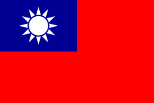

# 共产党成立后的革命

>这里用历史叙事，讲故事的方式来介绍中共领导的革命。在这个时期马克思主义的中国化已经开始了，这里的理论性还没有那么强。在内容上这里和后面的马克思主义中国化内容有重叠，但是侧重但不同。这里更注重历史的连贯性，既历史的发展逻辑。马克思主义中国化则理论性更强。

## 大革命时期

这个时期共产党刚成立，清朝已经没了，有了政党就要做点事情。但是自己又没军队，就找国民党一起打打北洋军阀。最后国民党很不爽，要干共产党，共产党只好退到省界慢慢发展。


### 革命纲领

```tip
1921-1927，这个时期，共产党在上海成立，国民党经历了二次革命、护国运动、护法运动失败在广州成立新国民政府，北洋军阀在北京。

共产党去找国民党要北伐打北洋军阀。
```

- 中国革命的首要问题：分清敌友。以往的斗争之所以成效甚少，一个重要的原因，就在于不能团结真正的朋友，以攻击真正的敌人。

- 中共二大：
    - 第一次提出了反帝反封建的民主革命的纲领，为中国人民指出了明确的斗争目标；最高纲领是实现共产主义，当前阶段的纲领是打倒军阀，推翻帝国主义，先成为民主共和国。
    - 开始采取民族资产阶级、小资产阶级的政党和政治派别没有采取过、也不可能采取的革命方法，即**群众路线**的方法。是不是相信群众、依靠群众，是关系革命成败的一个大问题。<!--再次BB：区别以往精英路线>

```note
一大要反资学苏联的，这是不对的。二大马上改对：正确的革命纲领：反帝反封建；正确的革命方法：群众路线的方法
```

- 发动工人运动：<!-- 共产党干的！！ -->
    - 香港海员罢工、<!--非中共领导，只参与，其他中共领导-->
    - 京汉铁路工人罢工、<!-- 第一个高潮顶点 -->
    - 安源路矿工人罢工、<!-- 完全胜利 -->
    - 开滦五矿工人罢工。

- 发动农民运动：浙江萧山县衙前村成立了中国第一个农民协会。<!--打土豪分田地靠这个组织>


### 国共合作的形成

- 革命统一战线形成的社会背景：社会矛盾日益加深，“打倒列强，除军阀”已成为全国人民的强烈愿望。

- 孙中山联俄政策确立的标志：孙中山和苏俄代表越飞联名发表《孙文越飞联合宣言》。

- 中共三大：正式决定全体共产党员以个人名义加入国民党，同孙中山领导的国民党建立统一战线。

- 第一次国共合作正式形成的标志：国民党一大的成功召开。

- 国民党一大确定的三大革命政策：联俄、联共、扶助农工。

- 第一次国共合作的“共同纲领”：新三民主义的政纲同**中国共产党在民主革命阶段的纲领基本一致**，因而成为国共合作的政治基础(“共同纲领")。<!-- 因为一致，所以称为共同纲领 -->

- 新三民主义的内容：在民族主义中突出了反帝的内容；在民权主义中强调了民主权利应“为一般平民所共有"，不应为“少数人所得而私”；把民生主义概括为“平均地权”和“节制资本”两大原则(后来又提出了“耕者有其田”的主张)。<!--完善了老的三民主义的缺陷-->

```warning
国共有共同纲领了。这成为国共合作的政治基础

从国民党一大开始，后面划分成了4个时期（从共产党角度看）。统一战线就是交朋友，找朋友一起干革命。

|         |    时期   |标志事件|统一战线|
|---------|：---------：|：-----------------：|：-------------：|
|1925-1927| 大革命时期 |      五卅运动     |   国民统一战线 |
|1927-1937|土地革命时期|      八七会议     |工农民主统一战线|
|1937-1945|抗日战争时期|      西安事变     |抗日民族统一战线|
|1945-1949|解放战争时期|国民党进攻中原解放区|人民民主统一战线|

```

```note
早期党内人少，开会比较随意。三大，党内合作，双重党籍，两党合成一个党，存在的问题：把自己交给别人，丧失独立自主。

国民党1905成立算的话，才开一大... 中共1921成立三年开三大，可以看出国民党是比较松散的。国民党欧盟性质的政党，宣誓完就完事了，后面该干啥干啥；共产党是苏俄性质的党，入党就是党的人，经常会叫到一起，热烈讨论。这时候国民党开会实际上是学共产党，国民党松散，找人找不到凑不齐...
```

```note
新三民主义。新旧三民主义，名字没变，民族民权民生，民族主义打击的帝国主义，旧的是满清贵族。民权主义也有反帝的内容，民生里面居然有节制资本，这比较奇怪。一个资产阶级政党，党纲里面要节制资本，而且要联俄联共扶助农工，赤化了。旧三民主义时代孙先生就有空想社会主义的理想，他的理想是解决资本主义帝国主义的贫富分化问题。资本主义发展的核心行动力，内部动力资本，外部市场。鸦片战争前为啥倾销鸦片，是要赚钱，正当贸易中英贸易明显中国大量赚钱，贸易顺差。大量资本进入中国是不行的，所以用贩毒的方式。新三民主义的地位，肯定是国民党的纲领，不能说是共产党的指导思想，心是资本主义的，共产党的纲领要比他高级的超越过去的。两个要合作只能就低，为国共合作的政治基础，不太好叫共同纲领。

北伐军为啥这么勇，为啥打得这么好？所有的武器都是苏联提供的，先进。北洋军用的汉阳造（张之洞），面对苏联的武器，洗洗睡吧。三面合击，战术高明，命令蒋介石下的，参谋是苏联红军开国五大元帅之一，苏联的军事顾问教官，要钱有钱要人有人有武器有武器，苏联帮的多。当然也有咬着牙说有中共领导的原因。

有共同敌人的时候，可以把国共两党的矛盾放在一边。北洋政府推翻了以后，叛变了，从这就开始骂蒋介石反动派了。确实蒋介石手上沾满了共产党人的鲜血，没心没肺的说这是免不了的。这两个党早晚要有冲突的，根本利益有冲突。不是一路人。
```


### 第一次国内革命战争

```tip
北伐和大革命是重叠的，国民党角度看是北伐，中共角度叫大革命，是第一次国内革命战争。
```

- 大革命的起点：以五卅运动为起点，掀起了全国范围的大革命高潮。

- 北伐战争的目标：推翻北洋军阀统治。

- 《国民革命与农民运动》：“农民问题乃国民革命的中心问题”，“所谓国民革命运动，其大部分即是农民运动”。

- 对大革命的评价：1925年至1927年中国反帝反封建的革命，比之以往任何一次革命，包括辛亥革命和五四运动，**群众的动员程度更为广泛，斗争的规模更加宏伟，革命的社会内涵更加深刻，因此被称作大革命**。

- 大革命中的中国共产党：没有中国共产党，就不会有这场大革命。这是因为：
    - 第一，大革命是在反对帝国主义、反对军阀的政治口号下进行的。而提出这个口号的，正是中国共产党。<!--我喊口号了！！-->
    - 第二，大革命是在以国共合作为基础的统一战线的组织形式下进行的，而中国共产党正是国共合作的倡导者和统一战线的组织者。<!--我先找你的，我更积极-->
    - 第三，大革命是近代中国历史上空前广泛而深刻的群众运动，而中国共产党正是人民群众的主要发动者和组织者。<!--群众路线，你孙中山学我的-->
    - 第四，大革命的主要斗争形式是革命战争，中国共产党人不仅帮助和推动了国民革命军的建立，而且在军队中进行了卓有成效的政治工作，共产党在战斗中更是身先士卒，起着先锋作用和表率作用。<!--黄埔军校，周恩来政治部主任-->

- 大革命失败的标志：“四一二”反革命政变和“七一五”反革命政变。

- 大革命的意义：
    - 首先，大革命沉重打击了帝国主义在华势力，基本推翻了北洋军阀统治。
    - 其次，大革命教育和锻炼了各革命阶级。<!--好歹有革命经验了-->
    - 最后，大革命提高了中国共产党在全国人民中的政治威望。<!--露个脸-->

- 大革命失败的原因：<!--中共失败了，必不可能是阶级局限性-->
    - 从客观方面来讲
        - 是由于反革命力量的强大；资产阶级发生严重的动摇、统一战线出现剧烈的分化，是由于蒋介石集团、汪精卫集团先后被帝国主义势力和地主阶级、买办资产阶级拉进反革命营垒里去了。
    - 从主观方面来说
        - 1.是由于中国共产党放弃了无产阶级对于农民群众、城市小资产阶级和民族资产阶级的领导权，尤其是武装力量的领导权;<!---党内合作把自己交给别人了，没了独立自主的地位->
        - 2.当时的中国共产党还处于幼年时期，不善于将马克思列宁主义的基本原理和中国革命的实践相结合(根本原因)；<!--只要没做好就因为他-->
        - 3.共产国际对于中国革命作出了一些不切实际的指导，影响了中国共产党对许多问题的决断和有关方针政策的实施。<!--共产国际瞎指挥，遵义会议前所有错误都有他原因-->

- 大革命失败的经验教训：
    - 1.中国的民主革命必须建立包括工人、农民、小资产阶级和民族资产阶级在内的广泛的革命统一战线。<!--朋友还得交-->
    - 2.在中国民主革命中，无产阶级领导权的中心问题是农民问题。<!--领导权一定要有-->
    - 3.中国革命的主要斗争形式是武装斗争，主要组织形式是军队。<!--要有自己的军队-->
    - 4.领导中国革命的中国共产党必须不断加强思想上、政治上和组织上的建设，善于把马克思主义普遍原理与中国革命具体实践相结合。

```note
毛泽东对中国革命的探索，背下来就完了。接下来共产党被杀晕了。反革命政变来了，大革命失败了。国共十年对峙、土地革命、第二次革命战争时期，1927-1937社会主要矛盾发生了怎么样的变化？1929美国经济危机了，**1931年918事变**，1932年溥仪当皇上了，**1935年华北**。1936年西安事变

||1927-1931|1931-1935|1935-1937|
|-|-|-|-|
|国民党|不打，绕道北伐|||
|共产党|继续战斗，去井冈山|||
|小日本|阻挠了一下北伐战争|||

27-31

如果27年中日全面冲突，那时候打不过日本。蒋介石推出济南，北伐继续。这段时期国民党内部自己打自己。奇了怪了。共产党忙着发展，日本应对国内危机。这段时间主要是阶级矛盾，

31-35，918民族矛盾激化，攘外必先安内，优先解决共产党，虽然民族矛盾增加了，但是还没到红线，此时共产党也没意识到。919中国共产党和日本共产党反对日本侵占东三省，这日本共产党又是哪来的：joy：，反应太快了，目前只占领了沈阳，这个东西是号召人民武装保卫苏联。。这声明发了之后实际上该干嘛干嘛，长征途中声称北上抗日，确实聪明。长征途中中共发了八一宣言（为抗日救国告全体同胞书），告诉全世界是北上抗日的，这事全世界知道，毛主席不知道，电台没了红军丢了，过了雪山找了个国民党的报纸写的在陕北剿匪，毛主席一看那我就去陕北，我不就是匪嘛。到了陕北和组织联系突然发现我原来是去抗日的，妙蛙。这是民心所向，只要你喊抗日，这时候共产党喊我是抗日的，国民党不抗日，还打我。蒋介石肯定很生气，你怎么这么玩，这时候国民党是执政党，有抗日的想法也不能说啊，来个报纸采访这咋整。共产党没事随便喊，一喊就得民心。蒋介石娶宋美龄中美合作，反正投靠了，投个胳膊粗的，美帝国主义一定会帮中国，因此蒋介石一定会抗日的，但是抗日的时候要灭共产党。

长征这事，毛主席贡献，毛对革命理论的探索最重要的是工农武装割据。工农是人，武装是手段，割据是目的，这会儿没法气吞天下，不太好取代蒋介石，这时候在刀缝求生存，交界地方。武装割据前提：中国割据不容易的，大一统。小农经济使得能够自给自足，只要把地圈下来，自己就能负担自己了。商品经济做不到的。如果两个地区一个生产粮食，一个生产衣服，割据以后那么结果就是一边衣着靓丽的饿死，一边吃饱了幸福的裸奔。比如上海一割据，周边一围起来，直接饿死。古时候的小农经济巨发达，为啥还会大一统呢？真正大一统的时间 ，中国的分裂是真分裂，统一是假统一，汉唐的统一是名义上的。自古以来就有个统一的梦想，统一是主流这话本身就是为政治服务的，中国的经济基础是不利于统一的，所以才要用超经济的手段来维护政治的统一。马克思经济基础决定上层建筑，经济基础统一了，政治上分都分不开。经济基础不同意，需要其他方式来维护，如中央集权，分裂太容易了，稍微有点地形优势就能占山为王水泊梁山，政府军就是打不进来。经济全球化，中国加入WTO，全球经济大一统，那么全球政治呢？欧盟。中国和台湾必然统一，依法统一台湾，但是如果用武力来打，不聪明，玉石俱焚，想打回来是很简单的，让两边的经济全插在一块，打他都打不走，这是个啥思路。将来（应该是很远的）全球政治是要统一的，但是是基于全人类的普适价值观，最先进的探索制度，或许不是中国特色。

35年是个重要的转折，中日民族矛盾正式成为了主要矛盾，35年后中共是最早喊出停止内战来抗日，虽然被追着全国跑，但是占据了舆论的先机，共产党说你看我要抗日你国民党要打我，什么意思？虽然有点站着说话不腰疼，但是人民的眼睛是雪亮的，疯狂给蒋介石压力。蒋介石是费抗日不可的，他不甘心单傀儡，娶宋美龄，投靠英美，日本与英美利益有冲突不抗都不行。实际上35年前就一边打共产党一边调兵做抗日的准备。但是不能直接说小日本你等着，老实点不让我腾出手抽你，不能啊，国民党是执政党，他说话是当做外交政策的，在野党破口大骂没问题，不用承担责任。这时候人民骂，共产党骂，日本给压力，还要追共产党，领导人不好当。蒋介石知道共产党比日本的威胁大，得同情一下老蒋，但是不支持他！、攘外必先安内对不对？对啊，团结了都不一定打得过日本何况不团结，但是安内的方法不太一样，杀绝了，是个安法，这可能做得到吗？有没有消灭共产党的可能性？这十年共产党做的是土地革命打土豪分田地，满足农民对土地的渴望，意味着，只要共产党还有一个人，找个山头一呼“打土豪分田地”，野火烧不尽，春风吹又生。想剿灭没那么容易。国民党退到台湾为啥没追过去呢？台湾人民为啥没推翻国民党呢？成立个台湾共产党，上阿里山打游击。为啥这套在台湾不灵了？实际上灵的，蒋介石去那打土豪分田地去了，干了共产党干的事，。去了台湾不要叫高山族，是蔑称。可以叫泰雅族阿美族，高山族是给别人轰上高山了。还有爱斯基摩人（殖民者喊得）不能喊，叫因纽特人，这称呼相当于喊黑人倪哥，喊中国人chink（中国佬，华仔）。这些词不应该出现在受过良好教育的人的口里。老蒋把原住民的地抢了，老兵都是农民，结果让打台湾去了，怎么办绝望了，老蒋说：打土豪分田地。。这台湾人民就支持蒋介石了，原住民最恨蒋介石。
```

>前面是大革命时期

## 土地革命时期

```tip
1927-1937，目前中国的情况，北洋军阀没了被消灭了，广州的国民党定都南京了，中共经过415成了非法组织转入地下了。
```
- *国民党在全国统治的建立*
    - 国民党统一全国的标志：东北易帜。张学良从东北发出通告，宣布“遵守三民主义，服从国民政府，改易旗帜”。北洋军阀不再作为独立的政治力量继续存在，国民党在全国范围内建立了自己的统治。<!--北洋军阀张作霖的儿子张学良，降下五色旗，升起青天白日旗-->
    - 国民党政权的性质：蒋介石、汪精卫先后叛变革命，实行清党分共政策后，国民党已经不再是工人、农民、城市小资产阶级和民族资产阶级的革命联盟，而是变成了一个由代表地主阶级、买办性的大资产阶级利益的反动集团所控制的政党。
    <!--这个时期中国本来应该是资本主义社会（如果孙中山在的话），然而...还是国情还是没变-->
    - 国民政府统一全国之后
        - 国情没有变，中国仍是一个处在帝国主义和封建主义统治之下的半殖民地半封建社会。
        - 革命对象没有变，中国革命的对象依然是帝国主义和封建主义。
        - 革命性质没有变，中国革命的性质仍然是反帝反封建的资产阶级民主革命。

<figure>
    
    <figcaption>北洋政府五色旗</figcaption>
</figure>

<figure>
    
    <figcaption>青天白日旗</figcaption>
</figure>

### 革命道路

- 1927年革命危急关头中共中央临时政治局常委会决定的三件大事
    - 将党所掌握和影响的部队向南昌集中，准备起义;（南昌起义，1927）
    - 组织湘、鄂、赣、粵四省的农民，在秋收季节举行暴动;（秋收起义，1927）
    - 召集中央会议，讨论和决定新时期的方针和政策（八七会议，1927）

- 八七会议：
    1.彻底清算了大革命后期的陈独秀右倾机会主义错误。<!--太依赖资产阶级，交出自己；左倾，太针对资产阶级；要又联合又斗争，敌人的敌人就是朋友...-->
    2.确定了**土地革命和武装反抗国民党反动统治**的总方针。会议明确提出**土地革命是中国资产阶级民主革命**的中心问题。毛：“枪杆子里面出政权”
    3.会议选出了以瞿秋白为首的中央临时政治局。
- 毛泽东在八七会议上的发言中强调，党“以后要非常注意军事，须知政权是由枪杆子中取得的”，实际上提出了以军事斗争作为党的工作重心的问题。<!--乱世之中，暴力的作用-->
- 对八七会议的评价：在中国革命处于严重危机的情况下，八七会议的及时召开，并制定出继续革命斗争的正确方针，为挽救党和革命作出巨大贡献。中国革命从此开始了从大革命失败到土地革命战争兴起的转折。（八七、遵义、十一届三中）
- 三大起义：南昌起义、秋收起义、广州起义。南昌起义打响了武装反抗国民党反动统治的第一枪。这是中国共产党独立领导革命战争、创建人民军队和武装夺取政权的开端。<!--南昌起义才有了自己的军队。目前都是直接打省会，全都失败了-->
    
```tip
秋收起义，打出了**工农革命军**的旗帜。

党对军队的领导的根本原则
- 发端于南昌起义
- 奠基于三湾改编
- 定型于古田会议
```

```note
前面属于是国民党杀疯了，共产党差点没了，做的一些应对的事情。这个时期，有了军队。城市起义效果不怎么样，马上退到农村寻求发展。

失败了，该咋办？摸索，毛写文章探索。这时期有了一系列文章。探索出了新道路。土地革命1927-1937,又可以分为早期：南方根据地时期，后期：长征后陕北根据地。
```

- 探索的文章
    - 《中国的红色政权为什么能够存在?》和《井冈山的斗争》：论证了红色政权能够长期存在并发展的主客观条件，提出了工农武装割据的思想。
    - 《星星之火，可以燎原》：进一步阐明了中国革命只能走与资本主义国家不同的道路。提出了党把工作重心由城市转移到农村，在农村开展游击战争，深入进行土地革命，建立和发展红色政权，待条件成熟时再夺取全国政权的中国革命新道路的思想。（农村包围城市，武装夺取政权）
    - 《反对本本主义》：阐明了坚持辩证唯物主义的思想路线即坚持理论与实际相结合的原则的极端重要性，提出了“没有调查，没有发言权"和“中国革命斗争的胜利要靠中国同志了解中国情况”的重要思想。//思想路线，初步阐明，这是个线索，后面的话说给共产国际听的
    - 毛泽东思想初步形成的标志：农村包围城市、武装夺取政权道路理论的提出，标志着中国化的马克思主义即毛泽东思想的初步形成。
    
    <!-- 国共北伐的聚堆叫国民革命军，南昌起义的部队也叫国民革命军（同一个军队，被中共控制的一部分）；9月秋收起义打出了工农革命军的番号，后来建军节还是定在了8月1。打南昌广州的两支军队失败了会师发展成工农红军 -->
    - 古田会议，军队负担打仗、筹款、执行政治任务；区别于一些旧军队。

```note
[《星星之火，可以燎原》](https://www.marxists.org/chinese/maozedong/marxist.org-chinese-mao-19300105.htm)是在全党全军绝望之中的领袖写的文章。这个时期确实是艰难，一般有共产主义想法的人聚到一起，差点被杀完了，退到山里，这时候，这革命还有没有希望，这反正是很艰难。这个文章可以看看。

这部分和毛概联系上了。道路的提出（初步形成）于土地革命战争早期，标志着毛泽东思想的形成
```


- 根据地政策
    - 土地革命中国共产党在井冈山时期的土地政策：消灭封建地主的土地私有制，实行农民的土地私有制，使广大农民在政治上得到翻身，农村生产力得到解放和发展。<!--变私有为私有-->
    - 中国共产党历史上第一个土地法：《井冈山土地法》<!--有点问题后面修正-->
    - 中国共产党历史上第一个可以付诸实施的土地法：《兴国土地法》。将“没收一切土地”(《井冈山土地法》的不足之处)改为“没收一切公共土地及地主阶级的土地”。这是一个原则性的改正，保护了中农的利益使之不受侵犯。
    - 土地革命中的阶级路线和土地分配方法：坚定地依靠贫农、雇农，联合中农，限制富农，保护中小工商业者，消灭地主阶级；以乡为单位，按人口平分土地，在原耕地的基础上，实行抽多补少、抽肥补瘦。<!--注意对待各个阶级的态度，限制富农！！！；耕者有其田-->

```note
南昌起义失败，向农村转变，探索者是毛泽东，毛是农民，深知广大农民如果不被发动，中国革命永远无法真正成功，农民由于自身的局限性，没法觉醒到自己解放自己，换言之，农民永远是革命的主力军，但是是被人驱使的，一定是被人领导的。为什么工农武装割据能成功呢？毛选的都是交界处三不管地区，湘鄂赣，鄂豫皖，都是最落后最贫穷，受压迫最重，在这打土豪分田地是合适的，去上海可能就不好使了，当然小农经济是最关键的因素。自然经济：自给自足，割据肯定找井冈山好，活不好也饿不死，上海割据那不太行啊。饿死和裸奔，割据了的后果，因此割据在商品经济不太行，在小农经济的合适。导致世界全球化的是商品经济，格局：如何统一台湾？让台湾士兵知道，对面工厂是他爸爸开的，绑架人质的意思，你中有我我中有你，打都打不走。收复台湾的说法，真要打了，就是辛辛苦苦60年，一夜回到解放前。

当小农经济自然经济有利于分裂的时候，发展商品经济资本主义就是导致政治和民族走向统一的一种方式。经济越发展，全球化越来越浓厚。抢索尼，砸松下，对爱国主义也要反思。流氓的最后一块遮羞布，搞得人都不好意思反驳，爱国主义是对的，但不是盲从的极端的。
```

<!--上面讲的是经济建设，下面开始政治建设-->
### 探索中的曲折
- 土地革命战争的发展与挫折
    - 中国共产党在土地革命战争时期的政权建设：中华苏维埃第一次全国工农兵代表大会在江西省瑞金县叶坪村举行。大会通过了《中华苏维埃共和国宪法大纲)》以及土地法令、劳动法等法律文件。中华苏维埃共和国实行工农兵代表大会制度。<!--有政权了；工农兵代表大会制度，代表性还没那么广泛-->
    - 中国共产党在土地革命战争时期犯过的错误：“左”倾盲动错误、“左"倾冒险主义、以陈绍禹(王明)为代表的“左”倾教条主义。
    - 教条主义的主要错误：<!--错哪了，错误的内容-->
        - 在革命性质和统一战线问题上，混淆民主革命与社会主义革命的界限，将反帝反封建与反资产阶级并列。<!--反帝反封的时候还要反资-->
        - 在革命道路问题上，继续坚持以城市为中心。
        - 在土地革命问题上，提出坚决打击富农和“地主不分田，富农分坏田”的主张。<!--太激进了-->
        - 在军事斗争问题上，实行进攻中的冒险主义、防御中的保守主义、退却中的逃跑主义。
        - 在党内斗争和组织问题上，推行宗派主义和“残酷斗争，无情打击”的方针。<!--毛泽东受打击太多，政治低潮。但是邓小平支持毛-->
    - 中国共产党在土地革命战争时期屡次犯错的原因：<!--犯错的原因-->
        - 1.八七会议以后党内一直存在着的浓厚的“左”倾情绪始终没有得到认真的清理。<!--太想和国民党拼，急了-->
        - 2.共产国际对中国共产党内部事务的错误干预和瞎指挥。
        - 3.不善于把马克思列宁主义的理论与中国实际全面地、正确地结合起来(主要原因)。

<!--一堆的左倾错误带来的问题就是第五次反围剿失败，被迫逃跑（长征），走到遵义，解决军事问题和组织问题，没解决政治问题（瓦窑堡会议）和思想问题（延安整风），这时候还没毛泽东思想-->
- 遵义会议与革命的转折
    - 遵义会议的内容：集中解决了当时具有决定意义的军事问题和组织问题。
    - 对遵义会议的评价：遵义会议开始确立以毛泽东为主要代表的马克思主义的正确路线在中共中央的领导地位，从而在极其危急的情况下挽救了中国共产党、挽救了中国工农红军、挽救了中国革命。遵义会议是中国共产党历史上一个生死攸关的转折点，它标志着中国共产党在政治上走向成熟。<!--熟了，和苏联不是父子党，是兄弟党，以后也没有共产国际瞎指挥的原因了-->

- *长征的胜利*
    - 红军的长征宣告了国民党反动派消灭中国共产党和红军的图谋彻底失败，宣告了中国共产党和红军肩负着民族希望胜利实现了北上抗日的战略转移，实现了中国共产党和中国革命事业从挫折走向胜利的伟大转折。(精神)

<!--长征完了，到陕北了，实际上已经是抗日战争早期了-->
- 经验教训
    - 红军长征到达陕北后，毛泽东、中共中央用很大精力总结历史经验。《论反对日本帝国主义的策略》：阐明党的抗日民族统一战线的新政策，批判党内的关门主义和对于革命的急性病，系统地解决了党的政治路线上的问题。<!--写文章总结；问会议，问文章-->
    - 《中国革命战争的战略问题》：总结土地革命战争中党内在军事问题上的大争论，系统地说明了有关中国革命战争战略方面的诸问题。<!--内容和书名一样-->
    - 《实践论》和《矛盾论》：从马克思主义认识论的高度，总结中国共产党的历史经验，揭露和批评党内的主观主义尤其是教条主义错误，深入论证马克思列宁主义基本原理同中国具体实际相结合的原则，科学地阐明了党的马克思主义的思想路线。<!--思想路线科学系统阐明-->
    
以毛泽东为主要代表的中共中央所进行的理论工作，对党的政治路线、军事路线和思想路线进行了拨乱反正，从思想上、理论上武装了中国共产党人，使他们满怀信心地去迎接即将到来的伟大的抗日民族解放战争。

```note
长征，怎么说呢，一次伟大的战略转移，胜利大逃亡。就是跑，没办法啊，不跑就死了。第五次围剿，100万人，蒋介石的最高军事顾问汉斯·冯·赛克特。冯Von意思是from，一是从赛克特来到汉斯，名字带冯是贵族，早期只做两件事军事家，政治家，后者都干。这人是德国总参谋部创始人，反正很厉害，没打仗否则是德国陆军元帅，没打仗没战功。游击战给蒋介石打的没脾气，16字方针真是，毛泽东真的是厉害。敌进我退，你来我就跑比脚力，我是主场作战我知道小路你指不定绕几十公里。敌驻我扰，你晚上扎营我捣乱，拿一铁皮桶里面放鞭炮，半夜当当当你得从炕上跳起来吧，折腾你半夜没人，然后给你扔一真手榴弹，你不起来在利益真家伙，一天两天天天这样，几个军官站一块和熊猫一样。敌疲我打，伤其十指不如断其一指，集中兵力切掉你最弱小拇指，你整只手得往回缩吧。敌退我追，你跑我去捡装备。

蒋介石士官学校毕业的，学的怎么做正规军作战，结果毛泽东神出鬼没。游击战是正规战的克星，国民党打不赢，将来日本人打不赢，如果碰上美国人死的更惨。讲点没良心的为啥三光，他不知道谁是八路军，智能通通地死啦死啦地。。后来也吃过亏，对越自卫反击战，那全民皆兵，共产党给老乡挑水做饭，这屋子里孩子哭，进去看看，哐当掉陷阱了还有倒刺，女人抱着孩子过去给钱，结果回头就给一枪。

但是汉斯·冯·赛克特，精锐之师最高级的指挥官，战略家战术家。指挥者一百万国军，命令下去落实的不到位，总是有缝让共产党钻，他的战术是，四路对进，中心开花，分割包围，各个击破，他不求快一步一步走，走一步挖壕沟建碉堡，日本人在沦陷区也干这个，弄个炮楼铁丝网，几十公里无人带，这些都是对付游击战的方法。但是最后还是让共产党跑了，真是太不容易了。这一跑亮娃迷雾千公里，中途开了个会，确立了毛泽东的领导地位，事实上是这样的。实至名归的领导地位是1945中共七大，这之前还是多少受到威胁，延安整风是他权利走向巅峰的过程。在这里获得的是军事指挥权，实际上是三人军事小组，组长王稼祥，副组长周恩来，组员毛泽东，但是毛泽东运兵入神，毛泽东是中国罕见的战略家战术家，运筹帷幄决胜千里。很难得，最终的成果，毛逐步带领红军来道陕北，这时期诗词，大白话居多，但是有历史意义。

共产党来到陕北，国民党跟着来剿匪，这个时候国民党的日子就不好过了。国内要求抗日的呼声让蒋介石很难办，丧失民心，后来西安事变，张学良杨虎城真敢玩，这里共产党起到的作用，1935反蒋抗日，35-37逼蒋抗日，37后联将抗日。
```

>知识多，篇幅大。

## 抗日战争时期

### *小日本的侵略计划*
- 抗日战争历史阶段的划分：1931-1937年为局部抗战时期; 1937-1945年为全面抗战时期。
- 局部抗战时期的历史事件
    - 占东北：1931年9月18日，日本发动九-一八事变，武装侵占中国东北。<!--八年抗战实际上是14年-->
    - 图华北：日方策动华北五省(河北、察哈尔、绥远、山西、山东)两市(北平、天津)“防共自治运动”，制造傀儡政权。这就是华北事变。<!--就是汉奸，-->
    - 全面抗战的起点：卢沟桥事变爆发。

|局部抗战|全面抗战|
|-|-|
|1931-1937|1937-1945|

### 一起抗日

- 中国共产党率先抗战：1931年的九一八事变是中国抗日战争的起点，中国人民不屈不挠的局部抗战，揭开了世界反法西斯战争的序幕。在中华民族处于生死存亡的危急关头，中国共产党率先举起了武装抗日的旗帜。<!--东北沦陷，蒋介石在南京，蒋介石的态度是能谈尽量谈，先不打，要打共产党。这时候共产党在江西被围剿，根据地快丢了，这时候说我要抗日。。得人心。觉悟。-->
- 八一宣言：在民族危机空前严重的关头，中国共产党驻共产国际代表团起草了《为抗日救国告全体同胞书》，即八一宣言，呼吁全国各党派、各界同胞、各军队停止内战，为抗日救国的神圣事业而奋斗。<!--共产党说不要搞我了，搞日本人-->
- 一二·九运动的意义：促进了中华民族的觉醒，标志着中国人民抗日救亡运动新高潮的到来。<!--但凡有什么风吹草动，首先闹起来的就是学生，纯粹的学生运动太好搞定了，学生和工农结合起来就厉害了-->
- **瓦窑堡会议**
    - 瓦窑堡会议提出了党的抗日民族统一战线的新政策。
        - 首先，阐明建立抗日民族统一战线的可能性。<!--广交朋友的可能性，为什么会和中共站一边-->
            - 中国的工人、农民、小资产阶级是要抗日的；<!--天然的朋友-->
            - 民族资产阶级的政治态度是可能变化的；<!--可以拉拢的-->
            - 地主买办阶级在斗争矛头指向日本帝国主义时，英美的走狗也有可能遵照其主子叱声的轻重，同日本帝国主义及其走狗暗斗以至明争的。<!--必拉不过来的-->
        - 其次，批判了“左"倾关门主义错误，强调中国共产党在抗日民族统一战线中的领导作用。<!--通俗说法，自己玩，抗日自己抗-->
        - 最后，规定了建立广泛的抗日民族统一战线的具体政策，决定以“人民共和国”口号代替“工农共和国”。<!--井冈山时期代表性，现在的代表性变强了-->
<!--下面还会出现，这个会全都围绕抗日民族统一战线-->
- 西安事变：10年内战基本结束。<!--转折点，战线，表格-->
- 中国共产党促成第二次国共合作的努力。
    - 国民党五届三中全会召开前，中共中央致电国民党五届三中全会，提出停止内战、一致对外等五项要求。如果国民党将这五项要求定为国策，中国共产党愿意实行四项保证：停止武力推翻国民党政府的方针；苏维埃政府改名为中华民国特区政府，红军改名为国民革命军；特区实行彻底的民主制度；停止没收地主土地。中国共产党的主张，在全国引起巨大反响，也得到国民党内抗日派的赞同。


<!--卢沟桥事变，全国性抗战-->
- 第二次国共合作
    - 第二次国共合作形成的标志：第一，国民党中央通讯社发表《中国共产党为公布国共合作宣言》；第二，蒋介石发表实际承认共产党合法地位的谈话。
    - 两次国共合作相比，第二次具有的新特点
        - 1.广泛的民族性和复杂的阶级矛盾。它不仅包括工人、农民、小资产阶级、民族资产阶级，还包括以国民党蒋介石为代表的亲英美派大地主大资产阶级。
        - 2.国共双方有政权有军队的合作。<!--第一次没有-->
        - 3.没有正式的固定的组织形式和协商-致的具体的共同纲领。国共两党只能采取临时协商的特殊形式解决问题。<!--第一次有共同纲领-->
    - 夺取抗战最后胜利的根本保证：抗日民族统一战线的巩
固、发展和壮大。<!--各阶层团结-->

```tip
第一次国共合作：
阶级：工（共产党）、农（共产党）、小资（共产党）、民资（孙中山）
阶级：工、农、小资、民资（民主党派）、大地主大资产阶级（国民党蒋介石）
无政权军队合作，第二次有政权军队
```
>前面是理论问题，现在开始要动手干了，分别讲国民党怎么打，共产党怎么打

### 国民党抗日

- 战略防御阶段：从卢沟桥事变到广州、武汉失守，是中国抗日战争的战略防御阶段。<!--广州武汉很重要，是个时间节点。卢沟桥事变北平沦陷，蒋介石还不着急，指望和日本人谈。日本人打到上海了，国民党着急了，都打到南京了（南京大屠杀）。头：北平，尾：广州武汉，中国都不剩多少了。广州武汉沦陷后日本人就没有大规模推进了，到了战略相持阶段了-->
<!--此时，日本人：武汉；国民党：重庆；共产党：延安-->
- 正面战场的胜仗：台儿庄战役等。其他全败。
- 正面战场溃败的原因：
    - 客观原因是在敌我力量对比上，日军占很大的优势；
    - 主观原因则是国民党战略指导方针上的失误。蒋介石集团实行的是片面抗战路线，即不敢放手发动和武装民众，将希望单纯寄托在政府和正规军的抵抗上。<!----指望正规军打，打赢军队就打赢了。可是共产党在沦陷区搞破坏，想打的时候居然找不到军队>
- 战略相持阶段的三股势力：
    - 日本对国民党政府采取以政治诱降为主、军事打击为辅的方针；<!--不大面积打了。因为要打共产党了-->
    - 国民党决定成立“防共委员会”，确定了“防共、限共、溶共、反共”的方针；<!--又开始了，国民党的军队越打越少，共产党的军队越打越多。长征完1万多，打到现在正规军200万，国民党一看这就算日本人打完了，中国也没我啥事了。。-->
    - 共产党坚持抗日民族统一战线，对国民党的分裂行为进行坚决斗争。
    - 太平洋战争：1941年12月，日军发动太平洋战争，美、英对日宣战。整个世界格局发生变化。由美、英、苏、中4国领衔，26个国家签署《联合国家宣言》，决心互相合作，结成反法西斯联盟。<!--联合国-->
    <!--美国一直在观望，一直也没打过什么打仗，不知道自己有多强。这时候开始打了，飞机产量1：200，对比很惨烈。天皇说绝对不投降，两个原子弹扔下去，天皇立马头像-->

<!--瓦窑堡=抗日民族统一战线，洛川会议=全面抗战路线-->

### 共产党抗日
- 全面抗战的路线和持久战的战略方针
    - 洛川会议：实行全面抗战的路线，即人民战争路线。制定了抗日救国十大纲领，强调要打倒日本帝国主义，关键在于使已经发动的抗战成为全面的全民族的抗战。<!--全面抗战，区别片面抗战（国民党干的事），只希望正规军的努力，不发动武装普通民众。-->
    - 《论持久战》：一方面，日本是强国，中国是弱国，强国弱国的对比，决定了抗日战争只能是持久战。另一方面，日本是小国，发动的是退步的、野蛮的侵略战争，在国际上失道寡助；而中国是大国，进行的是进步的、正义的反侵略战争，在国际上得道多助。毛泽东还科学地预测了抗日战争的发展进程，即抗日战争将经过战略防御、战略相持、战略反攻三个阶段。其中，战略相持阶段是中国抗日战争取得最后胜利的最关键的阶段。<!--即主席说不要急不要慌，我们是正义的。-->


- 敌后战场的开辟与游击战
    - 敌后战场的胜仗：平型关大捷是全民族抗战以来中国军队取得的第一次重大胜利，粉碎了日军不可战胜的神话。<!--敌后战场，正面战场台儿庄战役。国共主要各打各的，配合着打的也有：忻口战役-->
    - 游击战争的战略地位和作用：在抗日战争的初期和中期，游击战被提到了战略的地位，具有全局性的意义。第一，在战略防御阶段，从全局看，国民党正面战场的正规战是主要的，敌后的游击战是辅助的。第二，在战略相持阶段，敌后游击战争成为主要的抗日作战方式。第三，游击战还为人民军队进行战略反攻准备了条件。<!--别的国家也有游击战，战术地位。-->

<!--共产党为了维持统一战线做的事情-->
- 坚持抗战、团结、进步的方针
    - 统一战线中的原则：独立自主。<!--看起来轻飘飘，第一次国共合作的教训。实际上为了争夺领导权-->
    - 针对国民党的分裂行径，共产党提出的口号：坚持抗战、团结、进步，反对妥协、分裂、倒退。<!--战略相持阶段，国民党又开始搞共产党了-->
    - 巩固抗日民族统一战线的策略总方针。<!--瓦窑堡会议说的-->
        - 抗日民族统一战线的策略总方针，即“发展进步势力，争取中间势力，孤立顽固势力”。
        - 进步势力主要是指工人、农民和城市小资产阶级。它们是统一战线的基础，抗日战争的主要依靠力量。
        - 中间势力主要是指民族资产阶级、开明绅士和地方实力派。争取中间势力需要一定的条件：一是共产党要有充足的力量；二是尊重它们的利益；三是要同顽固派作坚决的斗争，并能一步一步地取得胜利。<!--谁赢中间势力跟谁-->
        - 顽固势力是指大地主、大资产阶级的抗日派，即以蒋介石集团为代表的国民党亲英美派。对待顽固势力，共产党必须采取革命的两面政策，即贯彻又联合又斗争的政策，同顽固派作斗争时，应坚持有理、有利、有节的原则。
        <!--这时候顽固势力也是朋友，敌人是日军-->

- 抗日民族根据地的建设
    - 政治方面：三三制的民主政权建设。三三制是指抗日民主政府在工作人员分配上实行“三三制”原则，即共产党员、非党的左派进步分子和不左不右的中间派各占1/3。<!--重复尊重愿意抗日的人的利益-->
    - **经济方面**：减租减息，发展生产。减租减息是中国共产党在抗白根据地为适当调节各抗日阶层的利益实行的土地政策。<!--土地政策-->
        - 一方面，地主要减租减息以改善农民的生活；
        - 另一方面，农民要交租交息以照顾地主富农的利益。这个政策的实行既调动了广大农民的抗日积极性，.又有利于争取地主资产阶级的大多数站在抗日民族统一战线一边。为了克服根据地的严重困难，毛泽东提出了“发展生产，保障供给的经济工作和财政工作的总方针，发出了“自己动手，丰衣足食”的号召。<!--该时期封建土地剥削还存在，但是被削弱了-->
    - 文化建设与干部教育方面：创办了中国人民抗日军事政治大学、鲁迅艺术学院、延安自然科学院。

<!--抗战民主。国民党把人聚在一起，又不让其他党派说话-->
- 大后方的抗日民主运动和进步文化工作
    - 文化界广泛的抗日民族统。战线建立的重要标志：文化界各抗敌协会相继成立。
    - 大后方的抗日民主运动：
        - 国民参政会中一些党派的代表发起宪政座谈会，批评国民党的一党专政，宪政运动在国民党统治区普遍开展起来；
        - 1941 年中国民主政团同盟成立，并于同年创办了盟报《光明报》；
        - 中共参政员林伯渠在国民参政会上提出废除国民党一党专政、召开各党派会议、成立民主联合政府的主张，得到民主党派、民主人士和社会各界的热烈响应。

<!-- 从中共开始革命以来，毛带领党摸索出来的路线，一路走来，一系列理论的集合就叫做新民主主义革命理论。这个时期毛把这堆理论总结出来了 -->
- 新民主主义理论的系统阐明
    - 在中国共产党召开的六届六中全会上，毛泽东明确提出了“马克思主义中国化”这个命题。
    - 抗日战争时期，毛泽东撰写了《<共产党人》发刊词》《中国革命和中国共产党》《新民主主义论》等一批重要的理论著作。
        - 首先，毛泽东揭示了中国半殖民地半封建社会的性质和主要特征，近代中国社会的主要矛盾和中国革命发生和发展的原因。在此基础上，他阐明了中国共产党领导的整个中国革命运动，是包括民主主义革命和社会主义革命两个阶段在内的全部革命运动。<!--国情、矛盾、-->
        - 其次，毛泽东阐明了中国共产党在新民主主义革命阶段的基本纲领：政治上，推翻帝国主义和封建主义的压迫，建立一个以无产阶级为领导、以工农联盟为基础的各革命阶级联合专政的新民主主义共和国。经济上，没收操纵国计民生的大银行、大工业大商业归新民主主义国家所有，建立国营经济；没收地主阶级的土地归农民所有，并引导个体农民发展合作经济；允许民族资本主义经济的发展和富农经济的存在。文化上，废除封建买办文化，发展无产阶级领导的人民大众的反帝反封建的中华民族的新文化，即民族的科学的大众的文化。
        - 最后，毛泽东总结了中国共产党成立以来的历史经验，指出统一战线、武装斗争、党的建设是中国共产党在中国革命中战胜敌人的三个主要的法宝。
    - 以毛泽东为主要代表的中国共产党人创立的新民主主义理论，是马克思主义基本原理同中国具体实际相结合的成果。毛泽东思想成熟的标志：新民主主义革命理论的系统阐述。
<!--毛在一些会议上陆陆续续提出来的一些理论性的东西，马克思主义中国话、国情、矛盾、革命性质、纲领、经验；把这些东西系统性的阐述，打个包，叫新民主主义革命理论-->
>毛泽东思想初步形成的标志：革命道路理论的提出（农村包围城市）
>成熟：系统阐述

- 延安整风与中共七大
    - 整风运动的开展：毛泽东《改造我们的学习》，党的高级干部，反对主观主义整顿学风；《整顿党的作风》，全体党员，反对宗派主义整顿党风；《反对党八股》，全体党员，反对党八股整文风。
    - 整风运动的内容：反对主观主义以整顿学风，反对宗派主义以整顿党风， 反对党八股以整顿文风。其中，反对主观主义以整顿学风是整风运动最主要的任务。
    - 对学风问题的理解：
        - 学风问题是领导机关、全体干部、全体党员的思想方法问题，
        - 是对待马克思列宁主义的态度问题，
        - 是全体党员的思想方法问题。所以是第一一个重要的问题。
    - 主观主义是出现左右倾错误的思想的根源。
    - 主观主义的实质：理论脱离实际，颠倒了认识和实践的关系，是实际工作中的唯心主义。
    - 主观主义的主要表现形式：教条主义和经验主义，其中，教条主义是整风运动的重点。<!--夸大感性经验主义，夸大理性唯书本论教条主义-->
    - 对整风运动的评价：整风运动是一场伟大的思想解放运动。一切从实际出发、理论联系实际、实事求是的马克思主义思想路线，在全党范围确立了起来。<!--评价一样，伟大的思想解放运动，思想路线，-->
    - 中共七大： 1945年4月，中国共产党第七次全国代表大会在延安举行。中共七大将以毛泽东为主要代表的中国共产党人把马克思列宁主义基本原理同中国具体实际相结合所创造的理论成果，正式命名为毛泽东思想，并将毛泽东思想规定为党的一切工作的指针。<!--马克思主义中国化的第一次飞跃-->
>开始了第一次结合：六届六中，首次提出马克思主义中国化命题，《论新阶段》

### 抗日胜利


- 中国人民抗日战争胜利纪念日：9月3日。
- 抗日战争取得完全胜利的标志：根据《波茨坦公告》，被日本占领50年之久的台湾以及澎湖列岛，由中国收回。<!--台湾是中国的，根据历史，还有这个条约-->
- 中国人民抗日战争在世界反法西斯战争中的地位：
    - 1.中国的抗日战争是世界反法西斯战争的重要组成部分，中国战场是世界反法西斯战争的东方主战场。
    - 2.世界反法西斯力量对中国的援助。中国的抗日战争得到了世界上所有爱好和平与正义的国家和人民、国际组织及各种反法西斯力量的同情和支持。<!--承认苏联的帮助-->

- 抗日战争胜利的原因：
    - 1.以爱国主义为核心的民族精神是中国人民抗日战争胜利的决定因素。<!--精神-->
    - 2.中国共产党的中流砥柱作用是中国人民抗日战争胜利的关键。
    - 3.全民族抗战是中国人民抗日战争胜利的重要法宝。中国人民抗日战争的胜利是全民族抗战的胜利。
    - 4.中国人民抗日战争的胜利，同世界所有爱好和平和正义的国家和人民、国际组织以及各种反法西斯力量的同情和支持也是分不开的。

- 抗日战争胜利的意义：抗日战争的胜利，为中华民族由近代以来陷入深重危机走向伟大复兴确立了历史转折点。<!--新提法，要注意-->
    - 1.抗日战争的胜利，彻底粉碎了日本军国主义殖民奴役中国的图谋，捍卫了国家主权和领士完整。
    - 2.促进了中华民族的大团结，形成了伟大的抗战精神。
    - 3.对世界各国夺取反法西斯战争的胜利、维护世界和平的事业产生了巨大影响。
    - 4.开辟了中华民族伟大复兴的光明前景。人民革命力量进一步发展壮大，为中国共产党赢得新民主主义革命的胜利、创建中华人民共和国，奠定了重要基础。

- 中国共产党在抗日战争中的中流砥柱作用：<!--毕竟党史，要展开学-->
    - 1.中国共产党倡导和推动国共合作，建立、坚持和发展广泛的抗日民族统一战线。<!--大敌当前，孰轻孰重-->
    - 2.中国共产党坚持全面抗战路线，制定正确的战略策略，开辟广大敌后战场，成为坚持抗战的中坚力量。<!--全面抗战是国民党没做到的-->
    - 3.中国共产党始终坚持抗战、反对投降，坚持团结、反对分裂，坚持进步、反对倒退，同各爱国党派团体和广大人民一起，共同维护团结抗战大局，引领着夺取战争胜利的正确方向，成为夺取战争胜利的民族先锋。


```note
日本不希望看到西安事变和平解决，希望张学良除掉蒋介石，回到各路军阀混战的局面，这对日本有利。然而蒋介石接纳了停止内战，抗日的主张，让日本人不爽。37.7.7卢沟桥事变，驻守的国民党29军，装备不太行，拿刀，日本人不怕死，怕死的时候掉头，灵魂无法回到神社，所以日本人帽子后面有一帘护着脖子。“大刀向鬼子头上砍去”，但是照看不误，然后那这大刀看不完的，人家手里的加会儿先进啊。这时候蒋介石还要看看怎么回事，严重不严重，打了四年多没宣战，1941.12.9宣战，为啥这么多年没宣战。12.7日本偷袭珍珠港，12.8美国对日宣战，12.9中国立刻对日宣战。。 是不是说中国人没骨气啊？不对。美国有个中立法案，保护美国不卷入他国战争，对于交战国双方都不卖武器，只要宣战，都不卖武器你们打。日本需要美国武器中国更需要，没美国武器中国很难撑得下去。陈纳德，美国飞虎队，训练中国飞行员，自己上来重创日本，日本人和美国抗议，罗斯福一摊手，对不起这是人民的行为，志愿军有买飞机出去的吗？一个中队出去。后来中国人民也学会了，抗美援朝叫中国人民志愿军，啥意思呢？中美没有打仗啊，人民自发出去的，人民觉得你欺负人，抽你，民间武装，义和团。虽然是标准正规军。现在中国人民志愿军还存在，在北朝鲜有个办事处，7个人，1953年签的停战协定还没作废。美国志愿军来中国帮忙，说起来心酸，很少有人知道中国能在天上作战，有苏联的支持，有美国的支持。抗日战争疏散定性，中共领导的反侵略斗争，敌后战场，正面战场都有参与，共产党有平型关大捷（一回也是有），当然国民党正面敌后也都有。《亮剑》国民党楚云飞，两人都在敌后。如果按照消灭日本的多少来算，有几个名字要记着，应该知道的。薛岳，国民党第九战区司令长官，长沙会战，歼灭10万，纯日军没伪军，因歼灭日军太多得享百岁高龄那个。

从情感态度价值观，谈谁是抗日主力没必要探究，是中华民族的抗争，国共全国人民都付出了艰辛的努力和人头滚滚的代价，具体伤亡了多少，没有具体数字。
```

## 解放战争时期

### 和平解放的争取
- 中共争取和平民主的斗争
    - 战后国际形势的变化：战后世界政治形势的一个重大变化就是原来以维持欧洲大国均势为中心的传统的国际格局被美、苏两极格局所取代。在此基础上，逐步形成分别以美、苏为首的帝国主义和社会主义两个阵营的对立。
    - 战后美国在中国的政策：扶蒋反共。
    - “双十协定”：蒋介石连发三电，邀请毛泽东赴重庆谈判。双方签署《政府与中共代表会谈纪要》，即“双十协定”，确认和平建国的基本方针，同意“长期合作，坚决避免内战”。<!--和平是民心所向，打了太久了-->
    - 重庆政协会议：出席会议的有国民党、共产党、民主同盟、青年党和无党派人士的代表。会上，共产党与民主党派和无党派人士的代表密切合作，推动政协会议达成了政府组织、国民大会、和平建国纲领、宪法草案、军事问题五项协议。这些决议贯彻了和平民主原则，确认了和平建国方针，确定了国会制、内阁制和省自治的政治制度。政协的上述协议及其他协议，还不是新民主主义性质的。<!--老政协，要对比新政协。-->

>解放战争时期以国民党进攻中原解放区为开始

### 解放战争
- *解放战争的胜利发展*
    - 解放战争的三个阶段：战略防御、战略反攻(战略进攻)、战略决战。
    - 战略反攻的意义：人民解放军的战略进攻，标志着中国革命已经发展到了一个历史的转折点。这是蒋介石二十年反革命统治由发展到消灭的转折点，这是二百多年来帝国主义在中国的统治由发展到消灭的转折点。
<!--抗日战争就硬脱，解放战争拖不得，拖着很难解决，现在台湾还没解决-->

>27-37土地革命，45-49土地改革，不一样

- 土地改革与农民的广泛运动
    - 《关于清算、减租及土地问题的指示》(史称《五四指示》)的内容：
        - 1.采取各种适当方法，使地主阶级剥削农民而占有的土地转移到农民手中；用一切方法吸收中农参加运动，绝不可侵犯中农土地；一般不变动富农土地，对富农和地主有所区别。<!--中农，富农，-->
        - 2.不可将农村中反对封建地主阶级的方法运用于城市中反对工商业资产阶级的斗争。<!--斗地主不斗资本家-->
        - 3.将党在抗日战争时期实行的减租减息政策改变为实行“耕者有其田”的政策。<!--有田了-->
        - 4.标志着解放区在农民土地问题上，开始由抗日战争时期的削弱封建剥削，向变革封建土地关系、废除封建剥削制度的过渡。
    - 《中国土地法大纲》：明确规定“废除封建性及半封建性剥削的土地制度，实行耕者有其田的土地制度”“乡村中一切地主的土地及公地，由乡村农会接收”，分配给无地或少地的农民。在解放区摧毁了封建土地制度的根基。

>土改分两段，现在是第一段

- 第二条战线<!--国统区内部，区别打仗这条线-->
    - 第二条战线的含义：在国民党统治区，以学生运动为先导的人民民主运动也迅速地发展起来，成为配合人民解放战争的第二条战线。
    - 第二条战线爆发的原因：
        - 第一, 国民党政府官员的贪污腐败。
        - 第二，执行反人民的内战政策。
        - 第三，对人民征收苛重的捐税。
        - 第四，恶性通货膨胀引起的物价飞涨。<!--1000000%恶性通货膨胀-->
        - 第五，民族工商业走向破产。
        - 第六，农村经济急剧衰退。
    - 第二条战线中的学生运动：一二·一运动；抗暴运动，也称一二·三〇运动；五二〇运动。
    - 第二条战线中的人民民主运动：上海人民和平请愿团到达南京下关车站，遭国民党特务围攻毒打，制造了震惊全国的下关惨案。<!--共产党的特务和政治宣传比国民党厉害多了-->

### 中共的合作
- 中国共产党与民主党派的团结合作
    - 中国民主党派的性质：中国各民主党派形成时的社会基础，主要是民族资产阶级、城市小资产阶级以及同这些阶级相联系的知识分子和其他爱国分子。<!---->
    - 中国民主党派的主张：中国各民主党派的政纲不尽相同，但都主张爱国、反对卖国，主张民主、反对独裁。在这些方面，同中国共产党的新民主主义革命政纲基本上是致的。
    - 《对时局的意见》：李济深、沈钧儒等民主党派的领导人和著名的无党派民主人士联合发表《对时局的意见》。这个政治声明表明，中国各民主党派和无党派民主人士自愿地接受了中国共产党的领导，决心走人民革命的道路，拥护建立人民民主的新中国。民主党派参加新政协并将在新中国参政，标志着民主党派地位的根本变化。它们不再是旧中国反动政权下的在野党，而是成为中国人民民主专政的参加者，在中国共产党的领导下，和共产党一道担负起管理和建设国家的历史重任。
    <!--现在中国还有民主党派。层次太低。参加民主党派都是精英阶层，民主党派代表的是精英阶层。但是共产党代表的是工农大众学生，所以本科入党也没啥问题。党派突出一个代表性-->
    <!--共产党的理论值得认可，所以加入中国共产党。从个人政治发展的角度讲，民主党派-->

>第三条路，当时中国两条明摆着道路，中共走社会主义道路，国民党走半殖民地半封建道路。还有人介意走两者之间的改良得资本主义路，介于国共之间。

- 第三条道路的幻灭
    - 两个中国之命运。
        - 一是地主阶级和买办性的大资产阶级。它们是反动势力(有时称顽固势力)、民主革命的对象。它们主张继续实行大地主、大资产阶级的军事独裁统治，使中国继续走半殖民地半封建社会的道路。
        - 二是民族资产阶级。它们是中间势力、民主革命的力量之一。它们主张建立一个名副其实的资产阶级共和国，以便使资本主义得到自由和充分的发展，使中国成为一个独立的资本主义社会。
        - 三是工人阶级、农民阶级和城市小资产阶级。它们是进步势力、民主革命的主要力量。它们的政治代表中国共产党主张，中国人民应当在工人阶级及其政党的领导下，首先进行一场新民主主义革命，以便建立一一个工人阶级领导的人民共和国，即人民民主专政的国家，并且经过这个人民共和国，逐步到达社会主义和共产主义。尽管在长时期里，上述三种建国方案始终摆 在中国人民面前，由他们在自己的政治实践中作出选择，但是实际上，中国人民可选择的方案只有两种，即大地主、大资产阶级的军事独裁统治和人民共和国。
        - 只有中国共产党提出的建立人民共和国的方案，逐步获得了工人农民、城市小资产阶级乃至民族资产阶级及其政治代表的拥护，由此成为中国最广大人民群众的共同选择。
    
    - 资产阶级共和国行不通的原因
        - 首先，从民族资产阶级自身来看，民族资本主义经济的特点决定了民族资产阶级没有勇气和能力去领导人民进行反帝反封建的革命斗争，不能为建立资产阶级共和国扫清障碍。中国的民族资产阶级是带有两面性的阶级：革命性和软弱性(妥协性)。
        - 其次，从当时中国所处的时代条件来看，帝国主义列强不可能使中国成为一个独立、富强的资本主义国家。
        - 最后，从中国的革命形势来看，国民党当局不允许任何阻止其一党专政的力量存在。<!--所以说蒋介石是独裁者，退到台湾还要把领导人的位置传给儿子-->

    <!--成为美国附庸，参考韩国、日本，美国还有驻军，想来演习就演习，当然人民过的不错，这是一个立场问题-->
```note
>>从二战的角度看抗日战争，首先不要妄自菲薄（过分看不起自己，自卑）中国人在抗战中做出的贡献是世界性的，这也是为啥联合国成立的时候是发起人和常任理事国，看看另外四个，英法前霸主，美国现霸主，苏联对抗现霸主的霸主，中国人口霸主😂。现在我们嘴上承认，国不分大小一律平等，当年人家嘴上都不承认，立足是靠抗日战争打下来了，实际上不是抗美援朝（当然有促进）。其次不要把中国看高了，我们确实是反法西斯的盟友，说主力就悬了，主战场就有点自娱自乐了，亚洲主战场在海上，陆地上基本上不能称为主战场，我们的战略作用很大，把中国看低了看高了都不是认识历史的方法。中国数以千万计的人伤亡，不容易，何等不容易，靠这几行文字怎么能表现出这不容易。
>>中共七大，毛泽东实至名归成为领袖，遵义会议开始的但不稳固，花了10年确立了绝对地位，推动把毛泽东思想写入党章的是刘少奇，后面文革受到清洗和这事有关，不是说毛泽东忘恩负义，既然把毛泽东思想作为党章，毛主席还建在，你也是党员，毛主席有了新思想，你要跟不上，你就是反毛泽东思想，反毛泽东就是反党。这自己设套自己钻了属于是，文革确实壮烈挺惨的。
>>抗战胜利，实际上是有条件的无条件投降，不动天皇制，不审判天皇，日本右派拒绝承认罪行，说我为天皇打仗的，天皇没错我就没错，东条英机，靖国神社，这是怎么来的。这个我呢提怎么解决？得往根上找。这事可能就落到我们这代人身上了，钓鱼岛之类的，还拖着也不是个事情。还得是学文科的。

>>解放战争，国民党是支持统一党，民进党这，一上来，不知道想干嘛。民进党上来发现还是国民党更可爱一点，问台湾人十一不放假，这台湾人得生气了，不把台湾兄弟当外人，说话还是要注意啊。挑起内战的责任放在蒋介石头上，蒋介石是容不得毛泽东的，反过来...。抗日时候就有冲突重庆谈判双十协定说是对人民有利最后也无法落实，内战实际上是必然，内战是阶级矛盾的体现，民族矛盾暂缓（中国和美帝国主义驱使下的蒋介石），主要矛盾又变成了阶级矛盾，从第一次国共合作反帝反奉，打掉两个击退一个，历史的必然，第二次合作，完成了使命，本质上资产阶级和无产阶级是对立阶级，在意识上超出了阶级的看法，这个认识才能重新找中国人的共识，所以抗日战争不要再去讲是哪个阶级的抗战，这是中国人的抗战。未来也可以这么想，现在大陆台湾往一块凑，九二共识是要的，大陆说中华人民共和国是中国唯一合法政府，台湾说中华民国是中国唯一合法政府，互相我们不承认，我们都认为对方是中国的一部分，但是我们都认为中国只有这么一部分。OK这就好谈，一个中国。这是内政。这是想办法消灭掉党派阶级政治意识，从民族的角度去考虑的。这个东西目前也很危险，台湾现在的社会真正从大陆过去的已经不多了，隔了70年了，怎么面对一群不认同根不在大陆的人？这挺难的，怎么去处理？这个问题很严重。这需要我们这一代的智慧。


>>旧政协、新政协，一旧一新根本区别在哪？旧指的是希望把中国建成资产阶级民主共和国，这是旧民主主义革命的目标，1946是新民主主义革命时期，但是有旧民主主义革命特色，目标是把中国建成资产阶级民主共和国，民主党派（民资代言人）既不认同国民党专制，也担心共产党独裁，当然有点自不量力了，这你没军队，第三条民主共和的路注定失败，失败是有执政党国民党镇压，于是投向共产党，中间势力总要导向一边的，加入了以共产党为核心的对新民主主义的探索。新政协目标是建立新民主主义社会并最终过渡到社会主义共产主义。这是两个革命的根本区别，资产阶级完不成，这事儿必须无产阶级来做。
```

### 新中国的建立
- *南京国民政府的覆灭*
    - 三大战役：在毛泽东和中共中央军委的领导和指挥下，在人民群众的热烈支援下，中国人民解放军先后发动了辽沈、淮海、平津三大战役。<!--战略决战，国民党北方势力没了，这时候蒋介石说划江而治-->
    - 南京政权覆灭的标志： 1949年4月，人民解放军占领南京，宣告延续了22年之久的国民党反动统治的覆灭。随后，解放军第一、第二、第三、第四野战军所部各路大军继续向中南、西北、西南各省举行胜利的大进军，分别以战斗方式或和平方式，迅速解决残余敌人，解放广大国土。国民党蒋介石集团逃往中国台湾省。<!--打-->

- 人民政协与《共同纲领》
    - 七届二中全会：取得全国胜利的前夕，在河北省平山县西柏坡村召开
        - 第一，提出了迅速夺取全国胜利的方针，具体方式是天津式、北平- - 第二，党的工作重心必须由乡村转移到城市。<!--该进城了-->
        - 第三，指出了中国由农业国转变为工业国、由新民主主义社会转变为社会主义社会的总任务和主要途径。<!--该反资了-->
        - 第四，毛泽东提出了“两个务必”的思想，即“务必使同志们继续地保持谦虚、谨慎、不骄、不躁的作风，务必使同志们继续地保持艰苦奋斗的作风”
    - 《论人民民主专政》：总结我们的经验，集中到一点，就是工人阶级(经过共产党)领导的以工农联盟为基础的人民民主专政。我们还必须利用一切于国计民生有利而不是有害的城乡资本主义因素，团结民族资产阶级。但是民族资产阶级不能充当革命的领导者，也不应当在国家政权中占主要的地位。<!--即将建国了，如何对待资本家-->
    - 北京政协会议(人民政协会议)： 1949年9月，中国人民政治协商会议第一届全体 会议在北平(今北京)中南海怀仁堂隆重开幕。会议通过的《中国人民政治协商会议组织法》《中华人民共和国中央人民政府组织法》和《中国人民政治协商会议共同纲领》(以下简称《共同纲领》)，被认为是中华人民共和国奠基的3个历史性文件。《共同纲领》在当时是全国人民的大宪章，起着临时宪法的作用。<!--新政协，三个纲领。为啥共同纲领是宪法，立法机构是人民代表大会，这时候还没人大-->
    - 人民政协的召开，标志着中国的新型政党制度一-中国共产党领导的多党合作和政治协商制度的确立。

- **中华人民共和国的成立及其伟大意义**
    - 1.帝国主义列强压迫中国、奴役中国人民的历史从此结束，中华民族一洗百年来蒙受的屈辱，开始以崭新的姿态自立于世界民族之林。
    - 2.本国封建主义、官僚资本主义统治的历史从此结束，长期以来受尽压迫和欺凌的广大中国人民在政治上翻了身，第一次成为新社会、新国家的主人。
    - 3.军阀割据、战乱频仍、匪患不断的历史从此结束，国家基本统一，民族团结社会政治局面趋向稳定，各族人民开始过上安居乐业的生活。
    - 4.从根本上改变了中国社会的发展方向，为实现由新民主主义向社会主义的过渡，创造了条件。
    - 5.中国共产党成为全国范围内的执政党。

>新中国成立。新民主主义革命基本胜利，两半结束，新民主主义社会建立（非社会主义社会），前面没反过资。
>第一项任务完成了，第二项任务国家富强人民富裕刚刚开始。
>标志着社会主义革命刚刚开始，要开始反资本家了。我国进入了过渡时期，性质是新民主主义社会。

### 中国革命胜利的原因和基本经验

>近代历史要结束了，这里指的是整个新民主主义革命胜利的原因

- 中国革命胜利的原因： 
    - 第一，中国革命的发生，有着深刻的社会根源和雄厚的群众基础。
    - 第二，中国革命之所以能够走上胜利发展的道路，是由于有了中国工人阶级的先锋队——中国共产党的领导。
    - 第三，中国革命之所以能够赢得胜利，同国际无产阶级和人民群众的支持是分不开的。<!--主要指苏联-->

- 中国革命胜利的基本经验：毛泽东指出：“统一战线，武装斗争，党的建设，是中国共产党在中国革命中战胜敌人的三个法宝，三个主要的法宝。<!--毛中特里详细有-->
- 统一战线中存在着两个联盟：主要依靠劳动者的联盟，即工人、农民和城市小资产阶级的联盟；建立和扩大劳动者与非劳动者的联盟，主要是劳动者与民族资产阶级的联盟。<!--统一战线到现在都很重要，统战部。朋友分两类，铁哥们和一般朋友-->
- 巩固和扩大统战线的关键：坚持工人阶级及其政党的领导权。<!--国共第一次合作的教训-->
- 实现领导权的条件：<!--凭什么别人听我的-->
    - 第一，必须率领同盟者向共同的敌人作坚决的斗争并取得胜利。<!--有共同敌人-->
    - 第二，必须对被领导者给以物质福利，至少不损害其利益，同时对被领导者给以政治教育。<!--跟着我会过的更好-->
    - 第三，必须对同工人阶级争夺领导权的资产阶级采取又联合、又斗争的政策。<!--对立统一，-->

>反帝反封，一百多年，终于基本上完成了。


<!-- 新中国时期 -->
1949-1956：新政权的建立，向社会主义过渡53-56
1956-1966：社会主义建设八大是对的，正确认识主要矛盾，正确的发展方针。然后总路线大跃进，三年经济困难，62年7000人大会，终于65年恢复到57年水平，66年文革，老运动员了
1966-1976（78）：直到现在还在有人说好。党说这是浩劫。
1978-至今：改革开放，76-78徘徊中前进的两年，邓小平前进，华国锋徘徊。

```note
现在是改革开放的后半段，是我经历的，我记事的这十几年中国变化巨大。

我们是在最初阶段进行社会主义建设，回头看，我们是允许党犯错误，允许一个国家走弯路的。因为谁也没干过这事儿啊。只看成绩是个傻子，只看问题是个破坏者。<!--不能忍的犯错不认-->

共和国史，也是可以分阶段的。每个阶段的矛盾，任务，共产党做的对不对，对的要夸，错的也不回避，以史为鉴。对的，认识国情正确；错的。比如对于文革，毛主席出发点是把中国弄崩溃吗？肯定不是啊，毛主席是个民族主义者，他是爱这个国家的，何况是他亲手缔造的共和国，他为什么要亲手把这个共和国的结构砸烂，让人民起来革命，他想的是这个国家已经变色了，出来一个东西叫走资派（走资本主义道路的当权派）。有一帮从中央到地方的领导人已经资产阶级化了，这个政权到底在不在无产阶级手里已经不确认了，所以要让人民起来砸烂国家机器，这样的结果是个阶级斗争，是一个殊死的阶级斗争。可是66-76年，社会主要矛盾是阶级斗争吗？不是，他错误的理解了社会的主要矛盾。这就是书里说的认清国情。

作为考试文革这一段肯定不是重点，但是还是要记着历史，谨慎，搞清楚犯错的原因。

1949新政协，建立新民主主义国家在北平召开，在会上把北平改北京。北京这个地方，最早建成西周分封燕国首都蓟，现在（到2022）应该是北京建都3060年。秦在咸阳，北京是边疆叫渔阳，唐朝范阳。金叫中都，元朝定都叫大都，朱元璋上来改名叫北平，然后改了北京，蒋介石二次北伐成功蒋介石改成北平，1949又叫成北京。这个地方少数民族控制的也不少，历史上，政治中心，商品经济最发达的大都市一个南京一个北京。这两城市首先是政治都市，其次带点经济功能。国民政府南京是政治经济中心，建国后北京是政治中心、文化教育中心，大学多，高素质市民多。经济上是被上海广州压着的。东部沿海三大经济区，珠江三角洲长江三角洲环渤海经济带。北京给人感觉是中央所在地，很重要但是不是经济重心。古时候政治经济中心基本上在关中地区，陕西附近吧，后来开始自西向东，自北向南移动了。一直被到北京。北京真正有了比较强大的经济功能，是在新中国建立以后，虽然北京还是军政中心，但是又工业化改造，毛主席说我站在天安门往西看要全是烟囱。最后真搞起来了，重工业全在那。现在北京市多种功能并存的国际化大城市。奥运会办了，北京也越来越好了。

新政协还有国歌国旗国徽，考试考得东西特别少，但是实际上的知识是很丰富很系统的。

建国初期的经济形势不怎么样，民族资本主义的发展，在49-56做了垂死挣扎，1950最后的挣扎，最后的发展机会，53年开始修理他，什么时候又出现了呢？这个东西比较敏感，因为阶级上还不承认已经完全出现了，在改革开放后出现了私营工商业者，个体户，这实际上不再是公有制体制下的社会主义员工，他是企业老板那就是投资人经理人，这些人实际上就是新兴的中国民族资产阶级。如果这种人多了，会不会喊出自己的声音呢？什么声音像是他们喊出来的，社会主义当中的私人经济从业者喊出来的？比如说保护私产，不仅保护私有生活资料，也要保护生产资料。《物权法》，保护私产是无产阶级愿意保护呢？还是资产阶级愿意保护呢？当然资产阶级他私产多。这是新生的经济形态，当然不是在中国第一次产生，我也不知道人会不会都资本化，也不知道资本化到底是好还是不好，但是要想的是这是一种客观存在，而且法律是反映了这种经济的需求的。

这也是“中国特色”的一部分，是摸索的一部分。
```


## 社会主义革命时期

### 新民主主义社会基本情况

<!--原标题：新民主主义社会的建立-->

<!--国情——矛盾——任务——路线。-->
- 中华人民共和国成立后国情的变化：中华人民共和国的成立，标志着半殖民地半封建社会的结束和新民主主义社会在全国范围内的建立。彻底改变了近代以后100多年中国积贫积弱、受人欺凌的悲惨命运，中华民族走上了实现伟大复兴的壮阔道路。
- 新民主主义社会的主要矛盾：中国从农业国转变为工业国并解决了土地问题以后，中国还存在着两种基本矛盾：国际上是新中国同帝国主义的矛盾；国内是工人阶级和资产阶级的矛盾。
- 新民主主义社会的主要任务：反资反私(社会主义革命)。
- 路线：“一化三改”

- 中华人民共和国成立后革命性质的变化：中华人民共和国的成立，标志着我国新民主主义革命阶段的基本结束和社会主义革命阶段的开始。

<!--经典社会情况：经济政治文化-->
- 新民主主义社会的经济：实行国营经济领导下的合作社经济(过渡性质)、个体经济、私人资本主义经济、国家资本主义经济(过渡性质)五种经济成分并存的经济制度。
    - 除去两种过渡性质的经济，主要的是三种，即社会主义经济、个体经济和私人资本主义经济。<!--国有社会主义经济-工人代表，私人资本主义资本主义性质-民资代表，个体-农合小资代表（没有性质，无所谓什么）；现在社会矛盾就出来了，社会主义和资本主义即工人和资本家的矛盾-->   
- 新民主主义社会的政治：实行工人阶级领导的，以工农联盟为基础的，各革命阶级联合专政的政治制度。<!--现在人民民主专政，现在各革命阶级联合专政-->新民主主义社会的阶级构成：工人阶级、农民及其他小资产阶级、民族资产阶级。
- 新民主主义社会的文化：发展以马克思主义为指导的新民主主义的文化，即民族的、科学的、大众的文化。

<!--三大改造就是社会主义革命，不一定要端起枪，必要的时候端起枪-->
>1949-1956可以划分为前三年和后三年。前三年：1.完成民主革命遗留任务（反帝反封基本完成，还没全完，比如西藏海南）；2.恢复国民经济。后三年：1.工业化；2.社会主义改造。

### 1949-1953前三年

- 中华人民共和国成立初期面临的困难
    1.解放全中国的任务还没有完全结束，在广大的新解放区还没有进行封建土地制度的改革。
    2.中国的经济十分落后。
    3.以美国为首的西方资本主义阵营，企图通过实行强硬的对华政策，即政治上孤立、经济上封锁、军事上威胁的政策，从根本上搞垮中华人民共和国。
    4.中国共产党能不能经受住执政的考验，继续保持谦虛、谨慎、不骄、不躁的作风和艰苦奋斗的作风。

- 以上情况说明，新生的共和国面临着两大任务：
    - 一是继续完成新民主主义革命的遗留任务，彻底解决中国人民同三大敌人的矛盾；
    - 二是动员人民努力医治战争创伤，恢复破败的国民经济。

>完成民主革命遗留任务和恢复国民经济


- 中国共产党和人民政府的重点工作<!--前三年-->
    - 1.完成民主革命的遗留任务。
        - 在新解放区进行土地改革。《中华人民共和国土地改革法》规定了这次土改的目的是废除地主阶级封建剥削的土地所有制，实行农民的土地所有制，解放农村生产力，发展农业生产，为中华人民共和国的工业化开辟道路。土改中对待富农的政策，由解放战争时期征收富农多余土地财产的政策改变为保存富农经济的政策。<!--地主所有改成农民所有，还是私有。就快要公有化了，革命时期不能公有化。此时对待富农的态度-->
        - 中央人民政府公布《中华人民共和国婚姻法》，废除封建婚姻制度，使广大妇女获得婚姻自由的权利，这是解放妇女、移风易俗的一项重大举措（王明起草的，遵义被整，延安又整）。
    - 2.恢复和发展国民经济。
    - 3.巩固民族独立，维护国家主权和安全。
        - 以毛泽东为主要代表的中国共产党人提出了“另起炉灶”“打扫干净屋子再请客”“一边倒”的外交方针。<!--扫屋子不承认不平等条约，一边倒向苏联-->
        - 抗美援朝战争的胜利，打破了美国军队不可战胜的神话。抗美援朝战争是一场抗击美国侵略者的正义战争，不仅支援了朝鲜人民，保卫了中国的国家安全，而且为维护亚洲和世界的和平作出了重要贡献。这一胜利增强了中国人民的民族自信心和民族自豪感。全世界对中华人民共和国刮目相看，中华人民共和国的国际威望空前提高，我国的经济建设和社会改革赢得了一个相对稳定的和平环境。
    - 4.加强中国共产党的自身建设。
        - “三反”运动：中国共产党在党政军机关开展以反贪污、反浪费、反官僚主义为核心的一场大规模的群众性政治运动，旨在惩治腐败，拒腐防变，保持党的先进性，巩固党的执政地位。
        - “五反”运动：中国共产党在全国大中城市，开展了打击不法资本家的行贿、偷税漏税、盗窃国家财产、偷工减料、盗窃经济情报等不法行为的大规模的群众性政治运动。

>要工业化，要富强起来。可以从资本主义和社会主义两个方向工业化。如何朝着社会主义方向工业化，三大改造。确保工业化的方向
>建国初：先化后改。后来：边化边改。三大改造变得更着急了

<!--理论准备好了，开始干了-->
### 1953-1956年社会主义革命
<!--有中国特点的向社会主义过渡的道路-->

>一些理论的东西

>对于新民主主义社会到社会主义社会的过渡，领导人们先后有过的思路。对于何时过渡怎样过渡，有个住不认识和发展变化的过程。
建国前，毛泽东曾经提出：在新民主主义革命取得全国胜利以后，大约还要10年15年或20年再向社会主义过渡。
1951年前后，党内大体形成了先用三个五年计划搞工业化建设，再向社会主义过渡的共识（先工业化建设，再一举过渡）
1953年6月，正式提出过渡时间点额总路线和总任务。


- 过渡时期总路线的提出<!--总路线：一化三改。-->
    - 中共中央领导人对向社会主义过渡的设想经历了一次大的改变：从“先工业化，再进行改造”变成了“一边工业化，一边进行改造”。
    - 从“先化后改"变成“边化边改"的原因：
        - 1.随着民主革命遗留任务的彻底完成，国内的阶级关系和主要矛盾发生了深刻的变化；<!--反帝反封没了，就剩你资本家了-->
        - 2.随着国民经济的恢复和初步发展，中国社会的经济成分(即生产关系)发生了重要变化。<!--有把握了-->
    - 过渡时期的总路线(“一化三改”) ：从中华人民共和国成立，到社会主义改造基本完成，这是一个过渡时期。中国共产党在这个时期的总路线和总任务，是要在一个相当长的时期内，逐步实现国家的社会主义工业化，并逐步实现国家对农业、对手工业和对资本主义工商业的社会主义改造。

<!--这么着急改能行吗？-->
- 实行社会主义改造的必要性和条件
    - 社会主义性质的国营经济力量相对来说比较强大，它是实现国家工业化的主要基础。<!--有把握了-->
    - 资本主义经济力量弱小，发展困难，不可能成为中国工业起飞的基础。<!--就靠你，属实不太行，都是轻工业，靠你起飞太难了，改了算了，重工业起飞-->
    - 对个体农业进行社会主义改造，是保证工业发展、实现国家工业化的一个必要条件。
    - 当时的国际环境也促使中国选择社会主义。


- 49-53年提前做的一些工作
    - 没收官僚资本，确立社会主义国营经济的领导地位。没收官僚资本，具有两重性质：从反对外国帝国主义的附庸中国的买办资产阶级的意义上看，它具有民主革命的性质；从反对中国的大资产阶级的意义上看，它又具有社会主义革命的性质。<!--一个事两个效果，官僚资本，官僚反帝反封建，资本反资-->
    - 开始将资本主义纳入国家资本主义轨道。<!--老板变成了国家-->
    - 引导个体农民在土地改革后逐步走上互助合作的道路。<!--地主的地变成农民的，农民的变成公有的-->

>边化边改

- 社会主义**工业化**与社会主义**改造**并举
    - 社会主义工业化的目的：使中国富强。
    - 社会主义改造的目的：消灭资本家，消灭私有制，建立社会主义制度，使工业化沿着社会主义的方向进行。
    - “一五” 期间工业化的成就：鞍山、包头、武汉三大钢铁基地的建设取得重大进展；武汉长江大桥通车；青藏、康藏、新藏公路建成通车。

>真·改造开始了

- 农业的社会主义改造
    - 农业改造的步骤：
        - 第一，互助组，具有社会主义萌芽性质。
        - 第二，初级农业生产合作社，具有半社会主义性质。
        - 第三，高级农业生产合作社，具有完全的社会主义性质。到1956年年底，农业合作化基本完成。<!--初级社，生产资料弄一块，私有制该存在。高级社你的就是我的-->
    - 农业改造的道路：互助合作。
    - 农业合作化的方针：积极发展、稳步前进、逐步过渡。
    - 农业合作化的原则：自愿互利、典型示范、国家帮助。
    - 农业合作化的方法：典型示范、逐步推广。.
    - 农业合作化是否办好的标准：是否增产。
    - “合作化”与“机械化”的关系：在实现农业合作化以后，国家应努力用先进的技术和装备发展农业经济。<!--以后才有的-->

- 手工业的社会主义改造
    - 手工业改造的步骤：
        - 第一，手工业生产合作小组，具有社会主义萌芽性质。
        - 第二，手工业供销合作社，具有半社会主义性质。
        - 第三，手工业生产合作社，具有完全的社会主义性质。到1956年年底，手工业的合作化基本完成。
    - 手工业改造的方针：积极领导、稳步前进。

- 资本主义工商业的社会主义改造
    - 方法：和平赎买。<!--先分你几年钱就和你没关系了-->
    - 形式：国家资本主义。
    - 民族资产阶级在社会主义时期的两面性：既有剥削工人取得利润的一面，又有拥护宪法、愿意接受社会主义改造的一面。
    - 步骤：
        - 第一，初级形式的国家资本主义(加工订货、经销代销)，具有社会主义萌芽性质。
        - 第二，个别企业的公私合营，具有半社会主义性质。
        - 第三，全行业的公私合营，具有完全的社会主义性质。到1956年年底，资本主义工商业的社会主义改造基本完成。
    - “四马分肥”：在个别企业的公私合营阶段，企业利润采取“四马分肥”的办法，即分为国家所得税、企业公积金、工人福利费。股金红利四个部分。
    - 对资产阶级的政策：
        - 一是用赎买和国家资本主义的方法，有偿地而不是无偿地，逐步地而不是突然地改变资产阶级的所有制。
        - 二是在改造资本家的同时，给予他们必要的工作安排。
        - 三是不剥夺资产阶级的选举权，并且对于其中积极拥护社会主义改造且在这个改造事业中有所贡献的代表人物给以恰当的政治安排。


乱了。。。。

>在社会主义时期的两面性：还有在革命时期的两面性是不一样的。


>这个时期对应的1956-1976（毛主席去世），这个时期以毛泽东为核心的第一代领导集体对社会主义建设。这段时间摸的好的叫成就，摸得不对的，...
>改革开放1978-2012，2012-2021习近平新时代。
>这里作为历史来有个时间线的概念，后面才是政治的精华，中国特色社会主义的真东西。


```note
10.1新中国成立了，事还没干完，军事上的成就，解放了西藏，赶走国民党甚至解放台湾。然后还有抗美援朝，传三代，大美帝国主义是为了保卫新中国，从美苏解密档案来看，美国倒是没有侵略中国的企图，朝鲜想统一半岛，朝鲜挑衅，美国打，苏联说你去打，只好去打，结果是打回三八线，联合国提出停战，美国没否决，美国猜中国会拒绝果然猜对了。打到过三七线的，膨胀了，拒绝停战。1951年5月15日的国会听证上，麦克阿瑟建议把朝鲜战争扩大至中国，布莱德利随后发言：Red China is not the powerful nation seeking to dominate the world. Frankly, in the opinion of the Joint Chiefs of Staff, this strategy would involve us in the wrong war, at the wrong place, at the wrong time, and with the wrong enemy.如果我们把战争扩大到中国，那我们就会被卷入错误的时间、错误的地点同错误的对手打一场错误的战争”。这话被断章取义了，也不能叫人家认输，也有美国人认为他认输了，这...看来断章取义造新闻在哪都有。此外学好外语，不然怎么被忽悠的都不知道。

对外战争和对内改革一起，反国民党是反封反官僚资本主义，抗美援朝打美国是反帝国主义，一句话，反对三座大山的参与。反封建还有个事，封建是经济制度，核心矛盾事地主和农民，没地少地的是农民，有地的是地主，打破剥削根本方法是打倒地主，分地，“耕者有其田”，某年收成不好，怎么办？卖地借钱，还不起怎么办？土地也得卖，这新地主又出来了...地主产生的根源实际上是土地私有。从这个角度讲，地主往往是历朝历代比较勤奋努力的农民，地主是地多的农民，农民和地主没有本质的矛盾，**农民梦想当地主，地主不想当农民**。但是土地就这么多，意味着一个人当地主，一帮人当农民，这个变换过程中往往是优胜劣汰的。所以古代有这么个看法：流亡农民农民起义的没啥善良人，都是好吃懒做占山为王，大碗喝酒大块吃肉，打着旗号替天行道杀富济贫，实际上先把自己救济了，参加农民起义的，坦白的说好人不多，也不能说都是流氓，也有好人的，不多。农民一旦得势，会建立更封建、更专制的统治，朱元璋典型。如果想彻底反封建要做的就是土地公有，一劳永逸的解决方法，没了私有属性，就没了地主农民的区别。但是土地公有是个理想的状态，要能达到这个设想的好处，前提是**政府不能贪污腐败**，说是归国家所有，实际上是政府替人民管，利益都归了贪官污吏了，怎么能体现出人民是国家的主人呢？可是如何让政府不腐败呢？这是另外一回事了（党的自身建设问题），从理论推理上，彻底打破封建剥削的是土地公有，共产党是付出了这个努力的，土地改革50-52是私有，从前一直到现在是默认土地私有的（保护农民土地私有，不保护地主），这不是个终极解决方案，这是阶段性的私有。53就开始回收了，农村合作化，建合作社，这个做法从理论上说，53-56是最彻底的反封建，把封建的因素从理论上断绝了，实际上做的好不好再说（这和人的素质这些都有关系），新政权新民主主义过渡到社会主义，所以说这个时期巩固政权。从现在来说这个是符合中国革命的主要方向的，是对的。当然也有问题，改革的速度太快，有些结果不太好，速度不适合，一些后果不太好。但是这符合共产党的阶级属性的。

工业农业手工业，资本主义工商业是最难改造的，从业者个人素质有些是远超中国农民和手工业者的，不少是留洋归来的硕博，但是共产党成功了，从这开始中共有些不同于苏联的模式，叫赎买，实际上也是不讲理但是意思意思嘛。先强行入股，公私合营，然后政治压力让你把那部分交给国家。当然懂事的人是很乖的。一化三改，共产党在接手这个政权后，在生产力与生产关系上都做了实质性的改造。

可以认为所有的正确都来自对国情的正确研究。49-56总体上对的。无产阶级，革命，通常来说暴力夺权，然后生产关系改造。中国不太一样，无产阶级领导的新民主主义革命是为资产阶级打工的，社会主义革命更像是改革，自上而下的，但是确实是一场革命。理论上要明确，社会主义的第一概念，什么是社会主义，是一系列政治经济文化政策思想，党第一要素是生产资料公有制，今天改革开放40多年了，不能动的是生产资料公有制，生产资料除了矿山工厂还有土地共有，日后怎么发展，探索新的路，终将有一天会落到我们这代人头上。回过头再来看三大改造，都很快，农业手工业从业者都是农民，长期革命，农民和工人是同盟军，农民无自己的政党和先进理论，他依附于工农联盟，归共产党统一领导统一代表，1927后就特别相信党，因为打土豪分田地，满足了2000多年来无法满足的愿望，所以分土地的时候农民是很开心的，农民土地所有取代地主土地所有是个进步但是没有根本改变，若干年后彻底解决这个问题时是土地公有，53-56土地问题解决了。难办的资本主义工商业，创造性的赎买，资产阶级在这个情况都不好意思，很主动的被主动的交出所有权。但是三年确实快了，面对经济结构复杂的大国，三年之内一刀切的变化，回想起来都会觉得成就巨大，当然伴随的问题也多，一快，成就一大就让人有一种不太容易脚踏实地的感觉。56当我们看到社会主义开始的时候，新的问题又来了。当然革命、社会主义建设都是从那个无经验到有经验，咱也没玩过，之前就一个苏联，还有苏联“帮”着建立的一堆小国家，像中国这状况发展社会主义，没什么可以参考的，经验非常少，可以理解党和国家是需要一个摸着石头探索的过程的。这个过程中如果出现问题是可以理解的，谁没打过败仗呢？
```

## 社会主义建设和成就与改革开放

### 探索时期<!--主要是一个会议，几篇文章，中共八大-->

>这是时期，三大改造完了，变成社会主义初级阶段了，国情变了，开始了全面建设社会主义的新时期。当时的两个问题，如何处理社会主义条件下的阶级斗争问题；如何处理好社会主义建设的规模和速度问题。问题找得不错，可是没处理好。

- 全面建设社会主义的开端
    - 社会主义改造基本完成后国情的变化：社会主义改造基本结束，社会主义经济制度和政治制度已经建立，马克思主义在意识形态领域占据了主导地位。这标志着我国完成了从新民主主义向社会主义的转变，进入了社会主义的初级阶段，开始了全面建设社会主义的新时期。
    - 当时中国主要面临的两大问题：
        - 一个是如何处理好社会主义条件下的阶级斗争问题；
        - 另一个是如何处理好社会主义建设中的规模和速度问题。
    - “第二次结合”的提出：毛泽东提出的关于实行马克思主义同中国实际“第二次结合”的任务，为探索适合中国情况的社会主义建设道路，提供了基本的指导原则。

>毛**提出**马克思主义与中国的第二次结合的任务，马克思主义中国化要一直去做
>毛第一次提出马克思主义中国画，六届六中，第一次飞跃，毛完成，成果毛泽东思想。
>第二次结合，毛提出，没能完成，邓小平实现了，飞跃的成果中国特色社会主义理论体系


- 中共八大路线的制定

- 成果<!--几篇文章-->
    - 《论十大关系》
    - 《关于正确处理人民内部矛盾的问题》

- 曲折发展
    - 文化大革命...


>是个中国特色社会主义理论体系的子集

### 改革开放时期
- 关于真理标准问题的讨论选择题考点
    - 对“真理标准问题讨论"的评价：真理标准问题的讨论是继五四运动和延安整风运动之后又一场马克思主义思想解放运动，其实质在于是不是坚持马克思列宁主义、毛泽东思想。<!--为改革开放做好准备-->
- 中共十一届三中全会的伟大转折
    - 《解放思想，实事求是，团结一致向前看》：这篇讲话，把解放思想、实事求是，坚持实践标准提到党的思想路线的高度，为重新确立党的思想路线奠定了基础，因而成为开辟中国特色社会主义新道路、开创中国特色社会主义新理论的宣言书。
    - 中共十一届三中全会：断然否定“以阶级斗争为纲”的指导思想，作出了把工作重点转移到社会主义现代化建设上来和实行改革开放的战略决策，重新确立了马克思主义的思想路线、政治路线和组织路线。中共十一届三中全会是中华人民共和国成立以来党的历史，上具有深远意义的伟大转折，会议形成了以邓小平为核心的党的中央领导集体，揭开了社会主义改革开放的序幕。以这次全会为起点，中国进入了改革开放和社会主义现代化建设的历史新时期。
- 邓小平南方谈话
    - 南方谈话的主要内容：
        - 第一，计划和市场都是经济手段。<!--不是制度-->
        - 第二，阐明了社会主义本质。<!--解放生产力、发展生产力、消灭剥削-->
        - 第三，提出了“发展才是硬道理”的重要论断。
        - 第四，提出判断改革开放和各项工作成败得失的“三个有利于”标准。<!--有利于人民，干！-->
        - 第五，强调加强党的建设。
        - 第六，关于社会主义初级阶段的长期性和前途。
    - 对南方谈话的评价：邓小平的南方谈话，在重大历史关头，科学地总结了中共十一届三中全会以来党的基本实践和基本经验，明确回答了长期困扰和束缚人们思想的许多重大认识问题，对整个社会主义现代化建设事业产生了重大而深远的影响。


- 中华人民共和国发展的两个历史时期及其相互关系
    - 改革开放前的社会主义实践探索为改革开放后的社会主义实践探索积累了条件，改革开放后的社会主义实践探索是对前一个时期的坚持、改革、发展。不能用改革开放后的历史时期否定改革开放前的历史时期，也不能用改革开放前的历史时期否定改革开放后的历史时期。正确认识和处理改革开放前后的社会主义实践探索的关系，不只是一个历史问题，更主要的是-一个政治问题。
    
```note
从1956就开始探索了，直到现在也在探索。1978年之前是第一个阶段，有人把前阶段后阶段割裂开了，有人说前阶段对，后阶段不对，也有人持相反意见。这不应该人为割裂开来，回头看历史是马后炮，都是摸索出来的。人都有局限性。
```

```note
中国的外交，还是很有感觉的事。49-50年代中期，刚建国开始外交，美国不满意中国变色，只能一边倒向苏联，外交重点是以苏联为首的东欧社会主义国家，英国最早承认中国（挺聪明的），新生国家，外交上还是挺老练的，得益于周恩来。56开始和苏联出现裂痕，苏共二十大，赫鲁晓夫反对斯大林个人崇拜，一夜之间变成地狱里的恶魔，中国站出来说斯大林要分开看。58年苏联提出建立长波电台联合舰队，想控制中国通信海军，毛泽东拒绝，赫鲁晓夫很不高兴，59年赫鲁晓夫访问中国，也访问了美国，毛很冷淡的接待了，第二年就破裂了。政策变成了一大片“亚非拉小朋友、手牵手一起走”，然后弄出一大帮黑哥们儿穷哥们，虽然穷了一点颜色也很可爱，但是在联合国那是一国一票的，1971阿尔巴尼亚、阿尔及利亚一忽悠，70多国一举手，中国就回去了，就有否决权了，然后就赶着建交，72年尼克松来了，田中角荣来了，美日改变了态度，一直到79年，中国的角色也在变，形象基本上定位为一个负责任的大国形象。未来一些没解决好的事情比如领土争端还是这代人需要用智慧去解决，中国的外交成绩斐然。
```


```note
苏联，战时共产主义政策。“余粮收集制”，半抢半买，市场也没了，资源都收集到国家了。

当时一个矿工，粮食配给30斤粮食，这是重劳动力的，未成年人，一个月18斤。就只有粮食，其他没有，这还是没加工的食物。还有更少的，老人病人，一个月12斤。

这个制度是为了应对国内战争，接近准共产主义状态。

当时如果到了战争胜利结束了，应该停下来。当时打完仗了，列宁觉得这也挺好。后来人民反对，有了新经济政策。

废除收集制，改成粮食税。这个过程中列宁也受到重创，1918年被打了两枪卧床不起，这也为政治动荡埋下伏笔，没时间考察接班人。

国家资本主义，不是资本主义。资本主义要运作，要有投资、生产，其中投资觉得了经济性质。国家资本主义国家扮演了投资人的角色。中国也有过国家资本主义。

还有个民族问题，苏联200多个民族主体民族占一半，这就很难搞。领土侵略军队打就完事了，但是民族属性靠军队不行。

放眼世界，中国的民族政策算是不错的。

1924年，列宁去世，当时正在开国民党一大，孙中山开会的时候，全体起立，默哀。这也很有意思，孙先生，资产阶级领袖，但是他的政策，联俄联共，他对共产主义是由好感的。


斯大林模式，高度集中的政治经济体制，单一公有制。中国一开始也学。这会儿世界市场已经形成了。1929年经济危机的时候，苏联经济、中国经济那肯定是没啥影响的。

```

